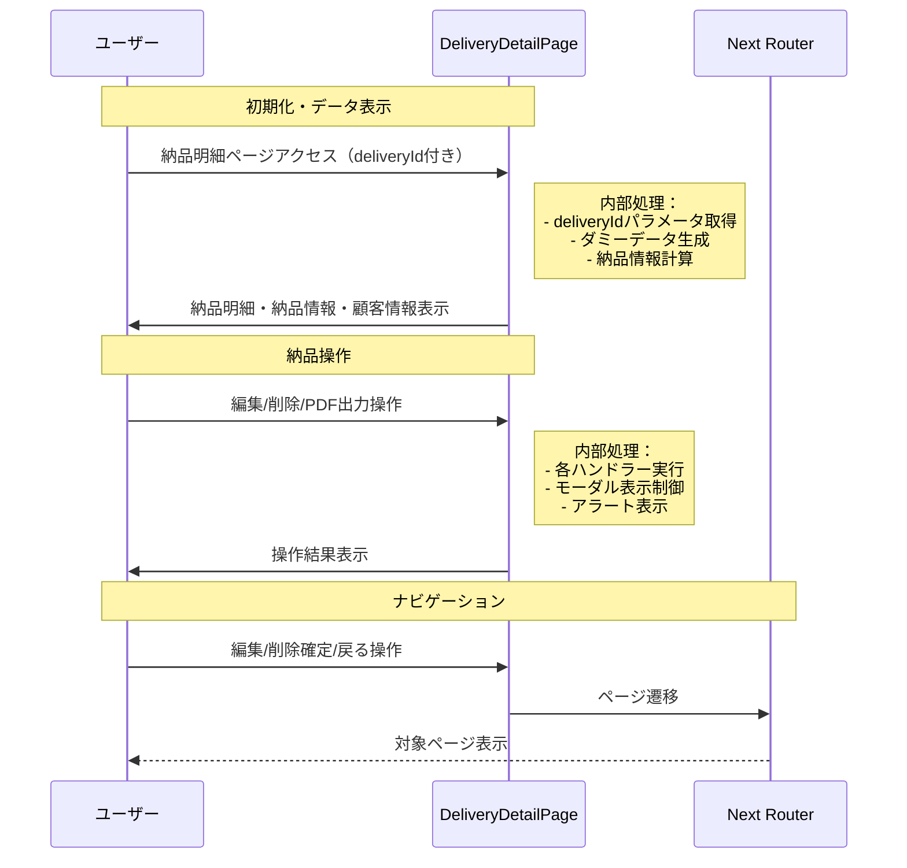

```mermaid
sequenceDiagram
    participant User as ユーザー
    participant Page as DeliveryDetailPage
    participant Router as Next Router
    Note over User, Page: 初期化・データ表示
    User->>Page: 納品明細ページアクセス（deliveryId付き）
    Note right of Page: 内部処理：<br/>- deliveryIdパラメータ取得<br/>- ダミーデータ生成<br/>- 納品情報計算
    Page->>User: 納品明細・納品情報・顧客情報表示
    Note over User, Page: 納品操作
    User->>Page: 編集/削除/PDF出力操作
    Note right of Page: 内部処理：<br/>- 各ハンドラー実行<br/>- モーダル表示制御<br/>- アラート表示
    Page->>User: 操作結果表示
    Note over User, Router: ナビゲーション
    User->>Page: 編集/削除確定/戻る操作
    Page->>Router: ページ遷移
    Router-->>User: 対象ページ表示
```