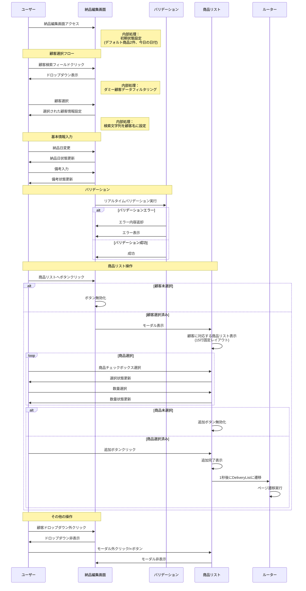

```mermaid
sequenceDiagram
    participant User as ユーザー
    participant UI as 納品編集画面
    participant Validation as バリデーション
    participant ProductModal as 商品リスト
    participant Router as ルーター
    User->>UI: 納品編集画面アクセス
    Note right of UI: 内部処理： <br/> 初期状態設定<br/>(デフォルト商品2件、今日の日付)
    
        Note over User, UI: 顧客選択フロー
        User->>UI: 顧客検索フィールドクリック
        UI->>User: ドロップダウン表示
        Note right of UI: 内部処理： <br/> ダミー顧客データフィルタリング
        User->>UI: 顧客選択
        UI->>User: 選択された顧客情報設定
        Note right of UI: 内部処理： <br/> 検索文字列を顧客名に設定
    
        Note over User, UI: 基本情報入力
        User->>UI: 納品日変更
        UI->>User: 納品日状態更新
        User->>UI: 備考入力
        UI->>User: 備考状態更新
        Note over User, Validation: バリデーション
        UI->>Validation: リアルタイムバリデーション実行
        alt バリデーションエラー
            Validation->>UI: エラー内容返却
            Validation->>UI: エラー表示
        else バリデーション成功
            Validation->>UI: 成功
        end
        Note over User, ProductModal: 商品リスト操作
        User->>UI: 商品リストへボタンクリック
        alt 顧客未選択
            UI->>UI: ボタン無効化
        else 顧客選択済み
            UI->>ProductModal: モーダル表示
            ProductModal->>ProductModal: 顧客に対応する商品リスト表示<br/>(15行固定レイアウト)
            
            loop 商品選択
                User->>ProductModal: 商品チェックボックス選択
                ProductModal->>User: 選択状態更新
                User->>ProductModal: 数量選択
                ProductModal->>User: 数量状態更新
            end
            
            alt 商品未選択
                ProductModal->>ProductModal: 追加ボタン無効化
            else 商品選択済み
                User->>ProductModal: 追加ボタンクリック
                ProductModal->>ProductModal: 追加完了表示
                ProductModal->>Router: 1秒後にDeliveryListに遷移
                Router->>Router: ページ遷移実行
            end
        end
        Note over User, UI: その他の操作
        User->>UI: 顧客ドロップダウン外クリック
        UI->>User: ドロップダウン非表示
        
        User->>ProductModal: モーダル外クリック/×ボタン
        ProductModal->>UI: モーダル非表示
```