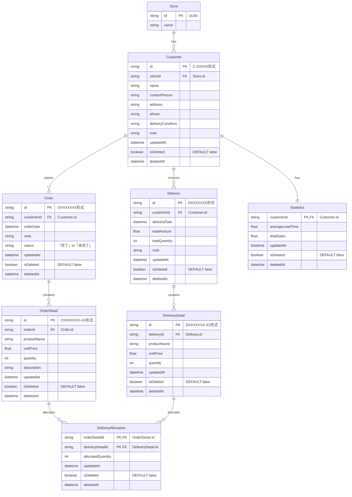

```mermaid
    erDiagram
    Store ||--o{ Customer : "has"
    Customer ||--o{ Order : "places"
    Customer ||--o{ Delivery : "receives"
    Customer ||--|| Statistics : "has"
    Order ||--o{ OrderDetail : "contains"
    Delivery ||--o{ DeliveryDetail : "contains"
    OrderDetail ||--o{ DeliveryAllocation : "allocates"
    DeliveryDetail ||--o{ DeliveryAllocation : "allocates"

        Store {
            string id PK "UUID"
            string name
        }

        Customer {
            string id PK "C-XXXXX形式"
            string storeId FK "Store.id"
            string name
            string contactPerson
            string address
            string phone
            string deliveryCondition
            string note
            datetime updatedAt
            boolean isDeleted "DEFAULT false"
            datetime deletedAt
        }

        Statistics {
            string customerId PK,FK "Customer.id"
            float averageLeadTime
            float totalSales
            datetime updatedAt
            boolean isDeleted "DEFAULT false"
            datetime deletedAt
        }

        Order {
            string id PK "OXXXXXXX形式"
            string customerId FK "Customer.id"
            datetime orderDate
            string note
            string status "「完了」or「未完了」"
            datetime updatedAt
            boolean isDeleted "DEFAULT false"
            datetime deletedAt
        }

        OrderDetail {
            string id PK "OXXXXXXX-XX形式"
            string orderId FK "Order.id"
            string productName
            float unitPrice
            int quantity
            string description
            datetime updatedAt
            boolean isDeleted "DEFAULT false"
            datetime deletedAt
        }

        Delivery {
            string id PK "DXXXXXXX形式"
            string customerId FK "Customer.id"
            datetime deliveryDate
            float totalAmount
            int totalQuantity
            string note
            datetime updatedAt
            boolean isDeleted "DEFAULT false"
            datetime deletedAt
        }

        DeliveryDetail {
            string id PK "DXXXXXXX-XX形式"
            string deliveryId FK "Delivery.id"
            string productName
            float unitPrice
            int quantity
            datetime updatedAt
            boolean isDeleted "DEFAULT false"
            datetime deletedAt
        }

        DeliveryAllocation {
            string orderDetailId PK,FK "OrderDetail.id"
            string deliveryDetailId PK,FK "DeliveryDetail.id"
            int allocatedQuantity
            datetime updatedAt
            boolean isDeleted "DEFAULT false"
            datetime deletedAt
        }
```
