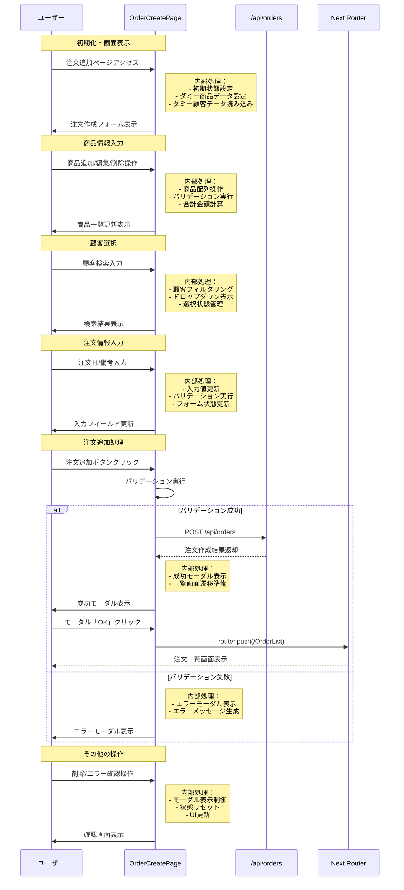

```mermaid
sequenceDiagram
    participant User as ユーザー
    participant Page as OrderCreatePage
    participant API as /api/orders
    participant Router as Next Router

    Note over User, Page: 初期化・画面表示
    User->>Page: 注文追加ページアクセス
    Note right of Page: 内部処理：<br/>- 初期状態設定<br/>- ダミー商品データ設定<br/>- ダミー顧客データ読み込み
    Page->>User: 注文作成フォーム表示

    Note over User, Page: 商品情報入力
    User->>Page: 商品追加/編集/削除操作
    Note right of Page: 内部処理：<br/>- 商品配列操作<br/>- バリデーション実行<br/>- 合計金額計算
    Page->>User: 商品一覧更新表示

    Note over User, Page: 顧客選択
    User->>Page: 顧客検索入力
    Note right of Page: 内部処理：<br/>- 顧客フィルタリング<br/>- ドロップダウン表示<br/>- 選択状態管理
    Page->>User: 検索結果表示

    Note over User, Page: 注文情報入力
    User->>Page: 注文日/備考入力
    Note right of Page: 内部処理：<br/>- 入力値更新<br/>- バリデーション実行<br/>- フォーム状態更新
    Page->>User: 入力フィールド更新

    Note over User, Page: 注文追加処理
    User->>Page: 注文追加ボタンクリック
    Page->>Page: バリデーション実行
    alt バリデーション成功
        Page->>API: POST /api/orders
        API-->>Page: 注文作成結果返却
        Note right of Page: 内部処理：<br/>- 成功モーダル表示<br/>- 一覧画面遷移準備
        Page->>User: 成功モーダル表示
        User->>Page: モーダル「OK」クリック
        Page->>Router: router.push(/OrderList)
        Router-->>User: 注文一覧画面表示
    else バリデーション失敗
        Note right of Page: 内部処理：<br/>- エラーモーダル表示<br/>- エラーメッセージ生成
        Page->>User: エラーモーダル表示
    end

    Note over User, Page: その他の操作
    User->>Page: 削除/エラー確認操作
    Note right of Page: 内部処理：<br/>- モーダル表示制御<br/>- 状態リセット<br/>- UI更新
    Page->>User: 確認画面表示
```