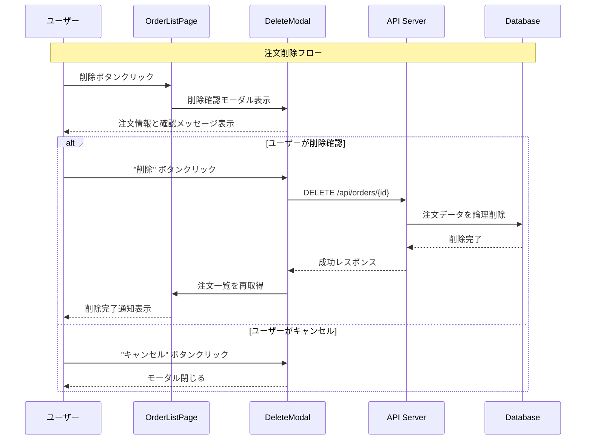

```mermaid
sequenceDiagram
    participant User as ユーザー
    participant List as OrderListPage
    participant Modal as DeleteModal
    participant API as API Server
    participant DB as Database

    Note over User,DB: 注文削除フロー

    User->>List: 削除ボタンクリック
    List->>Modal: 削除確認モーダル表示
    Modal-->>User: 注文情報と確認メッセージ表示
    
    alt ユーザーが削除確認
        User->>Modal: "削除" ボタンクリック
        Modal->>API: DELETE /api/orders/{id}
        API->>DB: 注文データを論理削除
        DB-->>API: 削除完了
        API-->>Modal: 成功レスポンス
        Modal->>List: 注文一覧を再取得
        List-->>User: 削除完了通知表示
    else ユーザーがキャンセル
        User->>Modal: "キャンセル" ボタンクリック
        Modal-->>User: モーダル閉じる
    end

```