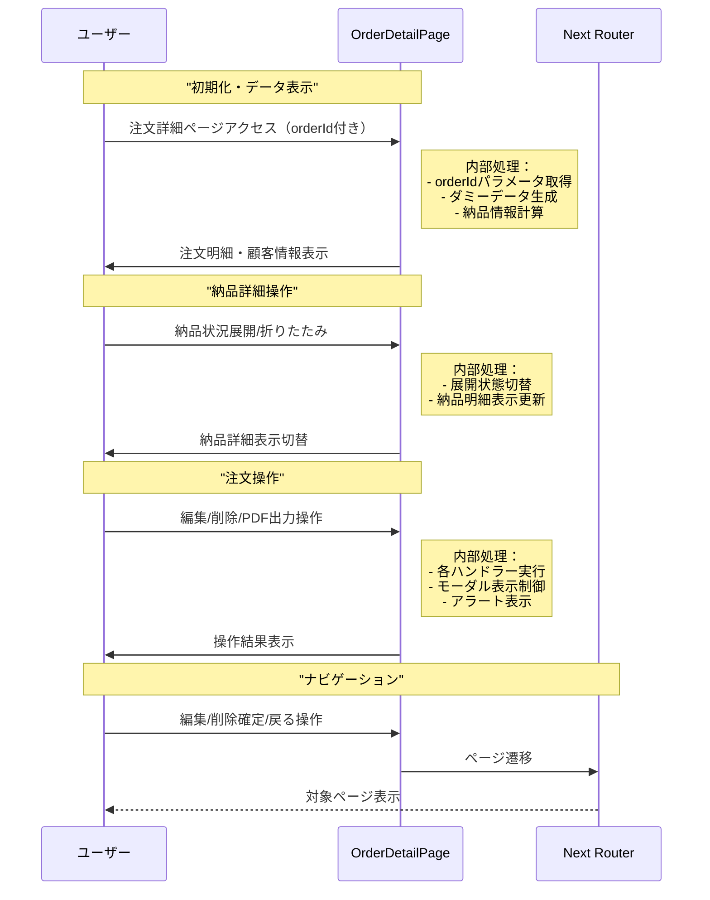

```mermaid
sequenceDiagram
    participant User as ユーザー
    participant Page as OrderDetailPage
    participant Router as Next Router

    Note over User, Page: "初期化・データ表示"
    User->>Page: 注文詳細ページアクセス（orderId付き）
    Note right of Page: 内部処理：<br/>- orderIdパラメータ取得<br/>- ダミーデータ生成<br/>- 納品情報計算
    Page->>User: 注文明細・顧客情報表示

    Note over User, Page: "納品詳細操作"
    User->>Page: 納品状況展開/折りたたみ
    Note right of Page: 内部処理：<br/>- 展開状態切替<br/>- 納品明細表示更新
    Page->>User: 納品詳細表示切替

    Note over User, Page: "注文操作"
    User->>Page: 編集/削除/PDF出力操作
    Note right of Page: 内部処理：<br/>- 各ハンドラー実行<br/>- モーダル表示制御<br/>- アラート表示
    Page->>User: 操作結果表示

    Note over User, Router: "ナビゲーション"
    User->>Page: 編集/削除確定/戻る操作
    Page->>Router: ページ遷移
    Router-->>User: 対象ページ表示
```