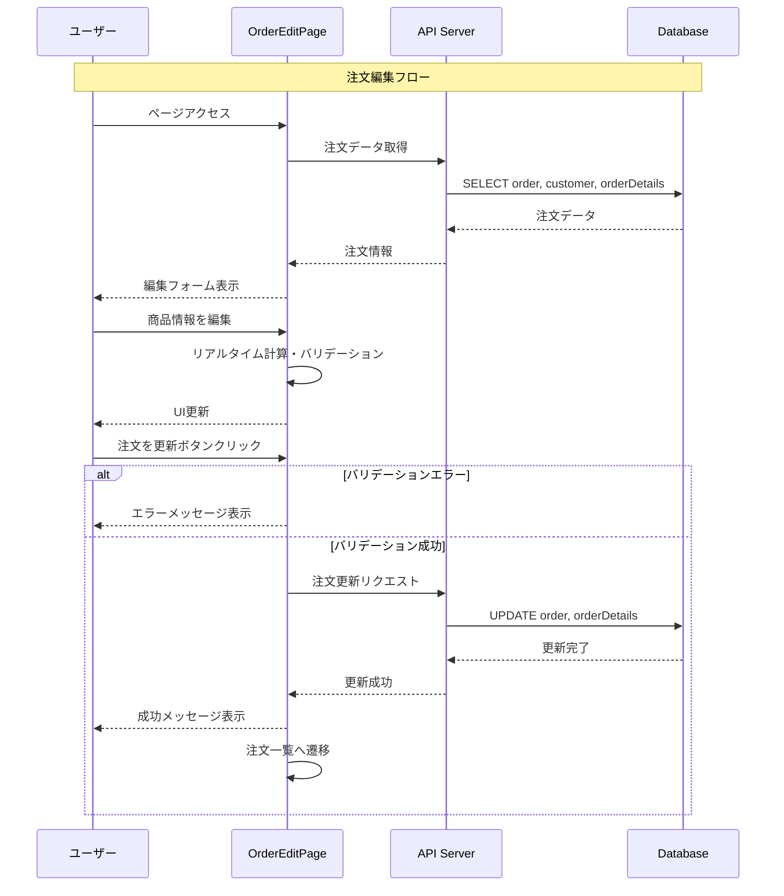

```mermaid
sequenceDiagram
    participant User as ユーザー
    participant Page as OrderEditPage
    participant API as API Server
    participant DB as Database

    Note over User,DB: 注文編集フロー

    User->>Page: ページアクセス
    Page->>API: 注文データ取得
    API->>DB: SELECT order, customer, orderDetails
    DB-->>API: 注文データ
    API-->>Page: 注文情報
    Page-->>User: 編集フォーム表示

    User->>Page: 商品情報を編集
    Page->>Page: リアルタイム計算・バリデーション
    Page-->>User: UI更新

    User->>Page: 注文を更新ボタンクリック
    
    alt バリデーションエラー
        Page-->>User: エラーメッセージ表示
    else バリデーション成功
        Page->>API: 注文更新リクエスト
        API->>DB: UPDATE order, orderDetails
        DB-->>API: 更新完了
        API-->>Page: 更新成功
        Page-->>User: 成功メッセージ表示
        Page->>Page: 注文一覧へ遷移
    end
```