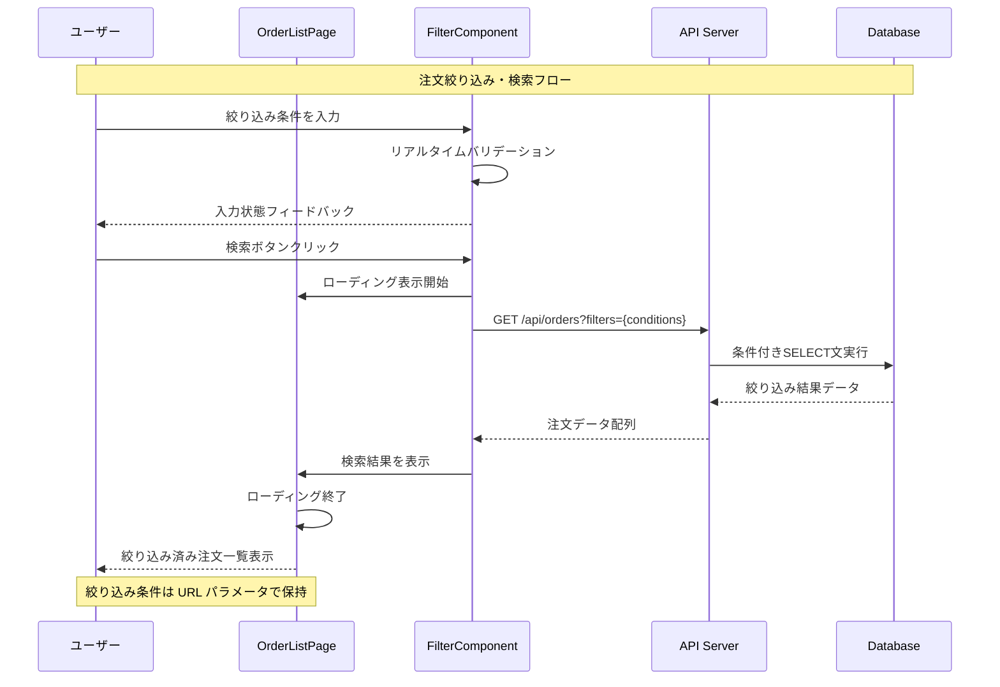

```mermaid
sequenceDiagram
    participant User as ユーザー
    participant List as OrderListPage
    participant Filter as FilterComponent
    participant API as API Server
    participant DB as Database

    Note over User,DB: 注文絞り込み・検索フロー

    User->>Filter: 絞り込み条件を入力
    Filter->>Filter: リアルタイムバリデーション
    Filter-->>User: 入力状態フィードバック
    
    User->>Filter: 検索ボタンクリック
    Filter->>List: ローディング表示開始
    
    Filter->>API: GET /api/orders?filters={conditions}
    API->>DB: 条件付きSELECT文実行
    DB-->>API: 絞り込み結果データ
    API-->>Filter: 注文データ配列
    
    Filter->>List: 検索結果を表示
    List->>List: ローディング終了
    List-->>User: 絞り込み済み注文一覧表示
    
    Note over User,List: 絞り込み条件は URL パラメータで保持
```