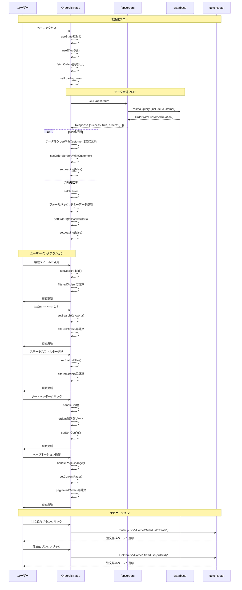

```mermaid
sequenceDiagram
    participant User as ユーザー
    participant Page as OrderListPage
    participant API as /api/orders
    participant DB as Database
    participant Router as Next Router

    Note over User, Router: 初期化フロー
    User->>Page: ページアクセス
    Page->>Page: useState初期化
    Page->>Page: useEffect実行
    Page->>Page: fetchOrders()呼び出し
    Page->>Page: setLoading(true)
    
    Note over Page, DB: データ取得フロー
    Page->>API: GET /api/orders
    API->>DB: Prisma Query (include: customer)
    DB-->>API: OrderWithCustomerRelation[]
    API-->>Page: Response {success: true, orders: [...]}
    
    alt API成功時
        Page->>Page: データをOrderWithCustomer形式に変換
        Page->>Page: setOrders(ordersWithCustomer)
        Page->>Page: setLoading(false)
    else API失敗時
        Page->>Page: catch error
        Page->>Page: フォールバック: ダミーデータ使用
        Page->>Page: setOrders(fallbackOrders)
        Page->>Page: setLoading(false)
    end

    Note over User, Page: ユーザーインタラクション
    User->>Page: 検索フィールド変更
    Page->>Page: setSearchField()
    Page->>Page: filteredOrders再計算
    Page->>User: 画面更新

    User->>Page: 検索キーワード入力
    Page->>Page: setSearchKeyword()
    Page->>Page: filteredOrders再計算
    Page->>User: 画面更新

    User->>Page: ステータスフィルター選択
    Page->>Page: setStatusFilter()
    Page->>Page: filteredOrders再計算
    Page->>User: 画面更新

    User->>Page: ソートヘッダークリック
    Page->>Page: handleSort()
    Page->>Page: orders配列をソート
    Page->>Page: setSortConfig()
    Page->>User: 画面更新

    User->>Page: ページネーション操作
    Page->>Page: handlePageChange()
    Page->>Page: setCurrentPage()
    Page->>Page: paginatedOrders再計算
    Page->>User: 画面更新

    Note over User, Router: ナビゲーション
    User->>Page: 注文追加ボタンクリック
    Page->>Router: router.push("/Home/OrderList/Create")
    Router-->>User: 注文作成ページへ遷移

    User->>Page: 注文IDリンククリック
    Page->>Router: Link href="/Home/OrderList/{orderId}"
    Router-->>User: 注文詳細ページへ遷移
```