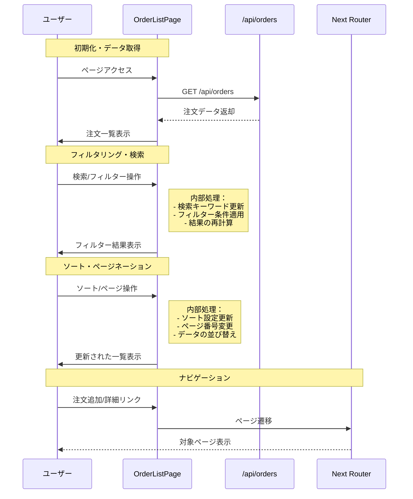

```mermaid
sequenceDiagram
    participant User as ユーザー
    participant Page as OrderListPage
    participant API as /api/orders
    participant Router as Next Router

    Note over User, Page: 初期化・データ取得
    User->>Page: ページアクセス
    Page->>API: GET /api/orders
    API-->>Page: 注文データ返却
    Page->>User: 注文一覧表示

    Note over User, Page: フィルタリング・検索
    User->>Page: 検索/フィルター操作
    Note right of Page: 内部処理：<br/>- 検索キーワード更新<br/>- フィルター条件適用<br/>- 結果の再計算
    Page->>User: フィルター結果表示

    Note over User, Page: ソート・ページネーション
    User->>Page: ソート/ページ操作
    Note right of Page: 内部処理：<br/>- ソート設定更新<br/>- ページ番号変更<br/>- データの並び替え
    Page->>User: 更新された一覧表示

    Note over User, Router: ナビゲーション
    User->>Page: 注文追加/詳細リンク
    Page->>Router: ページ遷移
    Router-->>User: 対象ページ表示
```