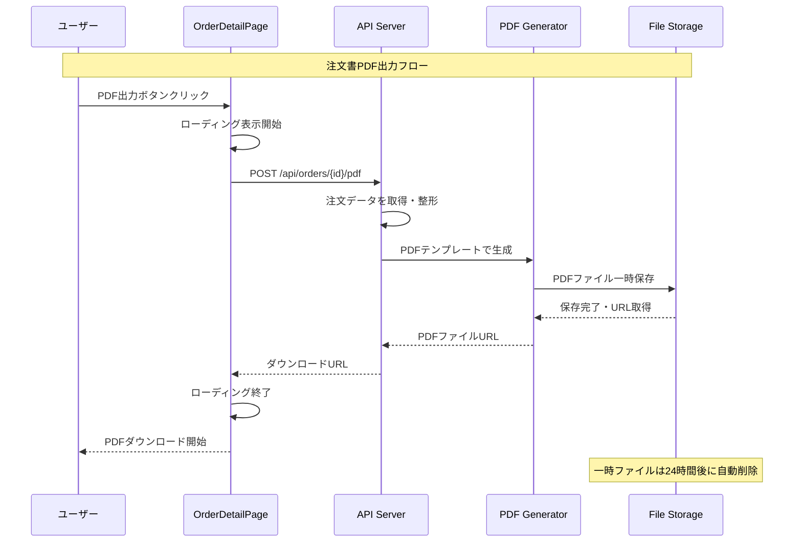

```mermaid
sequenceDiagram
    participant User as ユーザー
    participant Page as OrderDetailPage
    participant API as API Server
    participant PDF as PDF Generator
    participant Storage as File Storage

    Note over User,Storage: 注文書PDF出力フロー

    User->>Page: PDF出力ボタンクリック
    Page->>Page: ローディング表示開始
    
    Page->>API: POST /api/orders/{id}/pdf
    API->>API: 注文データを取得・整形
    API->>PDF: PDFテンプレートで生成
    PDF->>Storage: PDFファイル一時保存
    Storage-->>PDF: 保存完了・URL取得
    PDF-->>API: PDFファイルURL
    API-->>Page: ダウンロードURL
    
    Page->>Page: ローディング終了
    Page-->>User: PDFダウンロード開始
    
    Note over Storage: 一時ファイルは24時間後に自動削除
```
