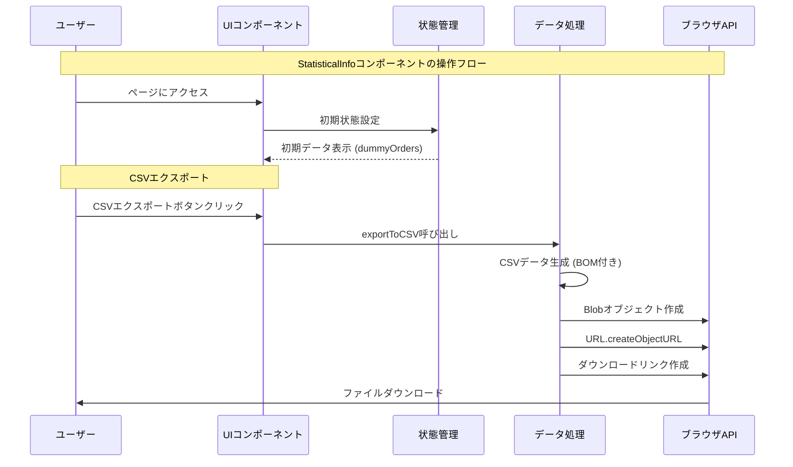

```mermaid
classDiagram
    class List {
        <<interface>>
        +string customerId
        +string customerName
        +number leadTime
        +number sales
    }
    
    class StatisticalInfo {
        -string searchField
        -string searchKeyword
        -List[] orders
        -List[] filteredOrders
        -List[] displayedOrders
        +useState() 状態管理
        +handleSort(field) 並び替え処理
        +handleSearch() 検索処理
        +exportToCSV() CSV出力処理
        +render() UI表示
    }
    
    StatisticalInfo --> List : uses
    ```