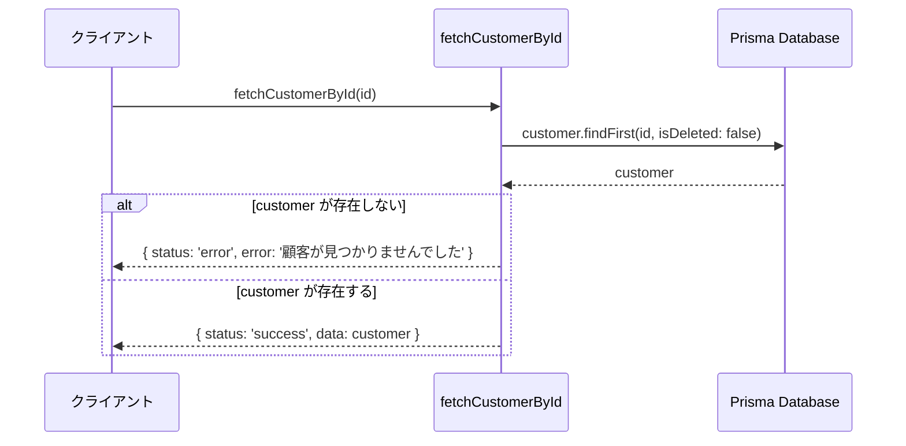
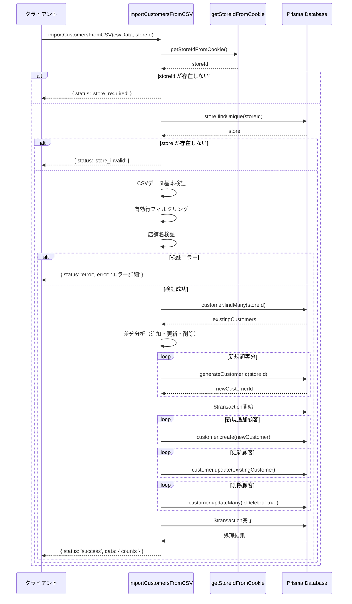
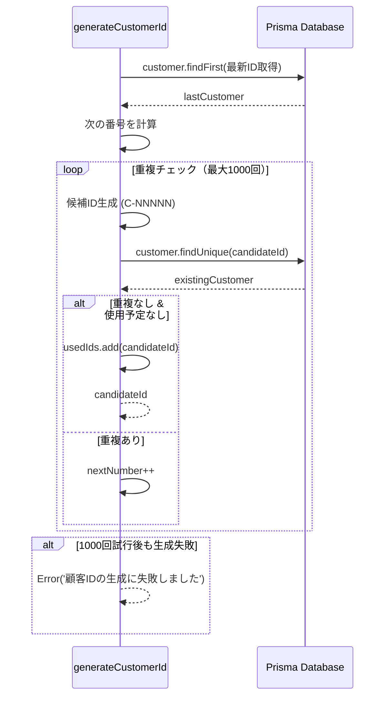
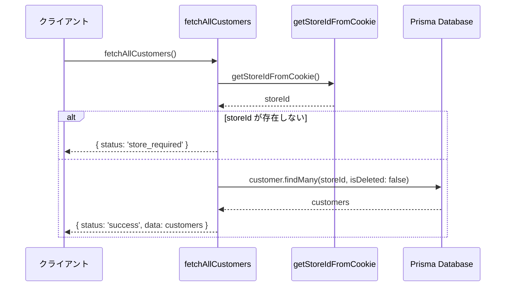
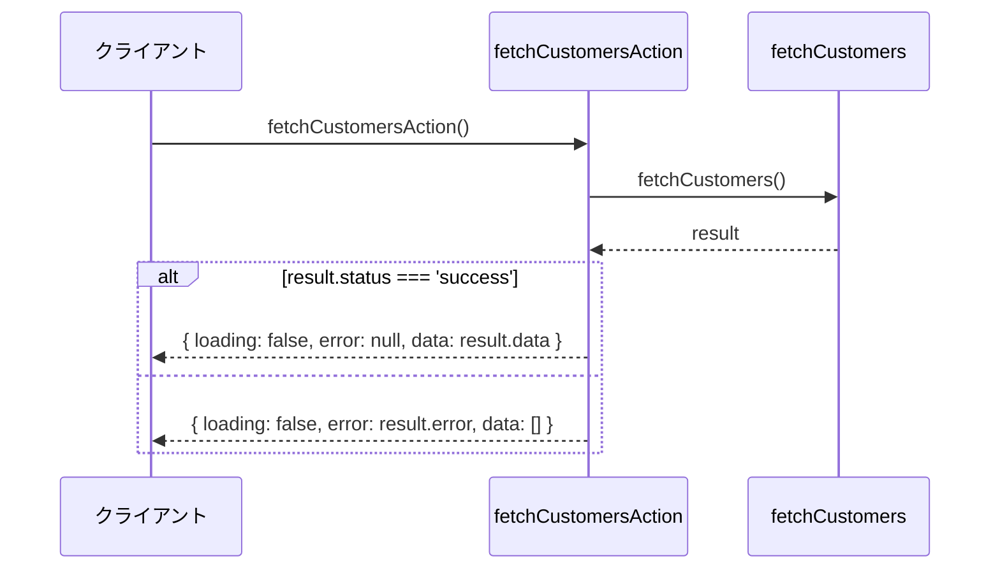
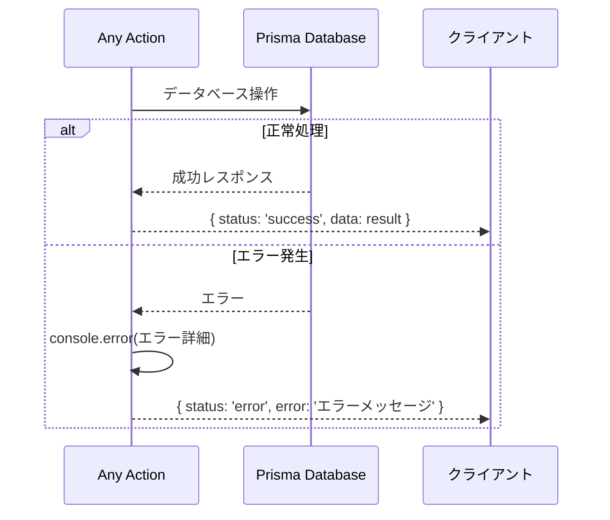

# customerActions.ts - シーケンス図

## 概要
顧客管理に関するServer Actionsの処理フローを示すシーケンス図です。

## 1. 顧客一覧取得 (fetchCustomers)

```mermaid
sequenceDiagram
    participant Client as クライアントsequenceDiagram
    participant Breadcrumbs as BreadcrumbssequenceDiagram
    participant Breadcrumbs as Breadcrumbs
    participant Segments as pathSegments
    participant Link as Link
    participant ChevronRight as ChevronRight

    Breadcrumbs->>Breadcrumbs: pathSegments.length チェック
    
    alt pathSegments.length <= 1
        Breadcrumbs->>Breadcrumbs: 空の span 返却
        Note over Breadcrumbs: "ホームページなど"
    else pathSegments.length > 1
        loop 各セグメントに対して
            Breadcrumbs->>Breadcrumbs: index < pathSegments.length - 1 チェック
            
            alt 最後のセグメントでない
                Breadcrumbs->>Link: Link コンポーネント生成
                Note over Link: "href: /${pathSegments.slice(0, index + 1).join('/')}"
                Link->>Link: "pathNames[segment] でラベル設定"
                Breadcrumbs->>ChevronRight: 区切り矢印追加
            else 最後のセグメント
                Breadcrumbs->>Breadcrumbs: span でテキスト表示
                Note over Breadcrumbs: "pathNames[segment] (リンクなし)"
            end
        end
    end
    participant Segments as pathSegments
    participant Link as Link
    participant ChevronRight as ChevronRight

    Breadcrumbs->>Breadcrumbs: pathSegments.length チェック
    
    alt pathSegments.length <= 1
        Breadcrumbs->>Breadcrumbs: 空の span 返却
        Note over Breadcrumbs: "ホームページなど"
    else pathSegments.length > 1
        loop 各セグメントに対して
            Breadcrumbs->>Breadcrumbs: index < pathSegments.length - 1 チェック
            
            alt 最後のセグメントでない
                Breadcrumbs->>Link: Link コンポーネント生成
                Note over Link: "href: /${pathSegments.slice(0, index + 1).join('/')}"
                Link->>Link: "pathNames[segment] でラベル設定"
                Breadcrumbs->>ChevronRight: 区切り矢印追加
            else 最後のセグメント
                Breadcrumbs->>Breadcrumbs: span でテキスト表示
                Note over Breadcrumbs: "pathNames[segment] (リンクなし)"
            end
        end
    end
    participant Action as fetchCustomers
    participant Store as getStoreIdFromCookie
    participant DB as Prisma Database

    Client->>Action: fetchCustomers()
    Action->>Store: getStoreIdFromCookie()
    Store-->>Action: storeId
    
    alt storeId が存在しない
        Action-->>Client: { status: 'store_required' }
    else storeId が存在する
        Action->>DB: store.findUnique(storeId)
        DB-->>Action: store
        
        alt store が存在しない
            Action-->>Client: { status: 'store_invalid' }
        else store が存在する
            Action->>DB: customer.findMany(whereCondition)
            DB-->>Action: customers
            Action-->>Client: { status: 'success', data: customers }
        end
    end
```

## 2. 顧客ID別取得 (fetchCustomerById)



## 3. CSVインポート (importCustomersFromCSV)



## 4. 顧客ID生成 (generateCustomerId)



## 5. 全顧客取得 (fetchAllCustomers)



## 6. useActionState用取得 (fetchCustomersAction)



## エラーハンドリング共通パターン



## 共通処理パターン

### 店舗チェック
1. `getStoreIdFromCookie()` で店舗ID取得
2. 店舗IDの存在チェック
3. 店舗の有効性チェック

### データ検証
1. 入力データの基本検証
2. 関連データの存在チェック
3. 権限チェック（店舗に属するデータのみ）

### トランザクション処理
1. 複数テーブル操作時は `$transaction` 使用
2. 失敗時は全体ロールバック
3. 成功時はコミット