# deliveryActions.ts - シーケンス図

## 概要
納品管理に関するServer Actionsの処理フローを示すシーケンス図です。

## 1. 納品一覧取得 (fetchDeliveries)

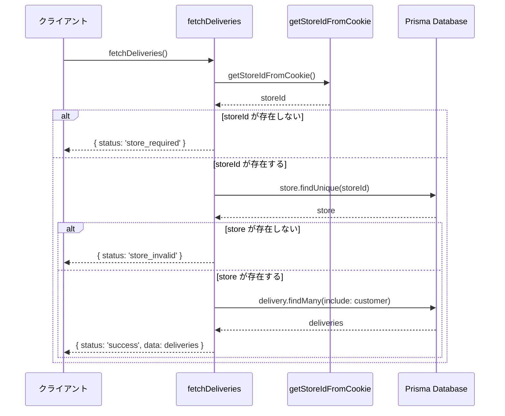

## 2. 納品ID別取得 (fetchDeliveryById)

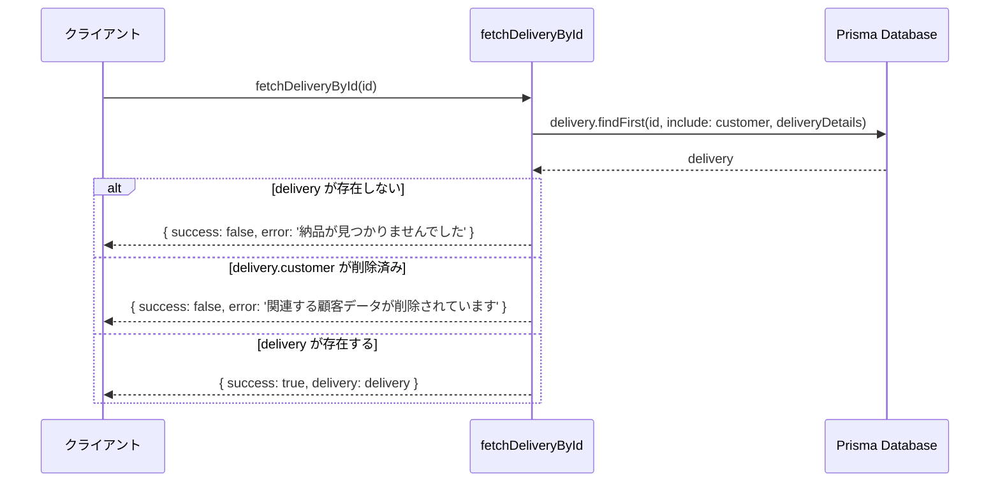

## 3. 納品作成 (createDelivery)

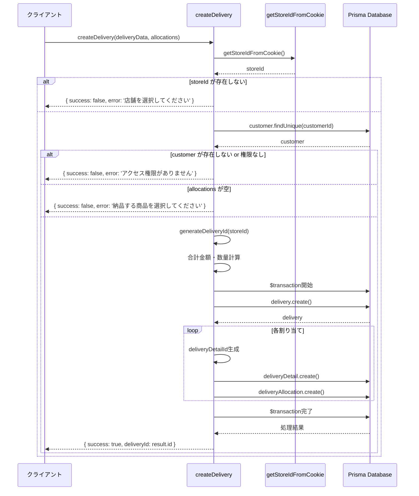

## 4. 納品割り当て更新 (updateDeliveryAllocations)

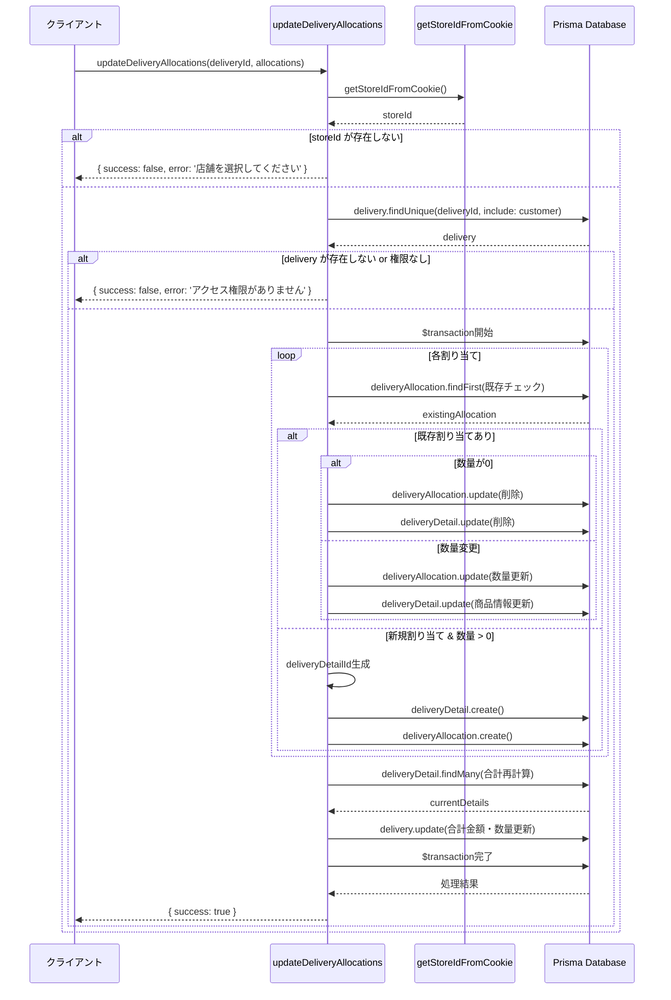

## 5. 未納品注文明細取得 (fetchUndeliveredOrderDetails)

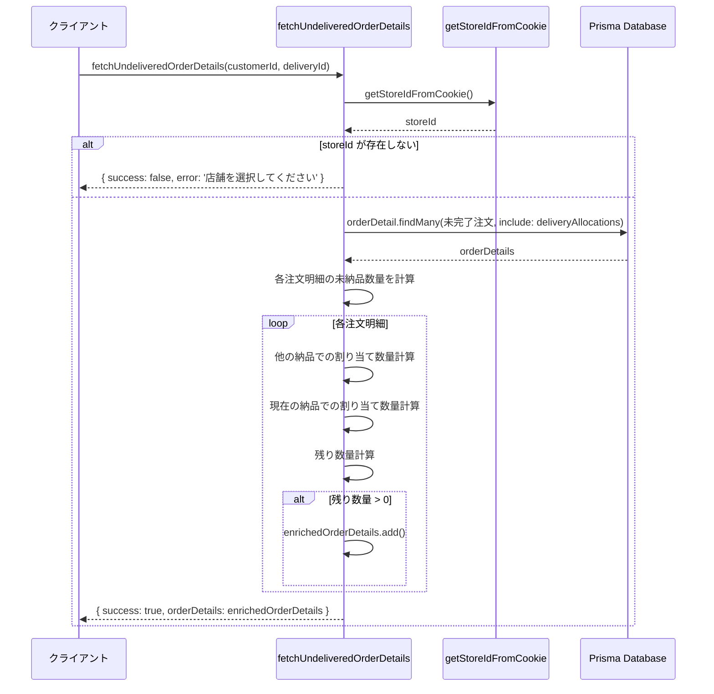

## 6. 編集用納品データ取得 (fetchDeliveryForEdit)

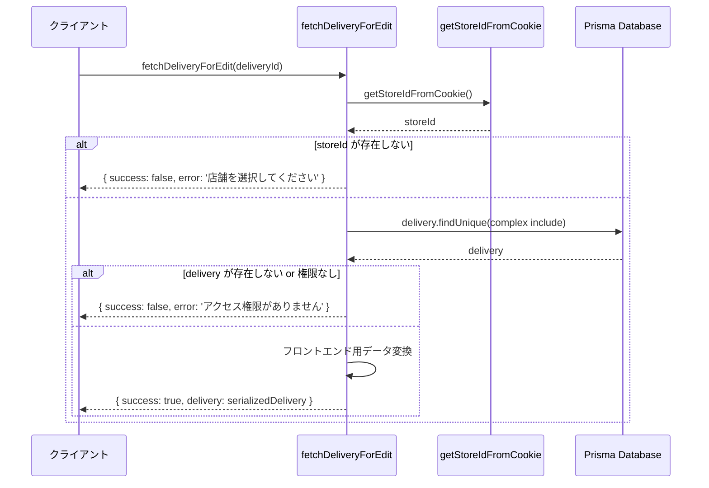

## 7. 納品削除 (deleteDelivery)

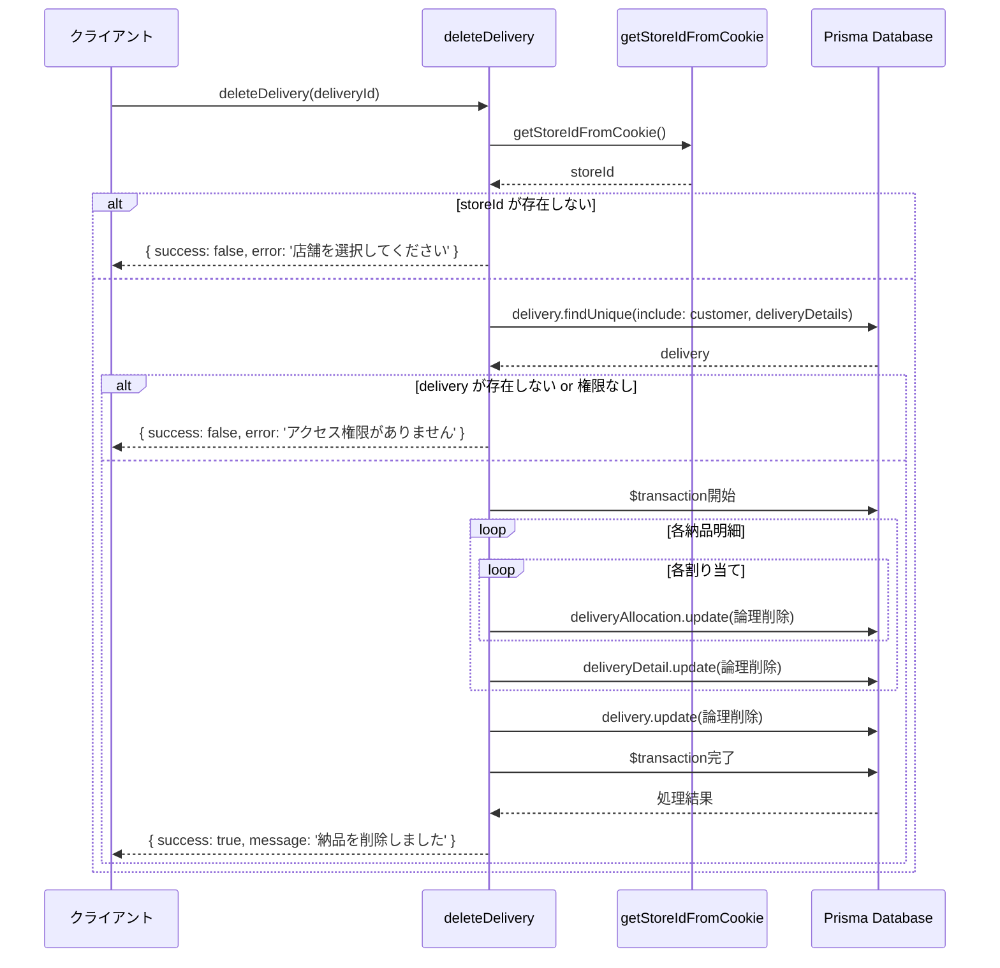

## 8. 納品ID生成 (generateDeliveryId)

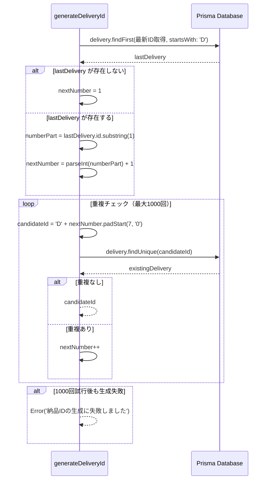

## 9. 新規作成用未納品明細取得 (fetchUndeliveredOrderDetailsForCreate)

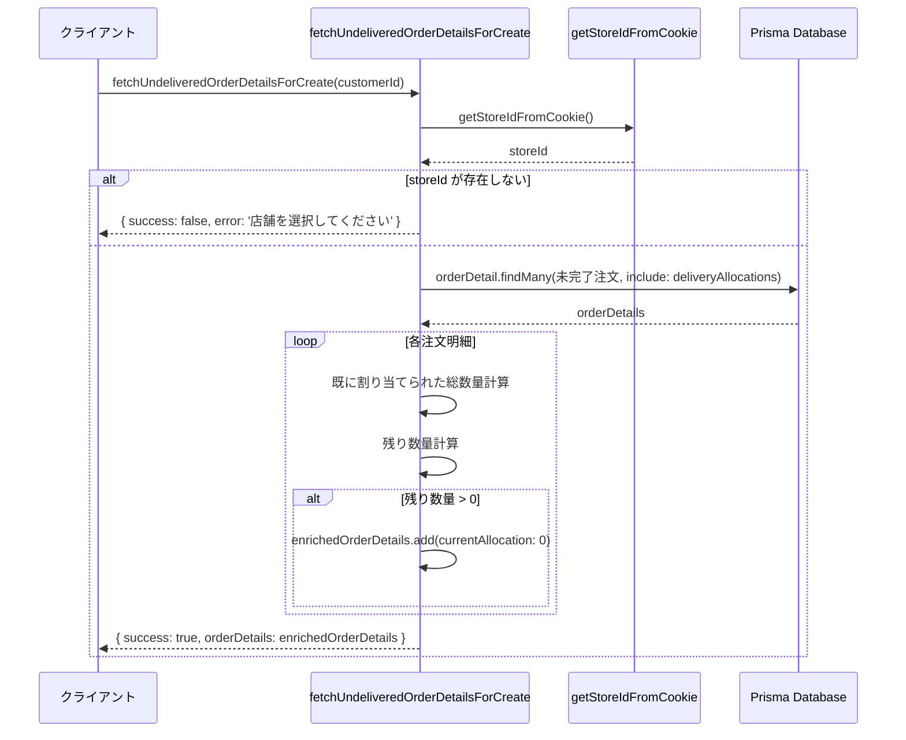

## 納品明細ID生成パターン

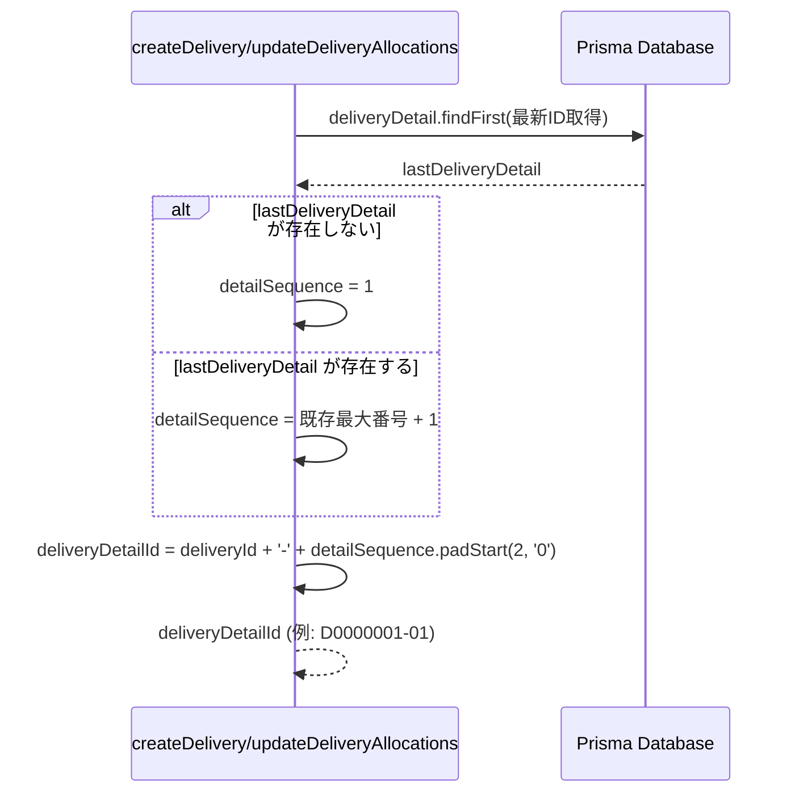

## エラーハンドリング共通パターン

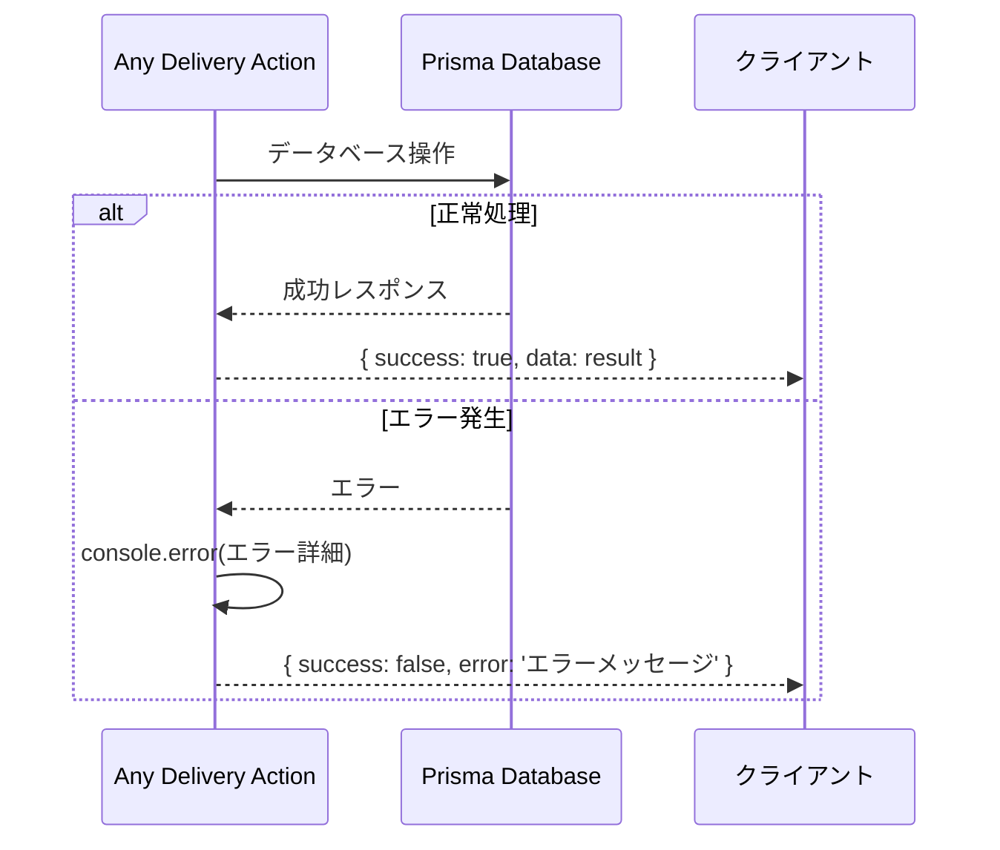

## 共通処理パターン

### 店舗・権限チェック
1. `getStoreIdFromCookie()` で店舗ID取得
2. 店舗IDの存在チェック
3. 納品が指定店舗に属するかチェック

### 複雑なデータ構造処理
1. 納品と注文明細の関係管理
2. 割り当て数量の計算
3. 未納品数量の追跡

### トランザクション処理
1. 納品、納品明細、割り当ての同時操作
2. 複雑な更新処理の整合性保証
3. 論理削除による安全なデータ管理