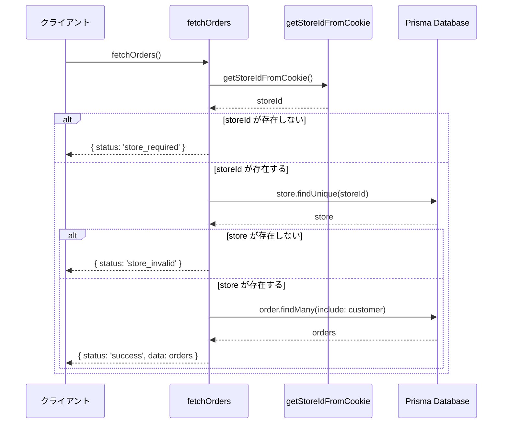
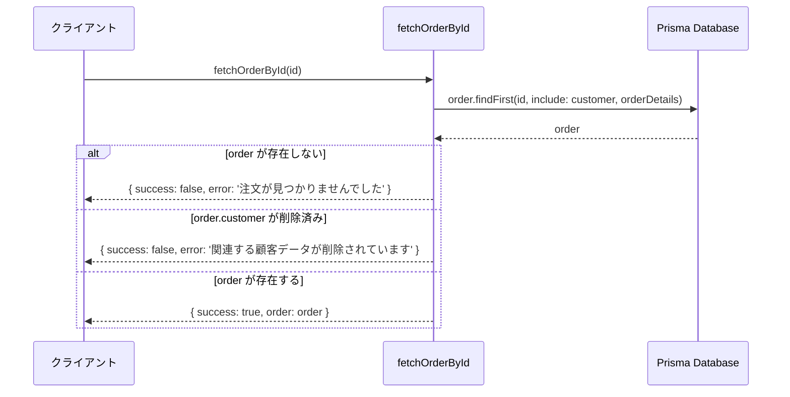
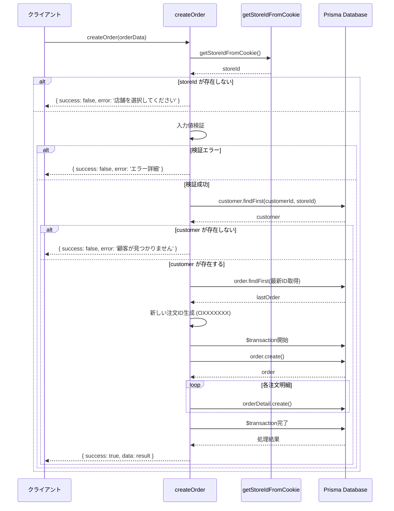
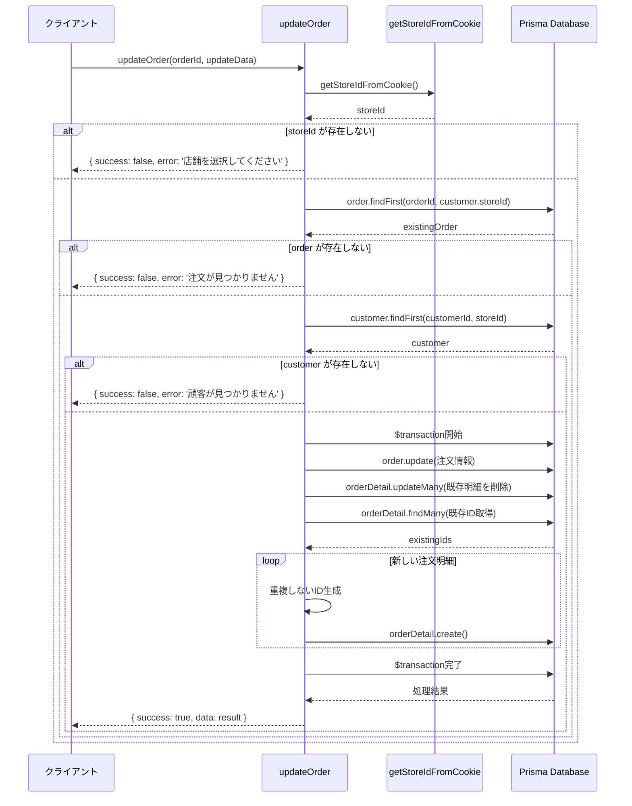
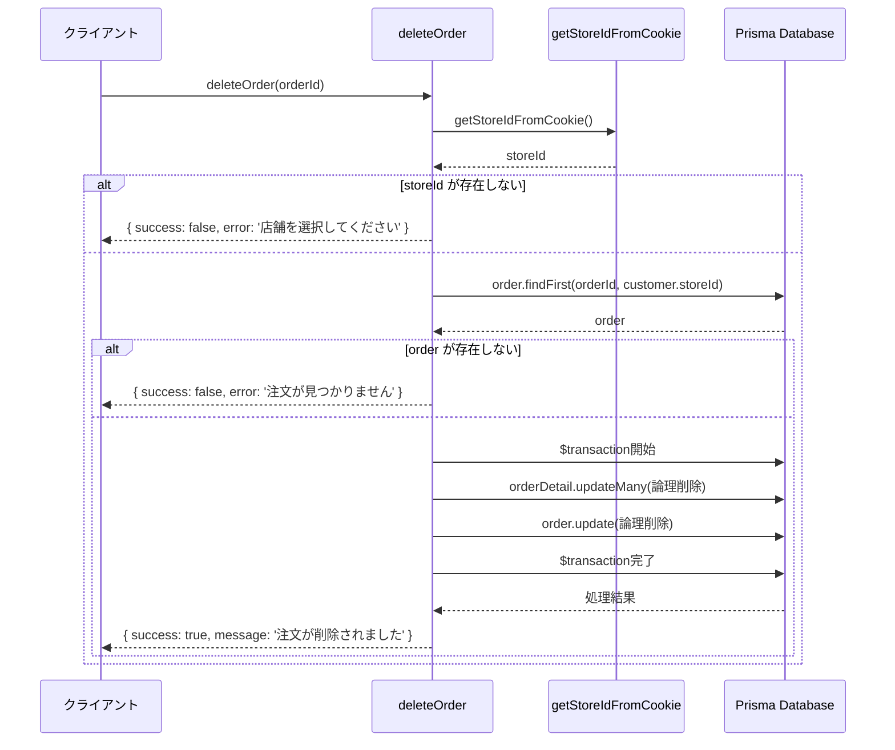
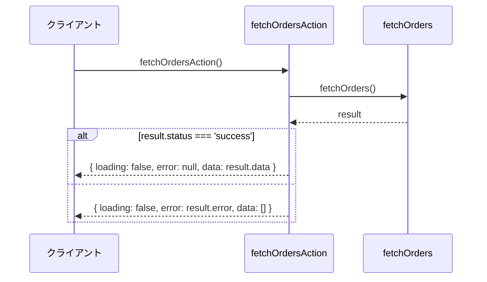
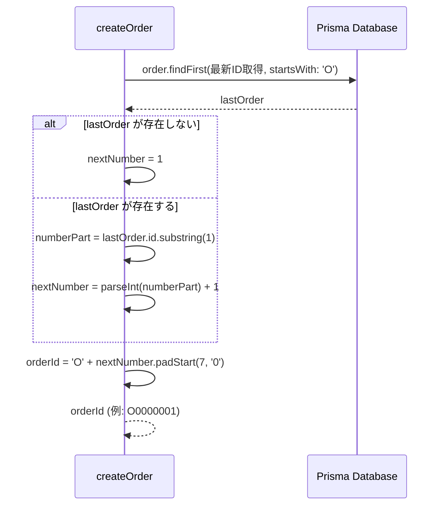
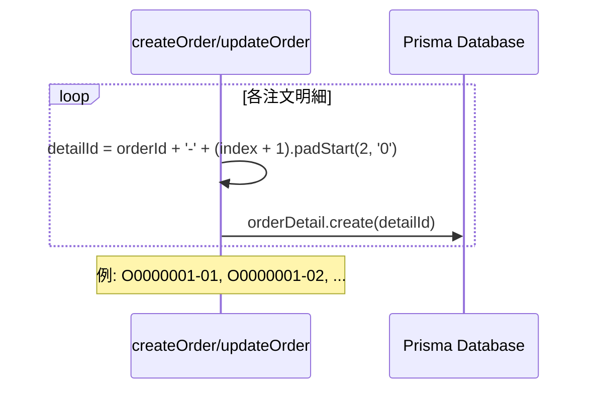
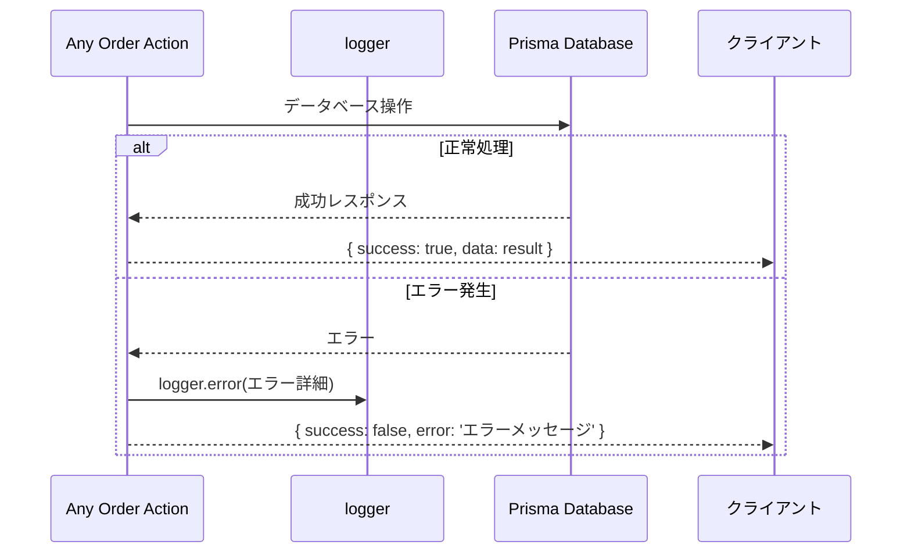

# orderActions.ts - シーケンス図

## 概要
注文管理に関するServer Actionsの処理フローを示すシーケンス図です。

## 1. 注文一覧取得 (fetchOrders)

## 2. 注文ID別取得 (fetchOrderById)

## 3. 注文作成 (createOrder)

## 4. 注文更新 (updateOrder)

## 5. 注文削除 (deleteOrder)

## 6. useActionState用取得 (fetchOrdersAction)

## 注文ID生成パターン

## 注文明細ID生成パターン

## エラーハンドリング共通パターン

## 共通処理パターン

### 店舗・権限チェック
1. `getStoreIdFromCookie()` で店舗ID取得
2. 店舗IDの存在チェック
3. 注文が指定店舗に属するかチェック

### データ検証
1. 入力データの基本検証（customerId、orderDetails等）
2. 関連データの存在チェック（customer、store）
3. 削除済みデータの除外

### トランザクション処理
1. 注文と注文明細の同時操作
2. 失敗時は全体ロールバック
3. 論理削除による安全なデータ管理