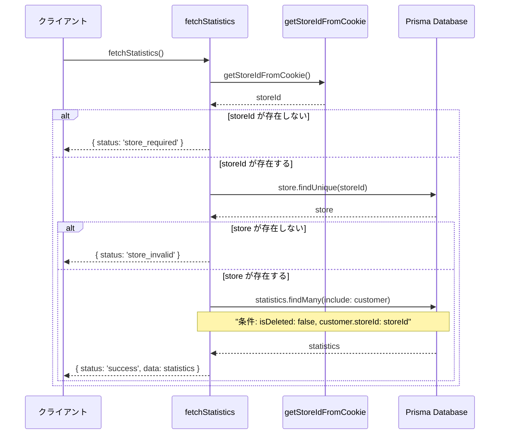
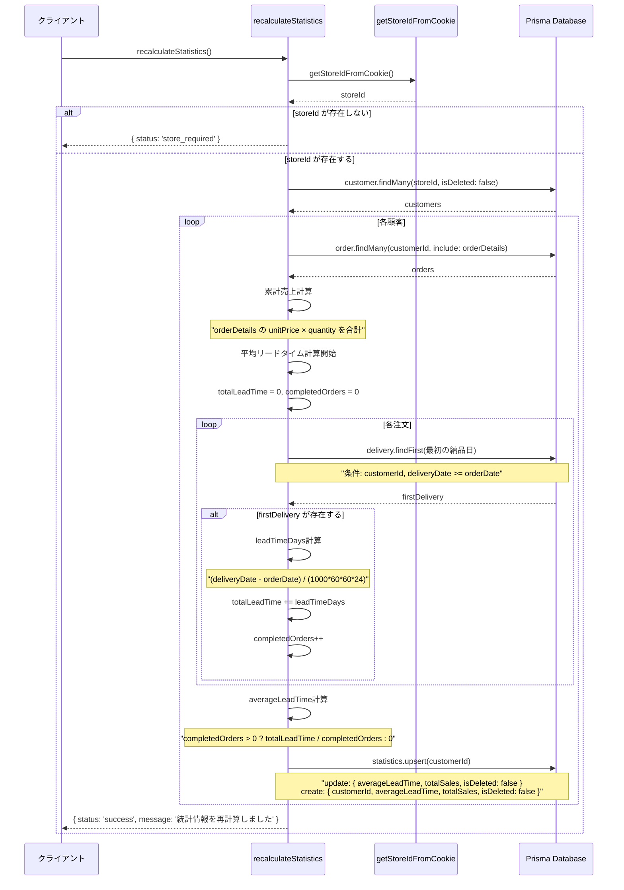
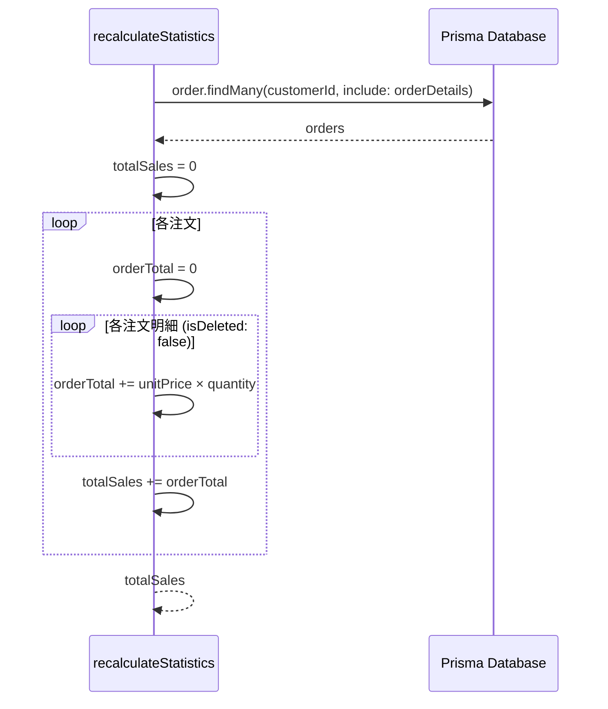
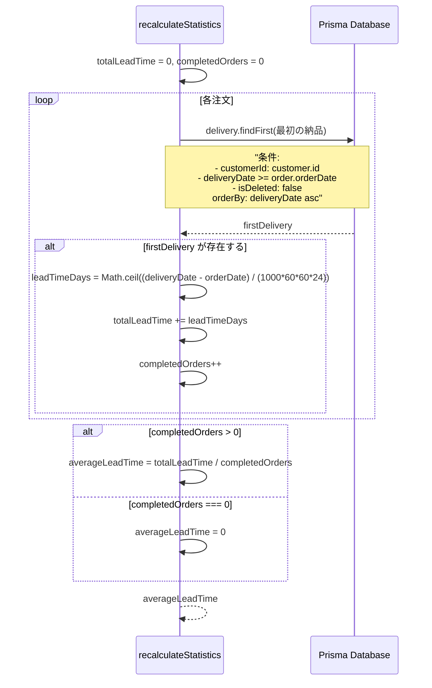
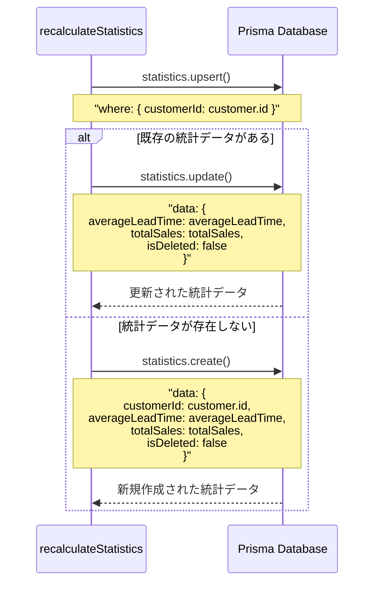
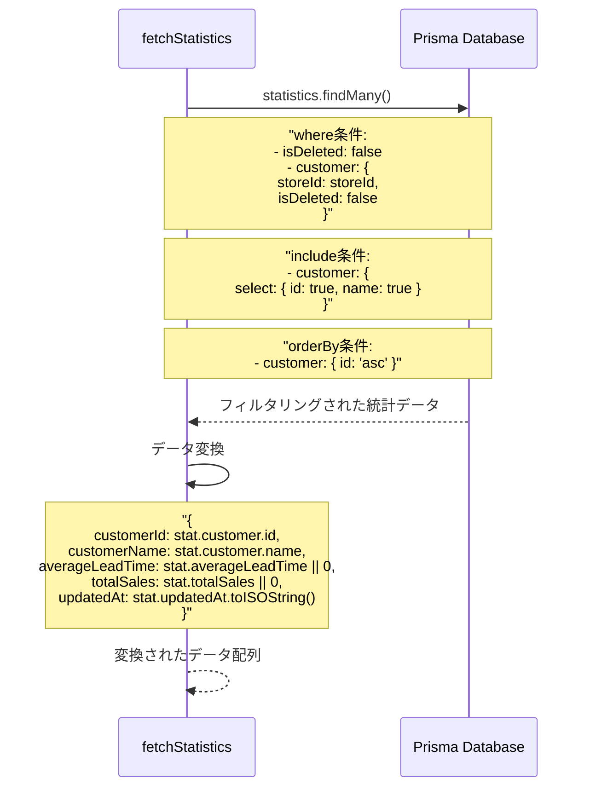
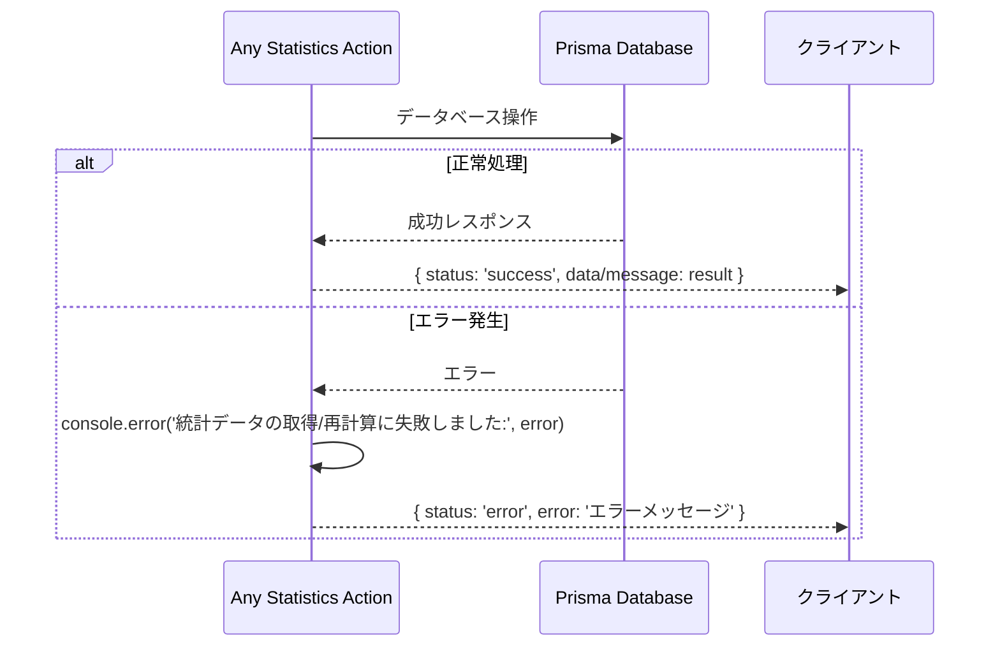

# statisticsActions.ts - シーケンス図

## 概要
統計情報管理に関するServer Actionsの処理フローを示すシーケンス図です。

## 1. 統計情報取得 (fetchStatistics)

## 2. 統計情報再計算 (recalculateStatistics)

## 詳細な統計計算処理

### 累計売上計算

### 平均リードタイム計算

### 統計データの更新・作成

## データ取得時のフィルタリング

## エラーハンドリング

## 統計計算の処理フロー概要

**統計情報再計算処理フロー**
1. 統計情報再計算開始 → 店舗IDチェック → 顧客一覧取得
2. 各顧客に対して繰り返し処理：
   - 注文データ取得
   - 累計売上計算
   - リードタイム計算
   - 平均リードタイム算出
   - 統計データ更新/作成
3. 次の顧客がある場合は繰り返し、ない場合は完了

このフローにより、各顧客の統計情報が正確に計算・更新されます。

## 共通処理パターン

### 店舗チェック
1. `getStoreIdFromCookie()` で店舗ID取得
2. 店舗IDの存在チェック
3. 店舗の有効性チェック

### データ整合性
1. 削除済みデータの除外
2. 店舗に属するデータのみ処理
3. NULL値の適切な処理（|| 0）

### 計算精度
1. 日数計算時の Math.ceil 使用
2. 0除算の防止
3. 小数点以下の適切な処理