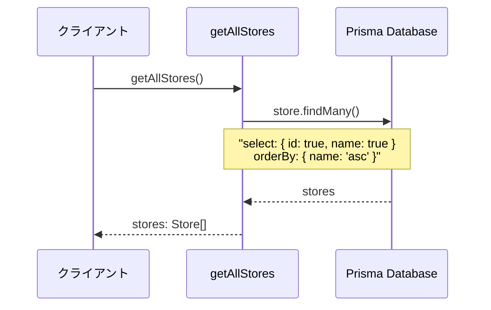
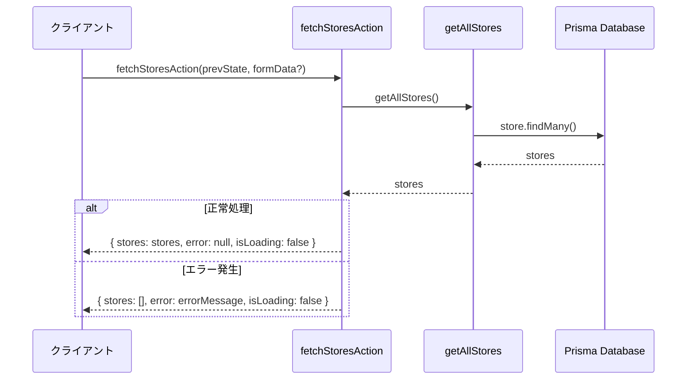
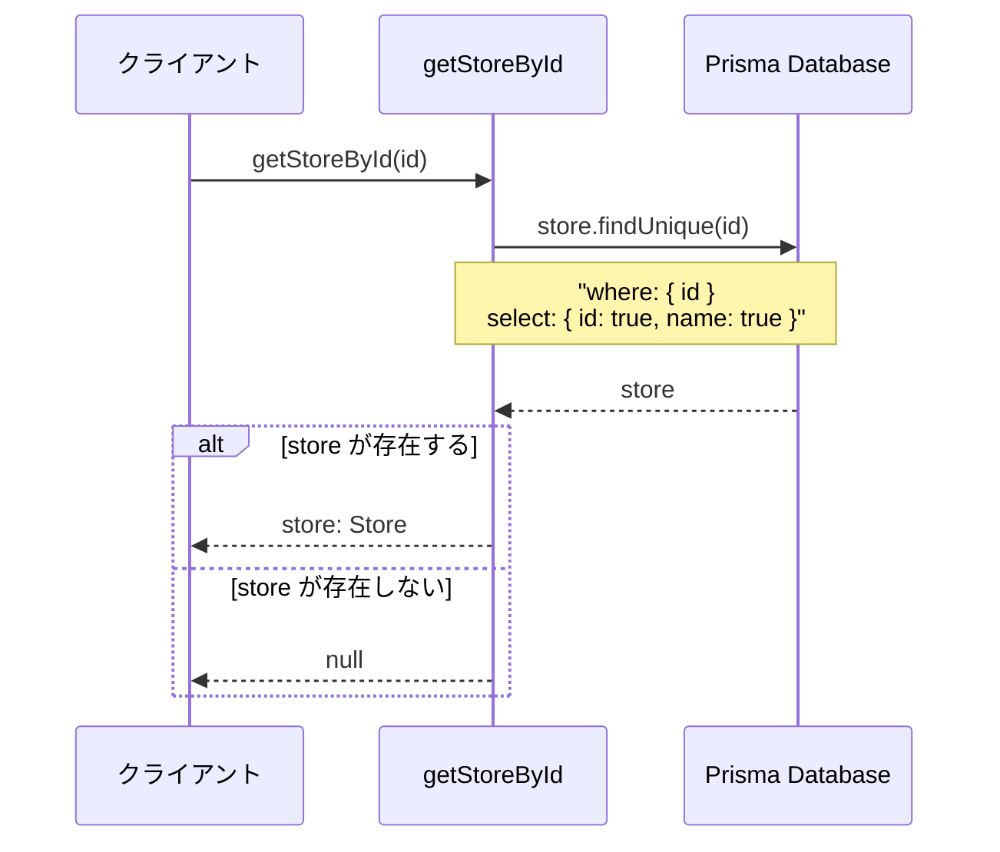
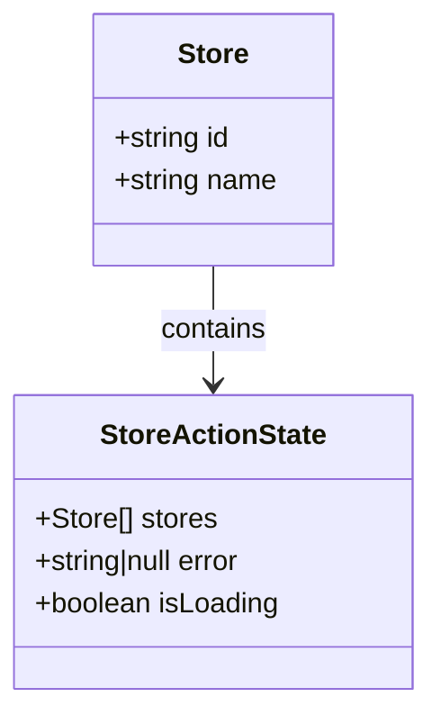
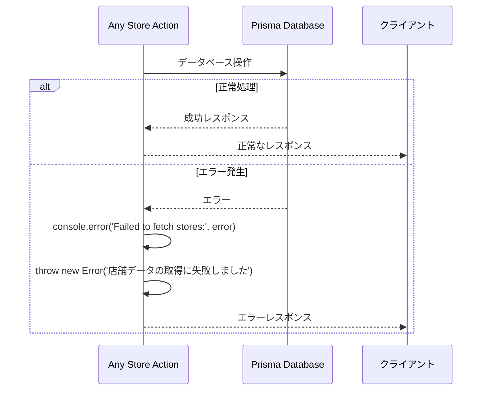
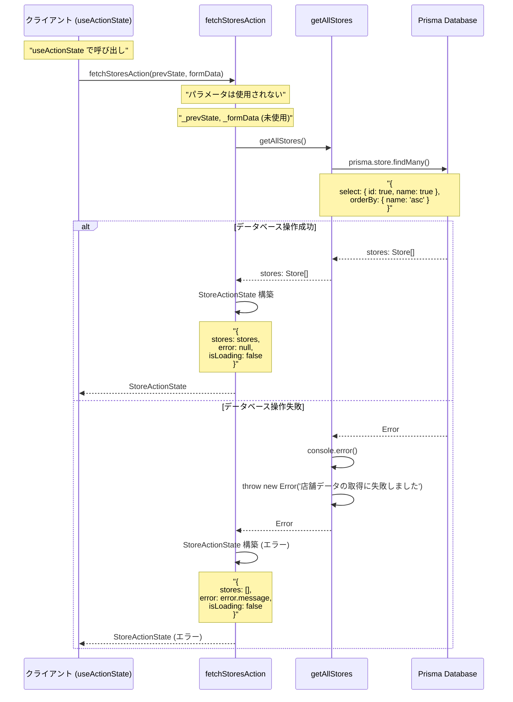
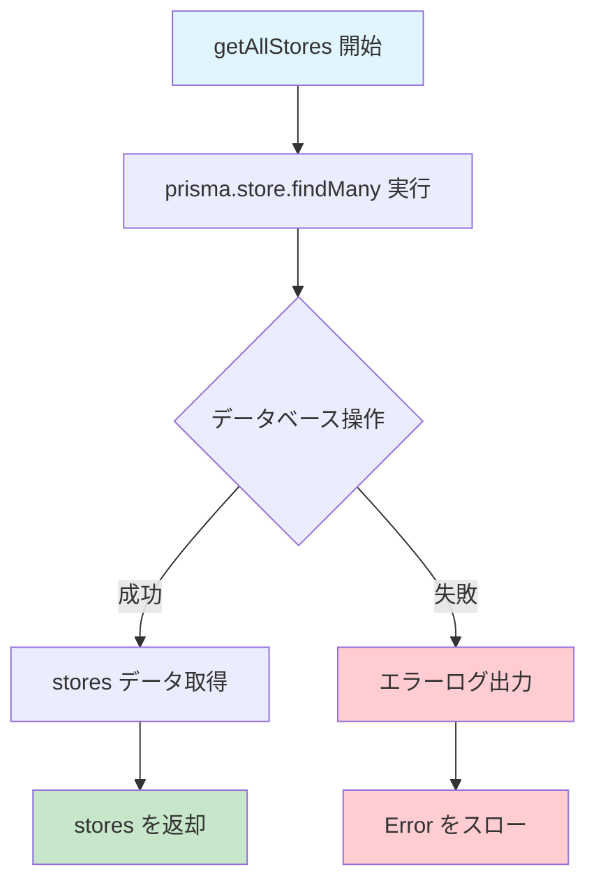
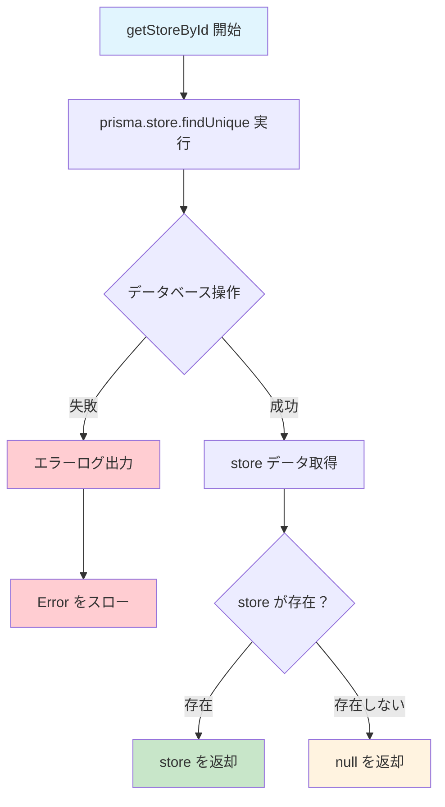

# storeActions.ts - シーケンス図

## 概要
店舗管理に関するServer Actionsの処理フローを示すシーケンス図です。

## 1. 全店舗取得 (getAllStores)

## 2. useActionState用店舗取得 (fetchStoresAction)

## 3. 店舗ID別取得 (getStoreById)

## データ型定義

## エラーハンドリングパターン

## fetchStoresAction の詳細フロー

## getAllStores の詳細処理

## getStoreById の詳細処理

## 共通処理パターン

### シンプルなデータ取得
1. 直接的なPrismaクエリ実行
2. 最小限のデータ選択 (id, name のみ)
3. 名前順でのソート

### エラーハンドリング
1. try-catch による例外処理
2. 詳細なエラーログ出力
3. ユーザーフレンドリーなエラーメッセージ

### 型安全性
1. TypeScript インターフェースの活用
2. Store, StoreActionState 型の定義
3. 明確な戻り値の型指定

## 使用場面

### getAllStores
- 店舗選択コンポーネントでの店舗一覧表示
- システム管理画面での店舗情報表示

### fetchStoresAction  
- React の useActionState フックとの連携
- フォーム送信後の店舗データ再取得

### getStoreById
- 特定店舗の詳細情報取得
- 店舗存在確認処理