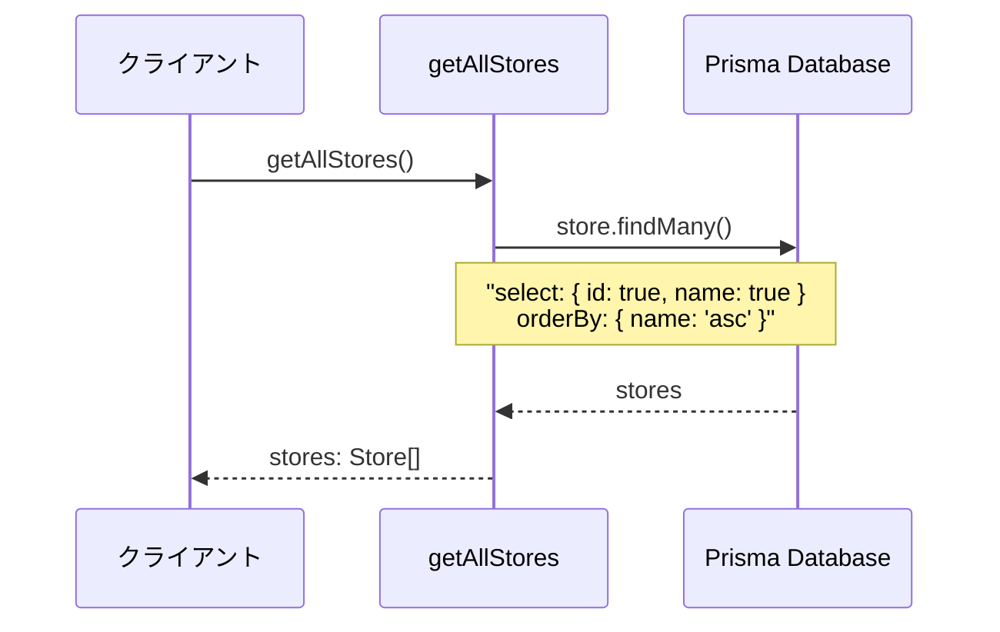
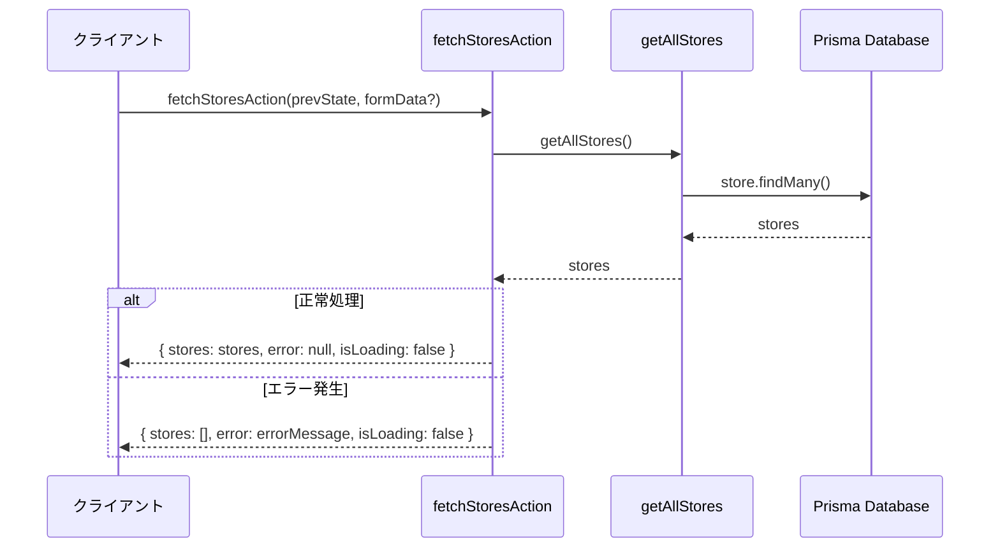
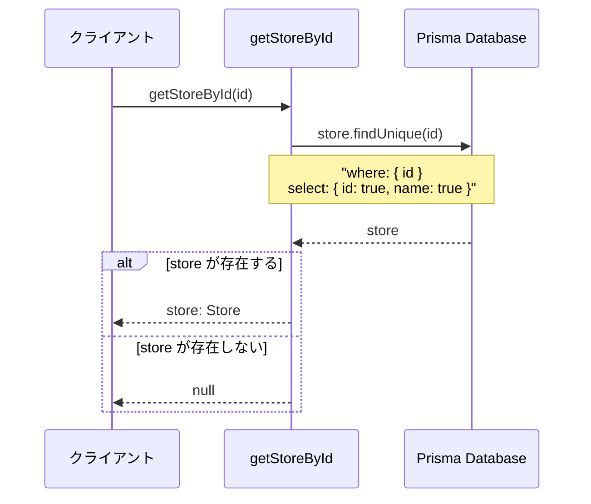
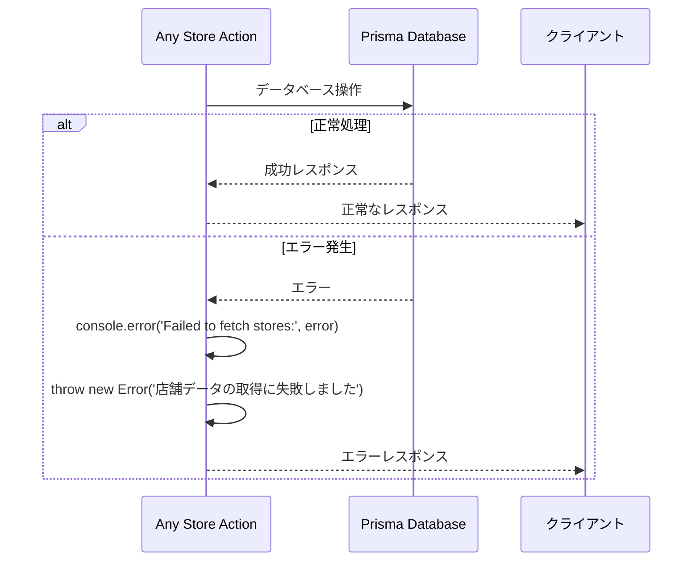
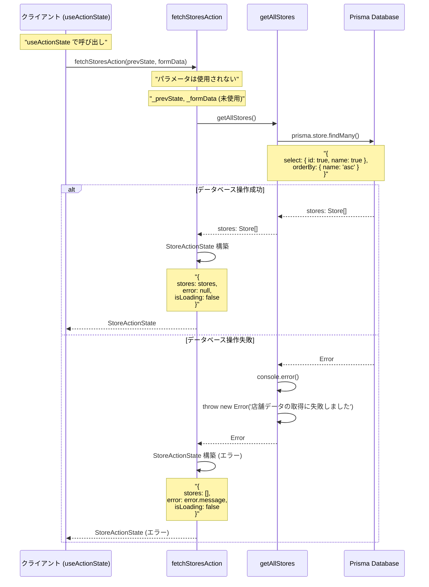

# storeActions.ts - シーケンス図

## 概要
店舗管理に関するServer Actionsの処理フローを示すシーケンス図です。

## 1. 全店舗取得 (getAllStores)

## 2. useActionState用店舗取得 (fetchStoresAction)

## 3. 店舗ID別取得 (getStoreById)

## データ型定義

**Store Actions データ構造**
- Store: id、name フィールドを持つ店舗データ
- StoreActionState: stores、error、isLoading フィールドで useActionState 用の状態を管理

StoreActionState は Store の配列を含み、React の状態管理と連携します。

## エラーハンドリングパターン

## fetchStoresAction の詳細フロー

## getAllStores の詳細処理

**getAllStores 処理フロー**
1. getAllStores 開始 → prisma.store.findMany 実行
2. データベース操作結果による分岐：
   - 成功: stores データ取得 → stores を返却
   - 失敗: エラーログ出力 → Error をスロー

この処理により、安全に店舗データを取得できます。

## getStoreById の詳細処理

**getStoreById 処理フロー**
1. getStoreById 開始 → prisma.store.findUnique 実行
2. データベース操作結果による分岐：
   - 成功: store データ取得 → store 存在チェック
     - 存在する: store を返却
     - 存在しない: null を返却
   - 失敗: エラーログ出力 → Error をスロー

この処理により、安全に特定店舗のデータを取得できます。

## 共通処理パターン

### シンプルなデータ取得
1. 直接的なPrismaクエリ実行
2. 最小限のデータ選択 (id, name のみ)
3. 名前順でのソート

### エラーハンドリング
1. try-catch による例外処理
2. 詳細なエラーログ出力
3. ユーザーフレンドリーなエラーメッセージ

### 型安全性
1. TypeScript インターフェースの活用
2. Store, StoreActionState 型の定義
3. 明確な戻り値の型指定

## 使用場面

### getAllStores
- 店舗選択コンポーネントでの店舗一覧表示
- システム管理画面での店舗情報表示

### fetchStoresAction  
- React の useActionState フックとの連携
- フォーム送信後の店舗データ再取得

### getStoreById
- 特定店舗の詳細情報取得
- 店舗存在確認処理