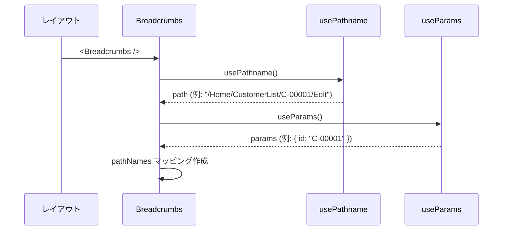
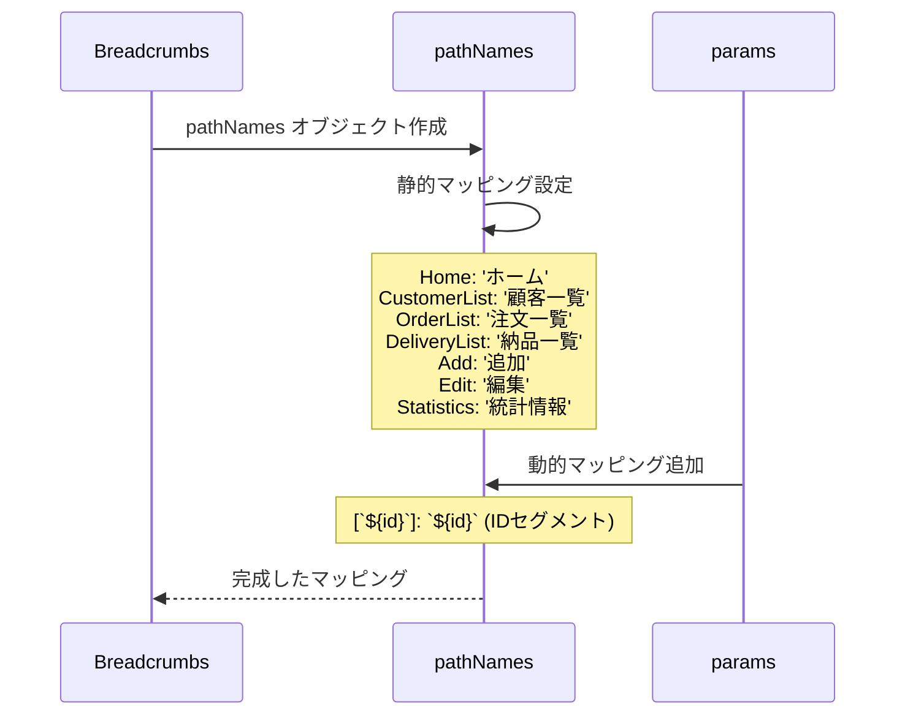
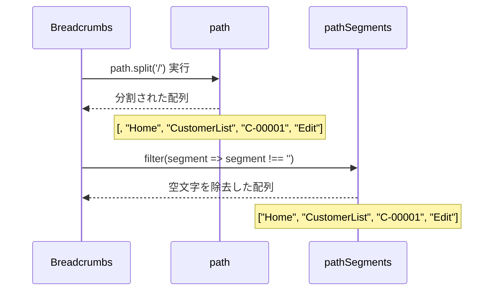
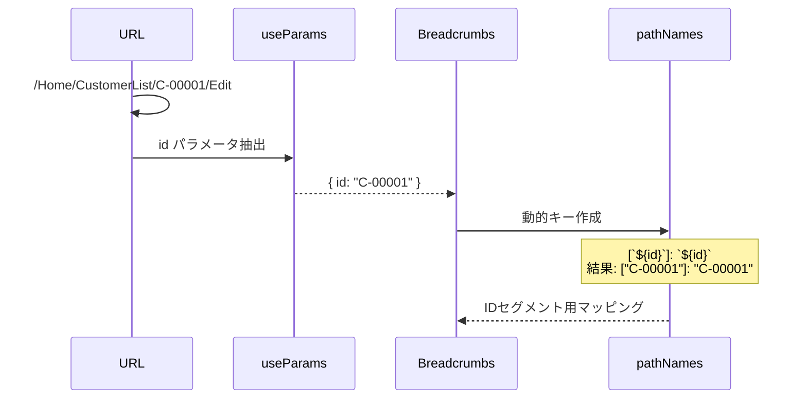
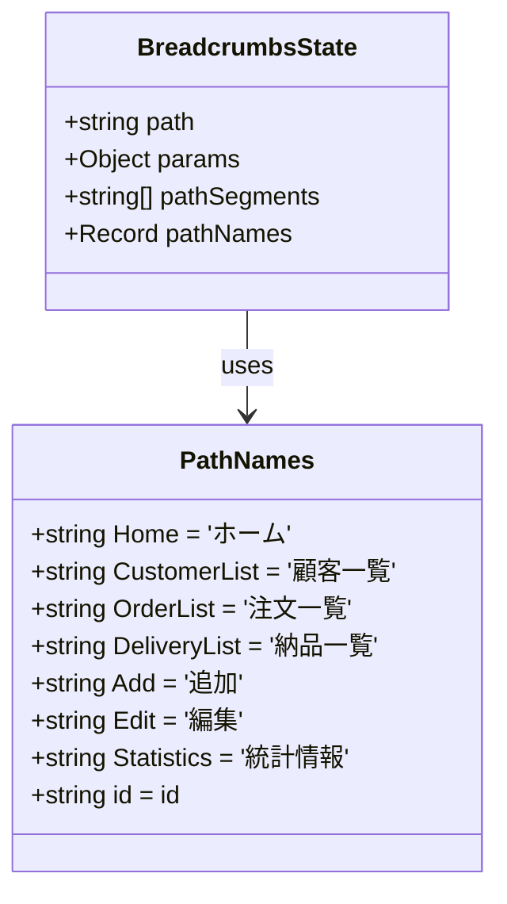
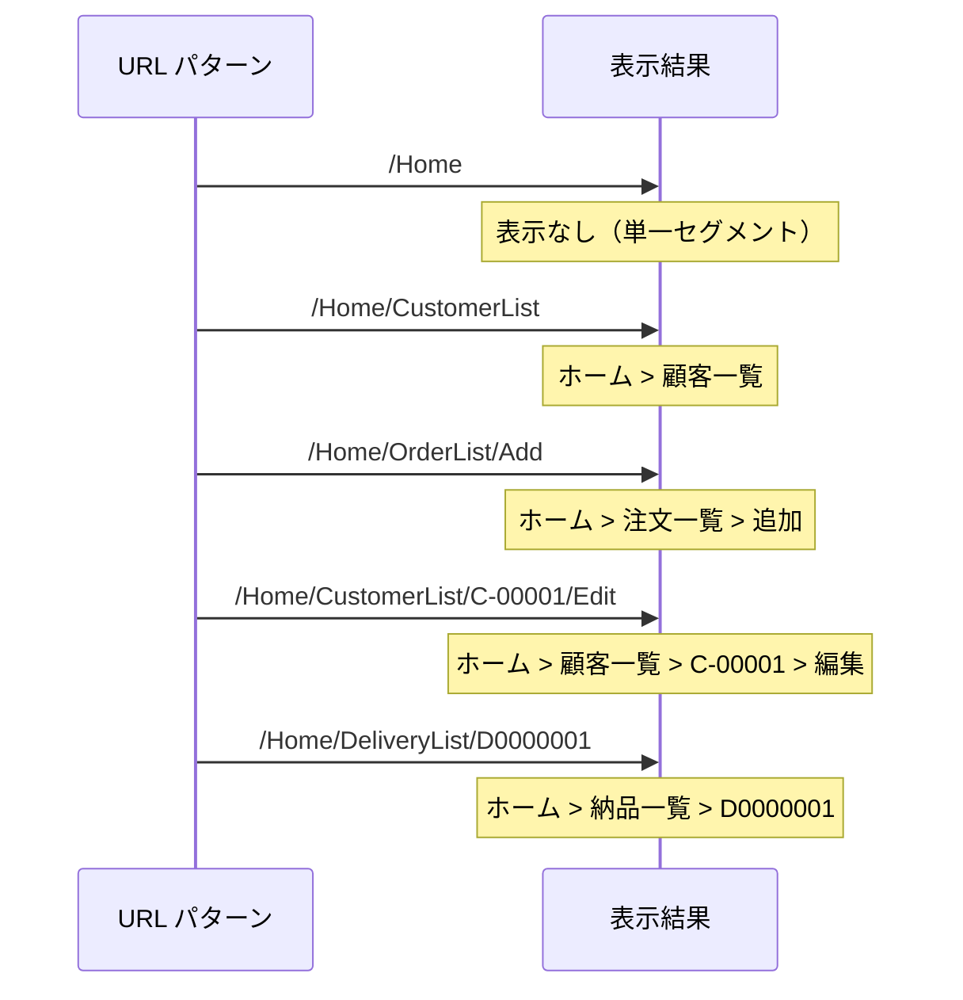

# Breadcrumbs.tsx - シーケンス図

## 概要
パンくずリストコンポーネントの処理フローを示すシーケンス図です。

## 1. コンポーネント初期化



## 2. パス名マッピング処理



## 3. パスセグメント分割



## 4. パンくずリスト生成

```mermaid
sequenceDiagram
    participant Breadcrumbs as Breadcrumbs
    participant Segments as pathSegments
    participant Link as Link
    participant ChevronRight as ChevronRight

    Breadcrumbs->>Breadcrumbs: pathSegments.length チェック
    
    alt pathSegments.length <= 1
        Breadcrumbs->>Breadcrumbs: 空の span 返却
        Note over Breadcrumbs: ホームページなど
    else pathSegments.length > 1
        loop 各セグメントに対して
            Breadcrumbs->>Breadcrumbs: index < pathSegments.length - 1 チェック
            
            alt 最後のセグメントでない
                Breadcrumbs->>Link: Link コンポーネント生成
                Note over Link: href: /${pathSegments.slice(0, index + 1).join('/')}
                Link->>Link: pathNames[segment] でラベル設定
                Breadcrumbs->>ChevronRight: 区切り矢印追加
            else 最後のセグメント
                Breadcrumbs->>Breadcrumbs: span でテキスト表示
                Note over Breadcrumbs: pathNames[segment] (リンクなし)
            end
        end
    end
```

## 5. レスポンシブ表示

```mermaid
flowchart TD
    A[Breadcrumbs レンダリング] --> B[レスポンシブクラス適用]
    
    B --> C[テキストサイズ調整]
    C --> D[text-sm md:text-base]
    
    B --> E[パディング調整]
    E --> F[px-2 py-1]
    
    B --> G[アイコンサイズ]
    G --> H[ChevronRight size={16}]
    
    B --> I[リンクスタイル]
    I --> J[text-blue-500 hover:underline]
    
    style A fill:#e1f5fe
    style D fill:#c8e6c9
    style F fill:#c8e6c9
    style H fill:#c8e6c9
    style J fill:#c8e6c9
```

## 6. 動的ID処理



## データフローとマッピング



## URL パターンと表示例



## リンク生成ロジック

```mermaid
sequenceDiagram
    participant Breadcrumbs as Breadcrumbs
    participant SliceJoin as slice & join
    participant Link as Link

    Breadcrumbs->>SliceJoin: pathSegments.slice(0, index + 1)
    Note over SliceJoin: 現在の位置まで切り取り
    SliceJoin->>SliceJoin: .join('/') でパス構築
    SliceJoin-->>Link: href パス
    
    Note over Link: 例: index=1 の場合<br/>["Home", "CustomerList"] → "/Home/CustomerList"
    
    Link->>Link: Link コンポーネント生成
    Link-->>Breadcrumbs: クリック可能なリンク
```

## 特徴

### 1. 動的ナビゲーション
- 現在のURLに基づく自動生成
- URLパラメータの適切な処理

### 2. 階層表示
- パスの階層構造を視覚化
- クリック可能なナビゲーション

### 3. 多言語対応
- 英語セグメントを日本語表示
- カスタマイズ可能なマッピング

### 4. レスポンシブデザイン
- モバイル/デスクトップ対応
- 適応的なサイズ調整

### 5. UX最適化
- 現在位置の明確な表示
- 直感的なナビゲーション

## 使用パターン

### Layout での統合
```typescript
export default function Layout({ children }) {
  return (
    <div>
      <Header />
      <Breadcrumbs />
      <main>{children}</main>
    </div>
  );
}
```

### カスタムマッピング拡張
```typescript
// 新しいページ追加時
const pathNames = {
  ...existingPathNames,
  NewPage: '新しいページ',
  Settings: '設定',
};
```

## 制限と考慮事項

### 1. 単一セグメント
- パスが1つ以下の場合は非表示
- ホームページでは表示されない

### 2. IDパラメータ
- 動的IDをそのまま表示
- より読みやすい名前への変換は未実装

### 3. ネストした動的ルート
- 複数の動的パラメータは考慮されていない
- 現在は `id` パラメータのみ対応