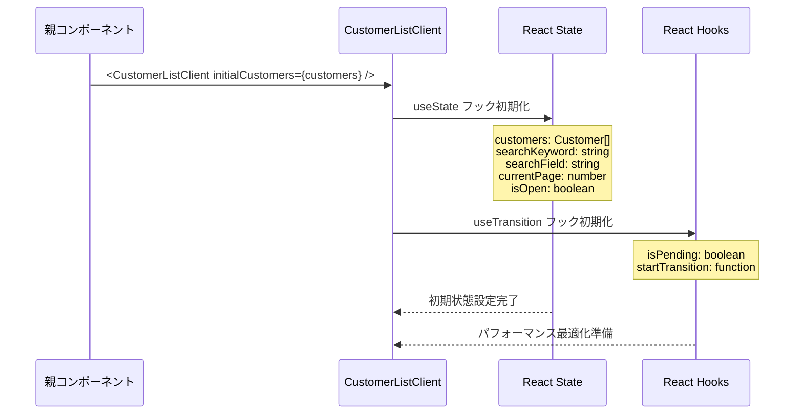
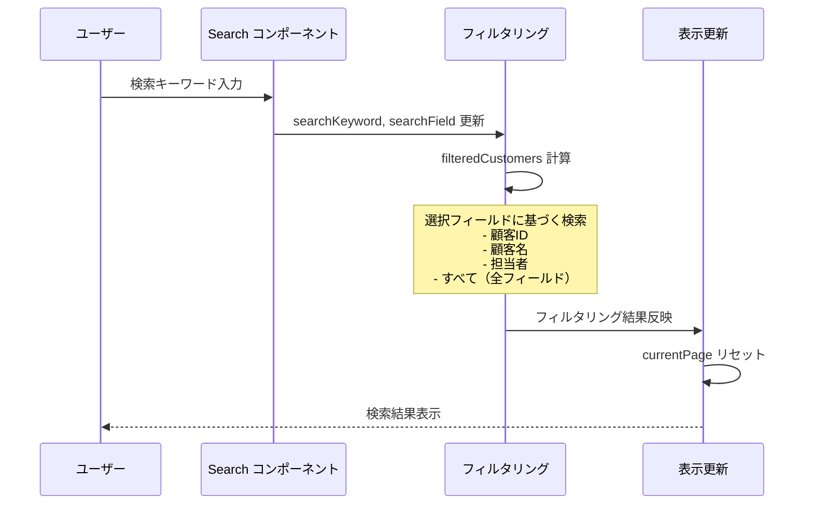
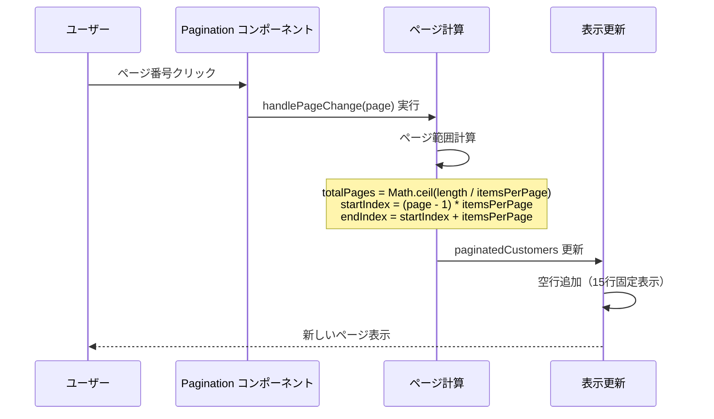
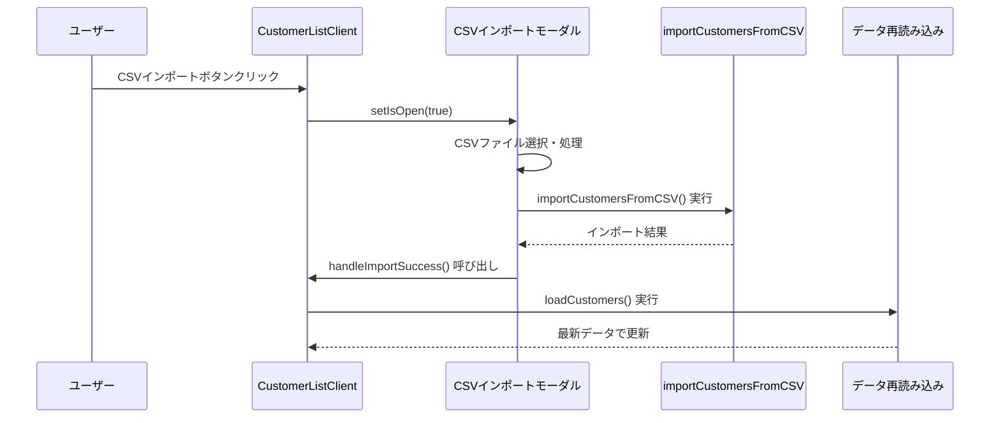
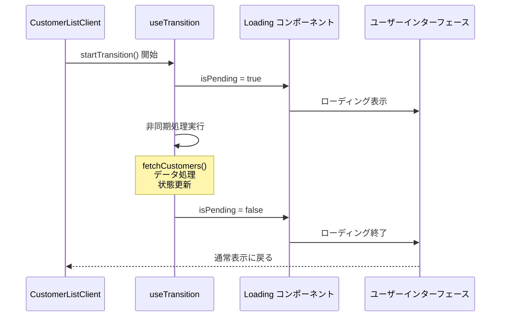
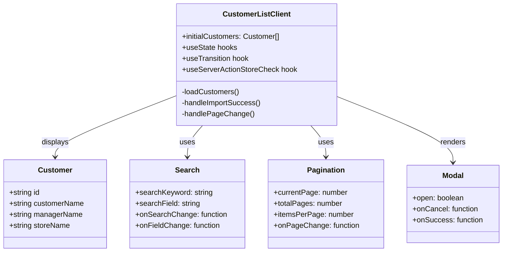
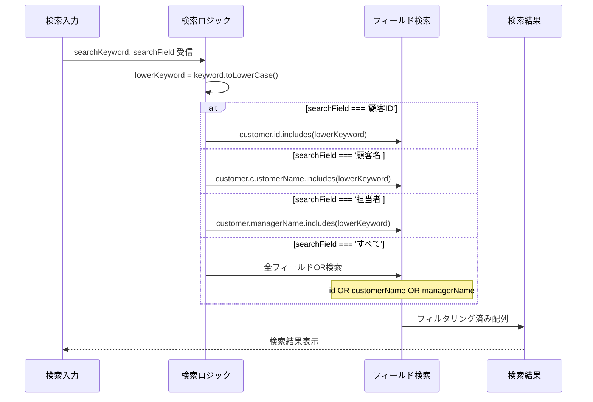
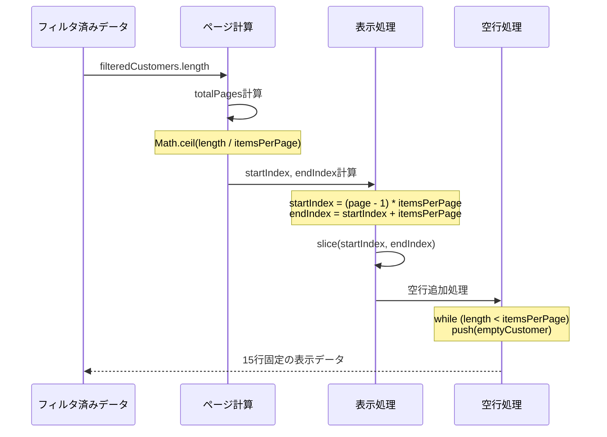
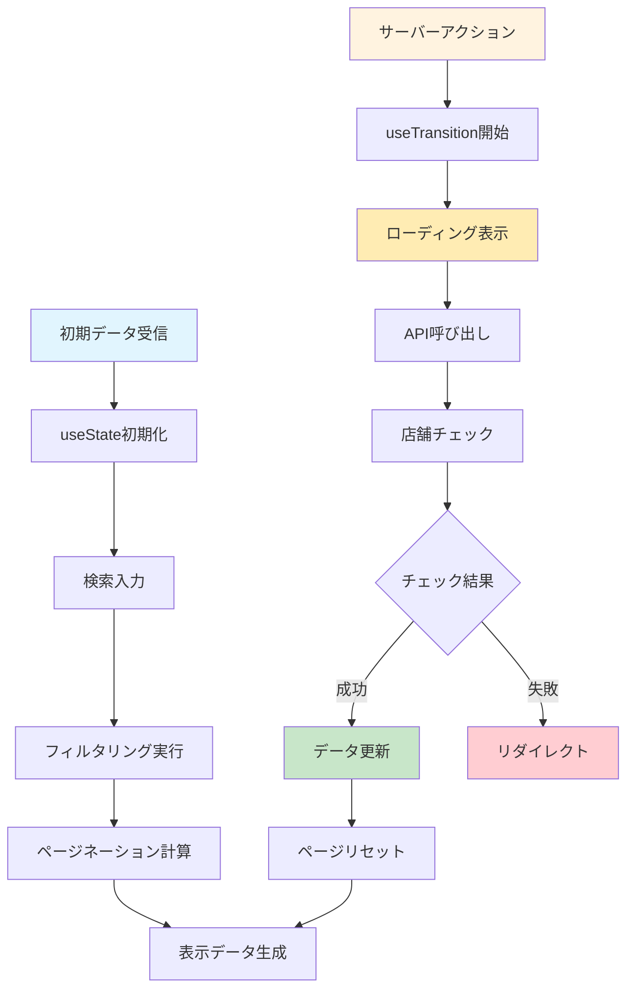
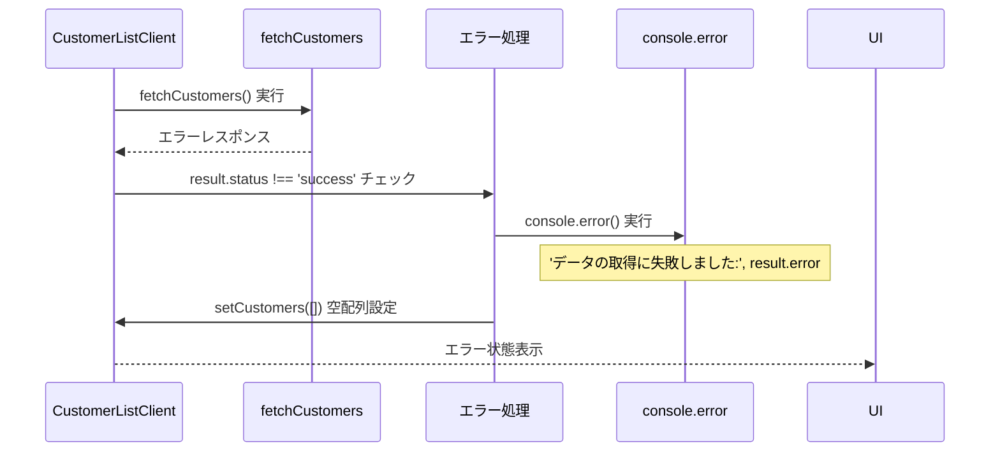

# CustomerListClient Component - シーケンス図

## 概要
顧客一覧クライアントコンポーネントの処理フローを示すシーケンス図です。

## 1. コンポーネント初期化



## 2. データ検索とフィルタリング



## 3. ページネーション処理



## 4. サーバーアクション呼び出し

```mermaid
sequenceDiagram
    participant User as ユーザー
    participant Client as CustomerListClient
    participant Transition as useTransition
    participant ServerAction as fetchCustomers
    parameter StoreCheck as useServerActionStoreCheck

    User->>Client: データ再読み込み要求
    Client->>Transition: startTransition() 実行
    Transition->>ServerAction: fetchCustomers() 呼び出し
    
    ServerAction-->>Client: Server Action 結果
    Client->>StoreCheck: checkStoreRequirement(result)
    
    alt 店舗チェック通過
        StoreCheck-->>Client: 処理続行
        Client->>Client: setCustomers(result.data)
        Client->>Client: setCurrentPage(1)
    else 店舗選択必要
        StoreCheck->>Browser: リダイレクト実行
    end
```

## 5. CSVインポート統合



## 6. ローディング状態管理



## コンポーネント構造



## 検索ロジック詳細



## ページネーション計算



## 状態更新フロー



## エラーハンドリング



## 特徴

### 1. パフォーマンス最適化
- useTransition による非ブロッキング更新
- 適切な状態管理

### 2. リアルタイム検索
- 入力に応じた即座のフィルタリング
- 複数フィールド対応

### 3. 固定レイアウト
- 15行固定表示による安定したUI
- 空行自動補完

### 4. サーバー統合
- Server Actions との連携
- 店舗要件チェック

### 5. CSVインポート対応
- モーダルとの統合
- 成功時の自動データ更新

## パフォーマンス考慮

### React最適化
- useTransition による優先度付きレンダリング
- 不要な再レンダリングの回避

### メモリ効率
- 効率的なフィルタリング処理
- 適切なページング実装

### ユーザー体験
- スムーズなローディング表示
- レスポンシブな検索機能

## 拡張可能性

### ソート機能追加
```typescript
const [sortConfig, setSortConfig] = useState<{
  field: keyof Customer;
  direction: 'asc' | 'desc';
} | null>(null);
```

### バッチ操作
```typescript
const [selectedCustomers, setSelectedCustomers] = useState<string[]>([]);
const handleBatchDelete = async (customerIds: string[]) => {
  // バッチ削除処理
};
```

### フィルタ保存
```typescript
const [savedFilters, setSavedFilters] = useState<SearchFilter[]>([]);
const saveCurrentFilter = () => {
  // フィルタ保存処理
};
```