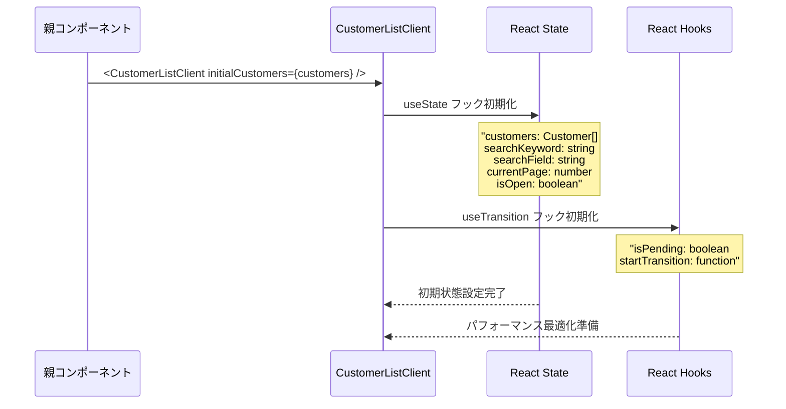
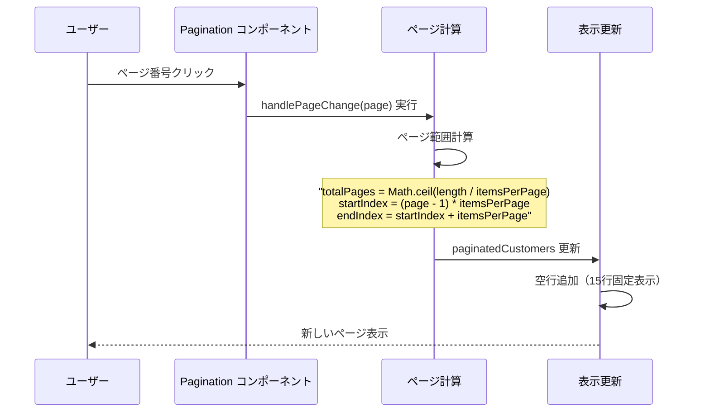
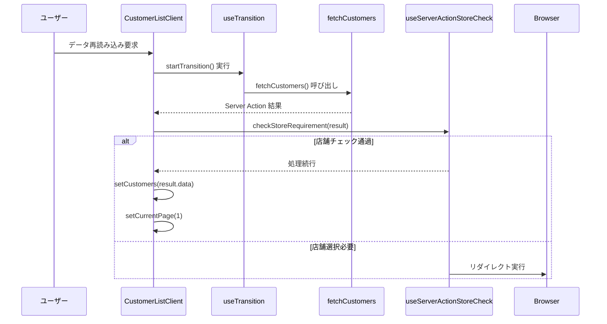
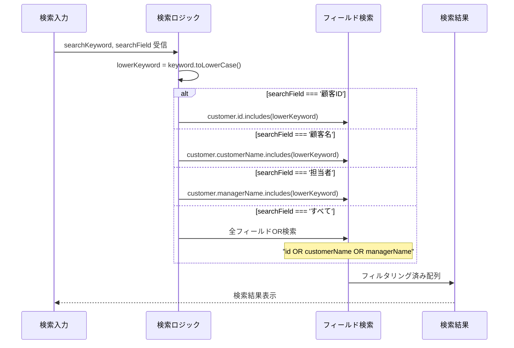
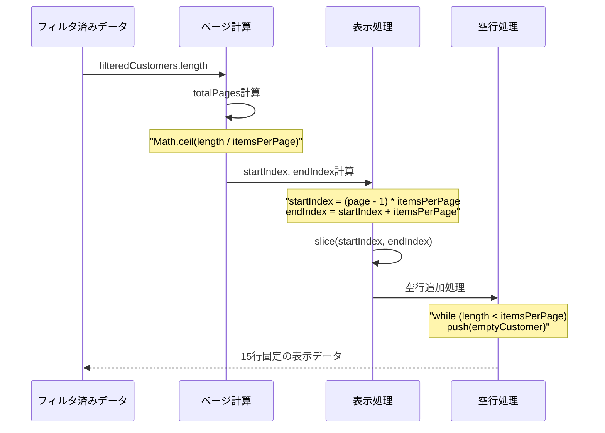

# CustomerListClient Component - シーケンス図

## 概要
顧客一覧クライアントコンポーネントの処理フローを示すシーケンス図です。

## 1. コンポーネント初期化



## 2. データ検索とフィルタリング


## 3. ページネーション処理



## 4. サーバーアクション呼び出し



## 5. CSVインポート統合


## 6. ローディング状態管理


## コンポーネント構造

CustomerListClientコンポーネントの構造と関連コンポーネント：

### CustomerListClientメインクラス
顧客一覧の中心となるコンポーネント：
- **initialCustomers: Customer[]** - サーバーから受け取った初期顧客データ
- **useState hooks** - 顧客リスト、検索キーワード、現在ページなどの状態管理
- **useTransition hook** - 非ブロッキング更新のためのパフォーマンス最適化
- **useServerActionStoreCheck hook** - サーバーアクション実行時の店舗チェック
- **loadCustomers()** - プライベートメソッド: サーバーから顧客データを再取得
- **handleImportSuccess()** - プライベートメソッド: CSVインポート成功時の処理
- **handlePageChange()** - プライベートメソッド: ページ変更時の処理

### Customerエンティティ
顧客情報を表すデータ構造：
- **id: string** - 顧客の一意識別子
- **customerName: string** - 顧客の会社名または名前
- **managerName: string** - 担当者の氏名
- **storeName: string** - 所属店舗の名前

### Search検索コンポーネント
顧客検索機能を提供：
- **searchKeyword: string** - 検索キーワード文字列
- **searchField: string** - 検索対象フィールド（顧客ID、顧客名、担当者、すべて）
- **onSearchChange: function** - 検索キーワード変更時のコールバック
- **onFieldChange: function** - 検索フィールド変更時のコールバック

### Paginationページネーションコンポーネント
ページ分割表示を管理：
- **currentPage: number** - 現在表示中のページ番号
- **totalPages: number** - 総ページ数
- **itemsPerPage: number** - 1ページあたりの表示項目数
- **onPageChange: function** - ページ変更時のコールバック

### Modalモーダルコンポーネント
CSVインポート機能を提供：
- **open: boolean** - モーダルの表示状態
- **onCancel: function** - キャンセル時のコールバック
- **onSuccess: function** - 成功時のコールバック

### 関係性
- CustomerListClientはCustomerエンティティを表示し、Search、Pagination、Modalコンポーネントを統合して包括的な顧客管理インターフェースを提供します。

## 検索ロジック詳細



## ページネーション計算



## 状態更新フロー

CustomerListClientの状態更新プロセスには2つの主要なフローがあります：

### クライアントサイド更新フロー
1. **初期データ受信** - サーバーからパスされた初期顧客データを受け取り
2. **useState初期化** - Reactの状態管理フックでコンポーネントの状態を初期化
3. **検索入力** - ユーザーが検索キーワードや検索フィールドを入力
4. **フィルタリング実行** - 検索条件に基づいて顧客データを絞り込み
5. **ページネーション計算** - フィルタ結果に基づいてページ数を計算
6. **表示データ生成** - 現在ページに表示すべきデータを準備し、空行で補完

### サーバーアクション更新フロー
1. **サーバーアクション** - ユーザーがデータ再読み込みやCSVインポートを実行
2. **useTransition開始** - React 18の同期機能で非ブロッキング更新を開始
3. **ローディング表示** - isPendingフラグによりユーザーに読み込み中であることを通知
4. **API呼び出し** - fetchCustomers()などのサーバーアクションを実行
5. **店舗チェック** - useServerActionStoreCheckフックで結果を検証

### 結果処理
#### 成功ケース
6. **データ更新** - 正常なレスポンスを受け取った場合、顧客データを更新
7. **ページリセット** - 現在ページを1ページ目にリセット
8. **表示データ生成** - 新しいデータで表示を更新

#### 失敗ケース
6. **リダイレクト** - 店舗チェックに失敗した場合、店舗選択ページへ自動リダイレクト

この2つのフローが連携して動作することで、ユーザーにはスムーズな検索体験と信頼性の高いデータ更新機能が提供されます。

## エラーハンドリング


## 特徴

### 1. パフォーマンス最適化
- useTransition による非ブロッキング更新
- 適切な状態管理

### 2. リアルタイム検索
- 入力に応じた即座のフィルタリング
- 複数フィールド対応

### 3. 固定レイアウト
- 15行固定表示による安定したUI
- 空行自動補完

### 4. サーバー統合
- Server Actions との連携
- 店舗要件チェック

### 5. CSVインポート対応
- モーダルとの統合
- 成功時の自動データ更新

## パフォーマンス考慮

### React最適化
- useTransition による優先度付きレンダリング
- 不要な再レンダリングの回避

### メモリ効率
- 効率的なフィルタリング処理
- 適切なページング実装

### ユーザー体験
- スムーズなローディング表示
- レスポンシブな検索機能

## 拡張可能性

### ソート機能追加
```typescript
const [sortConfig, setSortConfig] = useState<{
  field: keyof Customer;
  direction: 'asc' | 'desc';
} | null>(null);
```

### バッチ操作
```typescript
const [selectedCustomers, setSelectedCustomers] = useState<string[]>([]);
const handleBatchDelete = async (customerIds: string[]) => {
  // バッチ削除処理
};
```

### フィルタ保存
```typescript
const [savedFilters, setSavedFilters] = useState<SearchFilter[]>([]);
const saveCurrentFilter = () => {
  // フィルタ保存処理
};
```