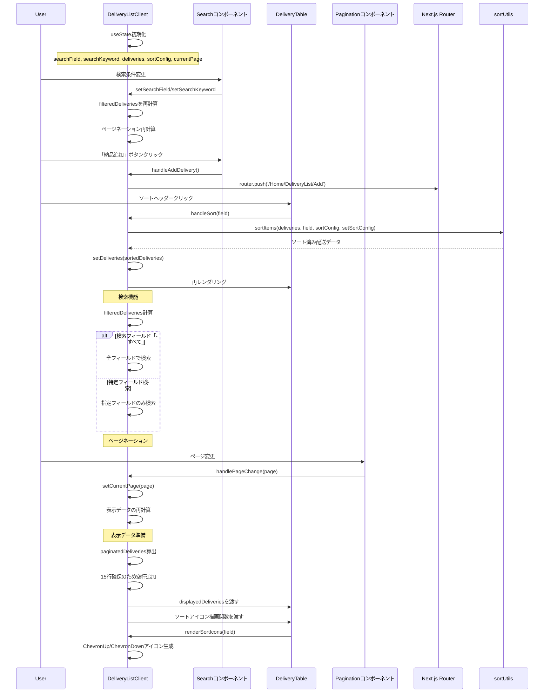

# DeliveryListClientコンポーネントのシーケンス図



## 概要

DeliveryListClientコンポーネント (`mbs/app/Home/DeliveryList/components/DeliveryListClient.tsx`) は、配送一覧画面のクライアントサイド機能を提供するメインコンポーネントです。

## 主要機能

### 1. 検索・フィルタリング機能
- **検索フィールド**: すべて、納品ID、納品日、顧客名、備考
- **リアルタイム検索**: 入力即座にフィルタリング実行
- **部分一致**: includes()による柔軟な検索

### 2. ソート機能
- **ソート対象**: 納品ID、納品日
- **双方向ソート**: 昇順・降順の切り替え
- **視覚的フィードバック**: lucide-reactアイコンによる状態表示

### 3. ページネーション
- **固定表示**: 15件/ページ
- **空行補完**: 不足分は空行で埋める
- **ページ情報**: 現在位置・総件数の表示

### 4. ナビゲーション
- **納品追加**: /Home/DeliveryList/Add への遷移
- **納品詳細**: 各行から詳細ページへのリンク

## 技術的特徴

### 1. 状態管理
```typescript
const [searchField, setSearchField] = useState<'すべて' | '納品ID' | '納品日' | '顧客名' | '備考' | '商品名'>('すべて');
const [deliveries, setDeliveries] = useState<Delivery[]>(initialDeliveries);
const [sortConfig, setSortConfig] = useState<SortConfig<Delivery> | null>({
  key: 'id',
  direction: 'asc',
});
```

### 2. 外部ライブラリ統合
- **lucide-react**: ChevronUp、ChevronDownアイコン
- **sortUtils**: 汎用ソート機能
- **Next.js Router**: ページ遷移

### 3. コンポーネント分離
- **Search**: 検索UI担当
- **DeliveryTable**: テーブル表示担当
- **Pagination**: ページング担当

### 4. データフロー最適化
```typescript
const filteredDeliveries = deliveries.filter((delivery) => {
  if (!searchKeyword) return true;
  // 検索ロジック
});
```

## 検索仕様

### 1. 全検索（すべて）
```typescript
delivery.id.includes(searchKeyword) ||
delivery.date.includes(searchKeyword) ||
delivery.customerName.includes(searchKeyword) ||
delivery.note.includes(searchKeyword)
```

### 2. フィールド別検索
- 納品ID: `delivery.id.includes(searchKeyword)`
- 納品日: `delivery.date.includes(searchKeyword)`
- 顧客名: `delivery.customerName.includes(searchKeyword)`
- 備考: `delivery.note.includes(searchKeyword)`

## ソート仕様

### 1. ソート可能フィールド
- **納品ID**: 文字列ソート
- **納品日**: 文字列ソート（ISO形式前提）

### 2. ソートアイコン表示
```typescript
const renderSortIcons = (field: keyof Delivery) => {
  const isActive = sortConfig?.key === field;
  const direction = sortConfig?.direction;
  return (
    <span className="ml-1 inline-flex flex-col">
      <ChevronUp className={isActive && direction === 'asc' ? 'text-gray-800' : 'text-gray-400'} />
      <ChevronDown className={isActive && direction === 'desc' ? 'text-gray-800' : 'text-gray-400'} />
    </span>
  );
};
```

## ページネーション仕様

### 1. 固定設定
- **1ページあたり**: 15件
- **空行補完**: 15行未満は空データで埋める

### 2. 表示計算
```typescript
const totalPages = Math.ceil(filteredDeliveries.length / itemsPerPage);
const startIndex = (currentPage - 1) * itemsPerPage;
const endIndex = startIndex + itemsPerPage;
const paginatedDeliveries = filteredDeliveries.slice(startIndex, endIndex);
```

## 使用技術

- **Next.js**: App Router、useRouter
- **React**: useState、関数コンポーネント
- **TypeScript**: 型安全なデータ操作
- **lucide-react**: アイコンライブラリ
- **カスタムコンポーネント**: Search、Pagination、DeliveryTable
- **ユーティリティ**: sortUtils

## レスポンシブ対応

### 1. コンテナレイアウト
```css
mx-auto flex min-h-142 max-w-screen-xl flex-col items-center p-2 sm:p-4 lg:p-5
```

### 2. テーブルスクロール
```css
w-full overflow-x-auto rounded-lg bg-white shadow-sm
```

## ファイルパス
`mbs/app/Home/DeliveryList/components/DeliveryListClient.tsx`