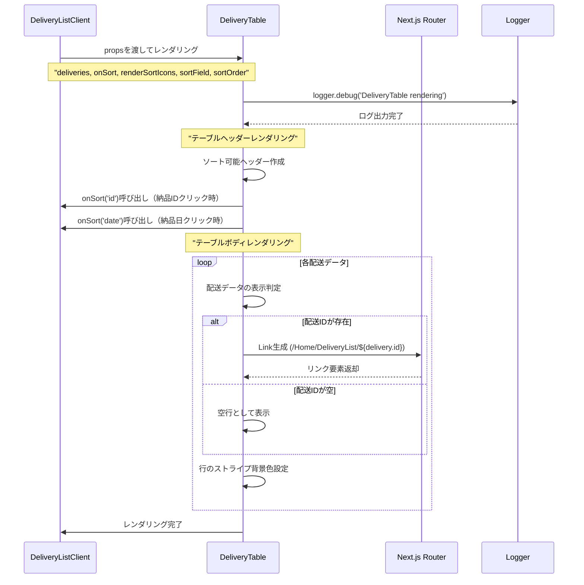

# DeliveryTableコンポーネントのシーケンス図



## 概要

DeliveryTableコンポーネント (`mbs/app/Home/DeliveryList/DeliveryTable.tsx`) は、配送一覧を表形式で表示する純粋な表示コンポーネントです。

## 主要機能

### 1. 配送データ表示
- **納品ID**: リンクとして表示（詳細ページへ遷移）
- **納品日**: YYYY-MM-DD形式で表示
- **顧客名**: 発注元の顧客名
- **備考**: 配送に関する備考

### 2. ソート機能
- **ソート可能フィールド**: 納品ID、納品日
- **視覚的フィードバック**: ソートアイコンの表示
- **コールバック**: 親コンポーネントへのソート要求

### 3. レスポンシブデザイン
- **モバイル対応**: 10px〜の極小フォント対応
- **タブレット**: 12px（sm）での中間サイズ
- **デスクトップ**: 14px（md）での標準サイズ
- **カラム幅**: min-width/max-widthによる柔軟な調整

### 4. 空行対応
- **固定行数**: 15行表示を前提とした設計
- **空データ**: IDが空の場合はリンク無しで表示

## 技術的特徴

### 1. 純粋コンポーネント設計
```typescript
export default function DeliveryTable({ 
  deliveries, 
  onSort, 
  renderSortIcons 
}: Props)
```

### 2. 型安全な設計
```typescript
export type Delivery = {
  id: string;
  date: string;
  customerName: string;
  note: string;
};
```

### 3. ログ統合
```typescript
logger.debug('DeliveryTable rendering', { deliveries })
```

### 4. 柔軟なソートシステム
- コールバック関数による疎結合
- 親コンポーネントでのソート状態管理

## UI/UX特徴

### 1. 視覚的階層
- **ヘッダー**: 青背景（bg-blue-300）
- **行**: 交互背景色（bg-blue-100 / bg-white）
- **ホバー**: 薄青背景（hover:bg-blue-200）

### 2. インタラクション
- **クリッカブルヘッダー**: cursor-pointerでソート可能示唆
- **リンク**: 青色下線付きでナビゲーション明示

### 3. レスポンシブ調整
```css
text-[10px] sm:text-xs md:text-sm
h-6 sm:h-8 md:h-10
px-1 sm:px-2 md:px-3
```

## 使用技術

- **Next.js**: Link コンポーネント
- **React**: 関数コンポーネント
- **TypeScript**: 型安全なprops定義
- **ログ**: @/lib/logger
- **CSS**: TailwindCSS、レスポンシブクラス

## Props インターフェース

- **deliveries**: 表示する配送データ配列
- **onSort**: ソート要求コールバック
- **renderSortIcons**: ソートアイコン描画関数
- **sortField**: 現在のソートフィールド（表示用）
- **sortOrder**: 現在のソート順序（表示用）

## ファイルパス
`mbs/app/Home/DeliveryList/DeliveryTable.tsx`