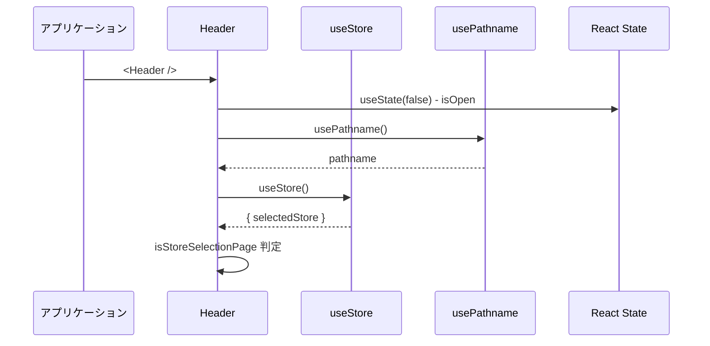
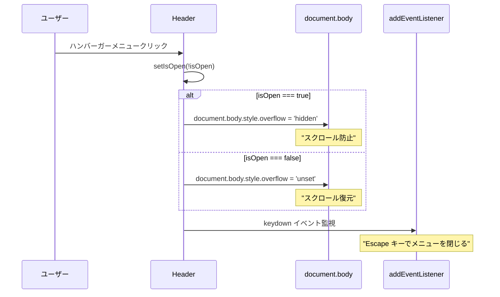
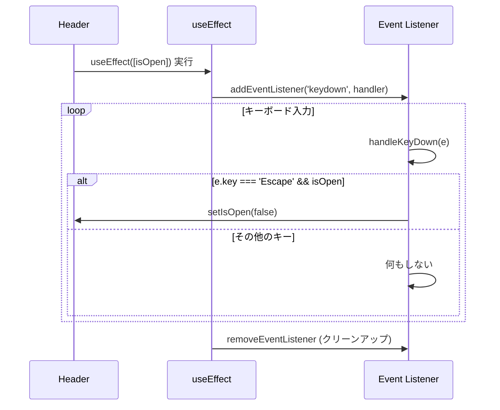
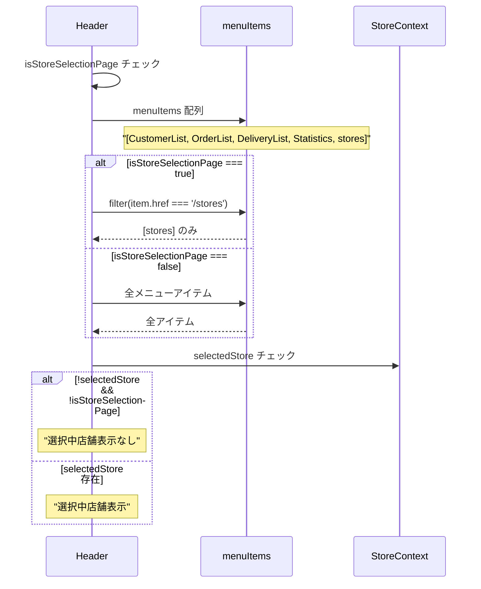
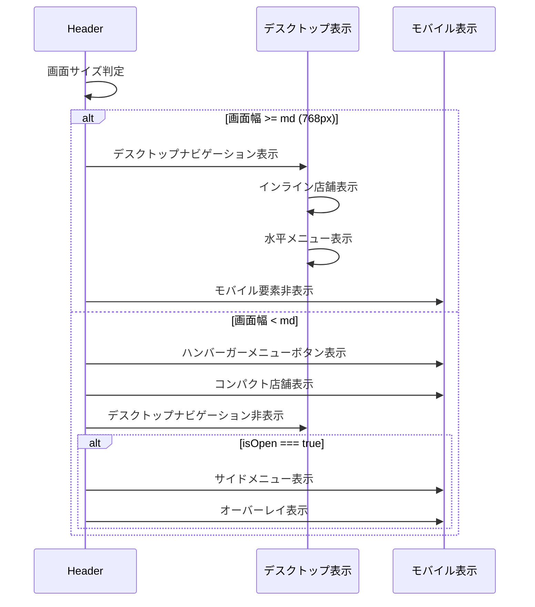
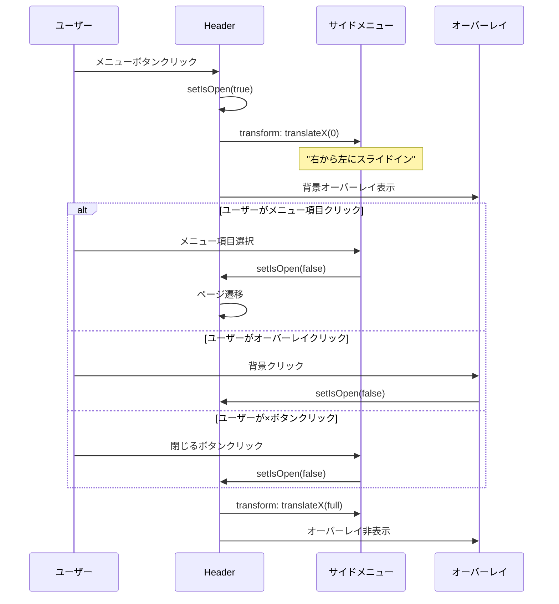
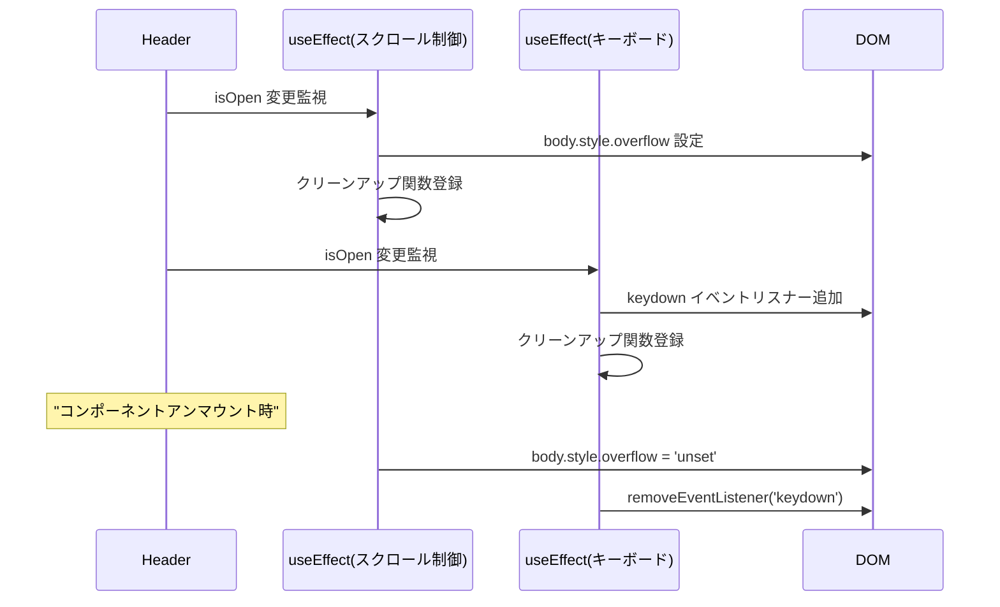

# Header.tsx - シーケンス図

## 概要
アプリケーションヘッダーコンポーネントの処理フローを示すシーケンス図です。

## 1. コンポーネント初期化



## 2. モバイルメニュー制御



## 3. キーボードイベント処理



## 4. メニューアイテム表示制御



## 5. レスポンシブ表示制御



## 6. モバイルメニューの開閉



## 7. 店舗表示の動的制御

**Header 店舗表示制御フロー**
1. Header レンダリング → selectedStore 存在チェック
2. selectedStore 存在状態による分岐：
   - 存在しない: 店舗表示なし
   - 存在する: isStoreSelectionPage チェック
     - 店舗選択ページ: 店舗表示なし
     - その他: 店舗表示あり
3. 店舗表示時の画面サイズ対応：
   - デスクトップ: フル店舗名表示 → アイコン + 店舗名
   - モバイル: 省略店舗名表示 → 最大20文字で truncate → アイコン + 店舗名

この制御により、適切なタイミングで店舗情報が表示されます。

## データ型とProps

**Header コンポーネントデータ構造**
- HeaderState: isOpen、pathname、selectedStore、isStoreSelectionPage の状態を管理
- MenuItem: href、label、icon フィールドを持つメニューアイテム
- Store: id、name フィールドを持つ店舗データ

HeaderState は Store を表示し、MenuItem を管理します。

## useEffect によるクリーンアップ



## 特徴

### 1. レスポンシブデザイン
- デスクトップ/モバイル自動切り替え
- 柔軟なレイアウト調整

### 2. アクセシビリティ
- キーボードナビゲーション対応
- aria-label 適切な設定
- フォーカス管理

### 3. UX最適化
- スムーズなアニメーション
- 直感的な操作性
- 視覚的フィードバック

### 4. 状態管理
- モバイルメニューの開閉状態
- 店舗選択状態の表示
- ページ状態に応じた表示制御

### 5. パフォーマンス
- 効率的な再レンダリング
- イベントリスナーの適切な管理
- CSS transform によるスムーズなアニメーション

## 使用パターン

### Layout での統合
```typescript
export default function Layout({ children }) {
  return (
    <div>
      <Header />
      <main>{children}</main>
    </div>
  );
}
```

### 条件付き表示
- 店舗選択ページでは簡素化表示
- 通常ページでは完全なナビゲーション