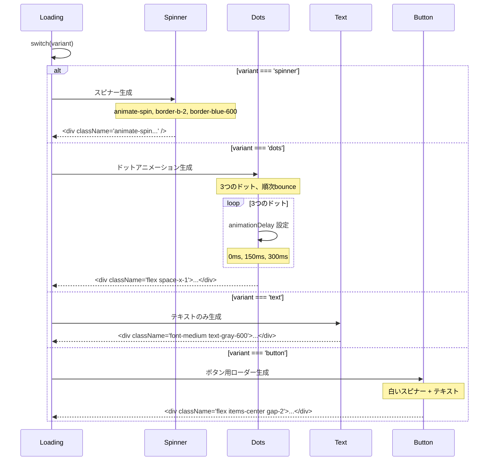
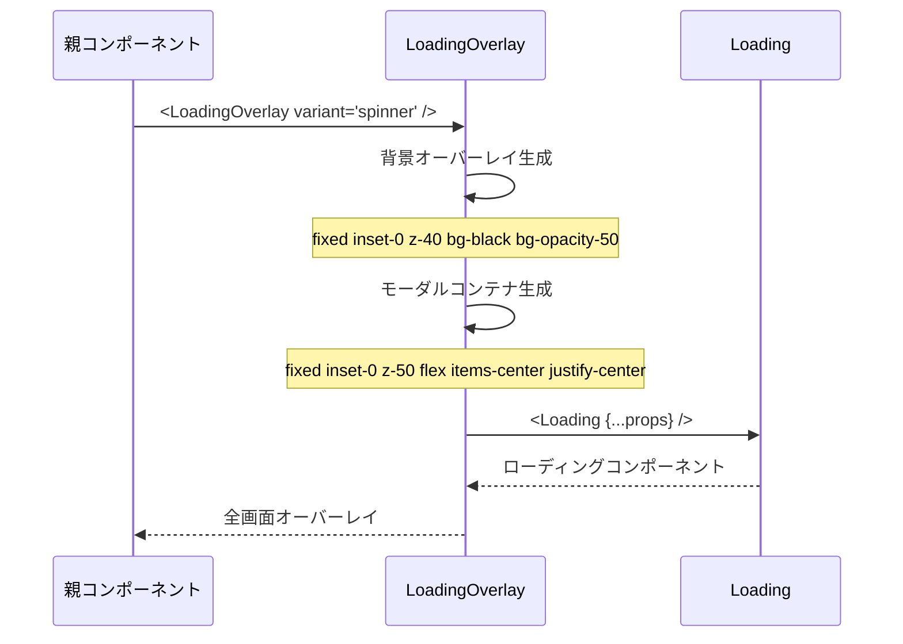
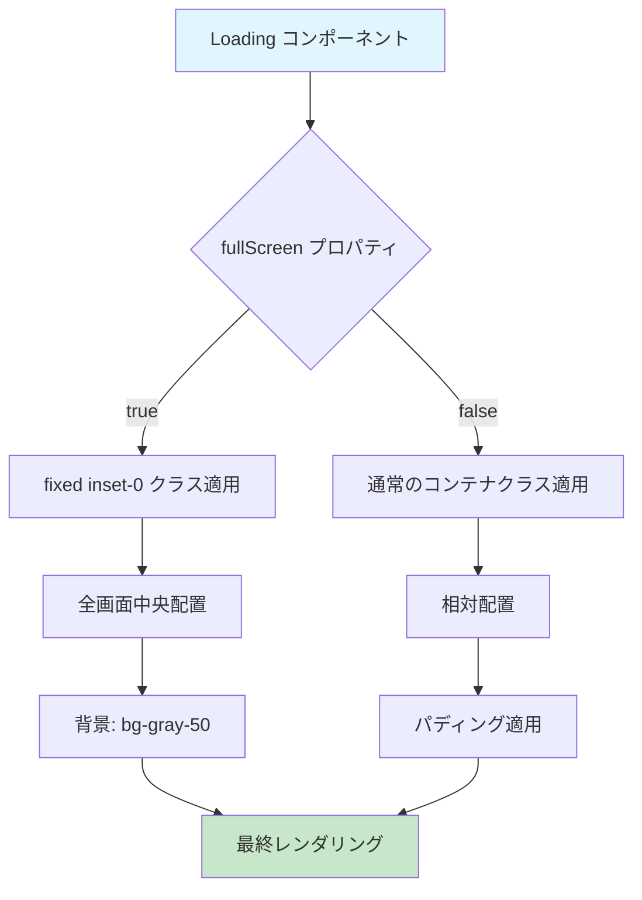
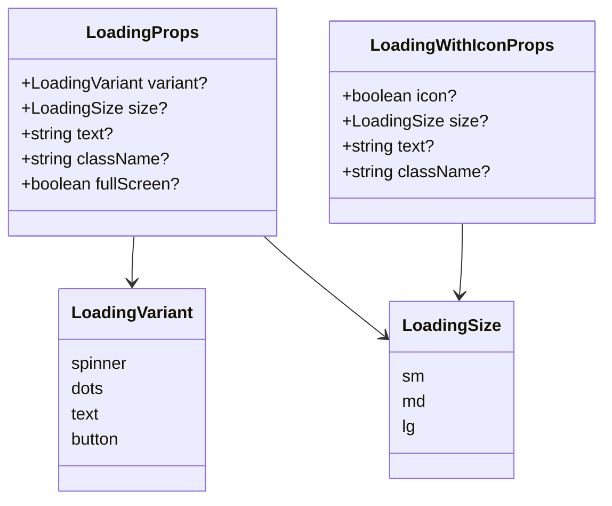
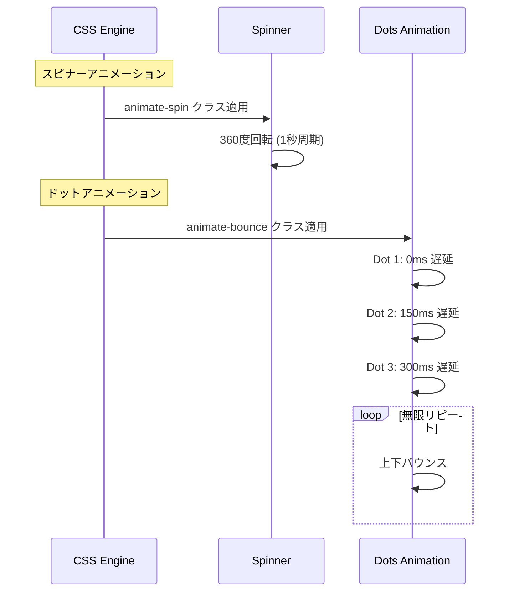

# Loading.tsx - シーケンス図

## 概要
汎用ローディングコンポーネントの処理フローを示すシーケンス図です。

## 1. Loading コンポーネントの初期化


## 2. バリアント別レンダリング



## 3. サイズ別スタイル適用


## 4. LoadingWithIcon コンポーネント


## 5. LoadingOverlay コンポーネント



## 6. フルスクリーンモード



## データ型とProps



## アニメーション詳細



## 使用例とパターン

### 基本的な使用方法
```typescript
// シンプルなスピナー
<Loading variant="spinner" size="md" />

// テキスト付きローディング
<Loading variant="dots" size="lg" text="データを読み込み中..." />

// ボタン内での使用
<Loading variant="button" size="sm" text="送信中..." />
```

### アイコン付きローディング
```typescript
// アイコン + テキスト
<LoadingWithIcon size="md" text="処理中..." />

// アイコンなし（テキストのみ）
<LoadingWithIcon icon={false} text="完了" />
```

### オーバーレイ表示
```typescript
// 全画面オーバーレイ
<LoadingOverlay variant="spinner" text="しばらくお待ちください" />

// フルスクリーンモード
<Loading variant="dots" fullScreen={true} />
```

## 特徴

### 1. 多様なバリアント
- spinner: 回転するスピナー
- dots: バウンスするドット
- text: テキストのみ
- button: ボタン用（白いスピナー）

### 2. レスポンシブサイズ
- sm/md/lg の3段階
- 要素ごとに最適化されたサイズ

### 3. 柔軟な表示モード
- インライン表示
- フルスクリーン表示
- オーバーレイ表示

### 4. カスタマイズ性
- カスタムクラス名対応
- テキストメッセージ対応
- アイコンの表示/非表示制御

### 5. アクセシビリティ
- 適切なコントラスト
- 視覚的フィードバック
- スクリーンリーダー対応