# Modal (CSVImportModal) Component - シーケンス図

## 概要
CSVインポートモーダルコンポーネントの処理フローを示すシーケンス図です。

## 1. モーダル初期化と表示

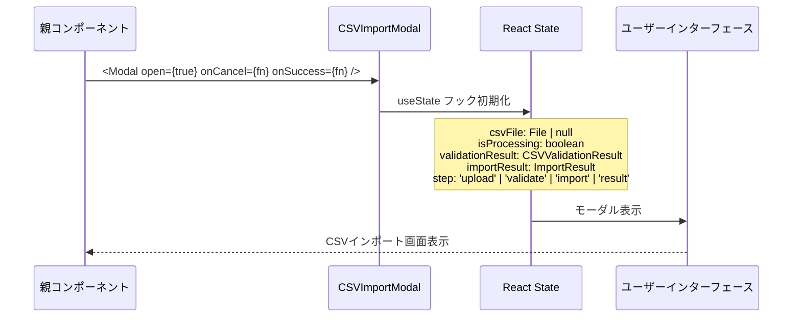

## 2. CSVファイル選択と検証

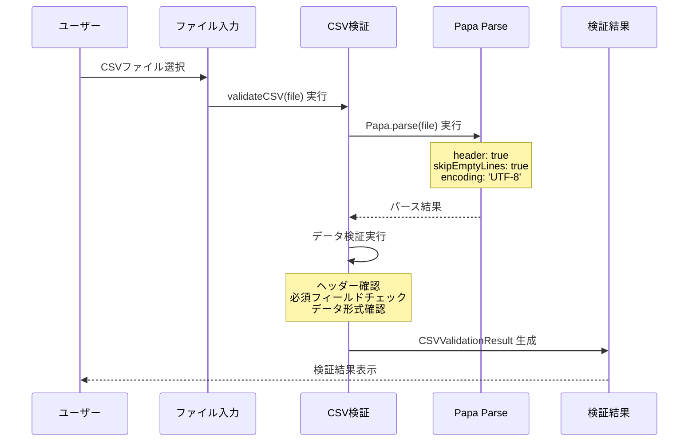

## 3. CSV検証処理詳細

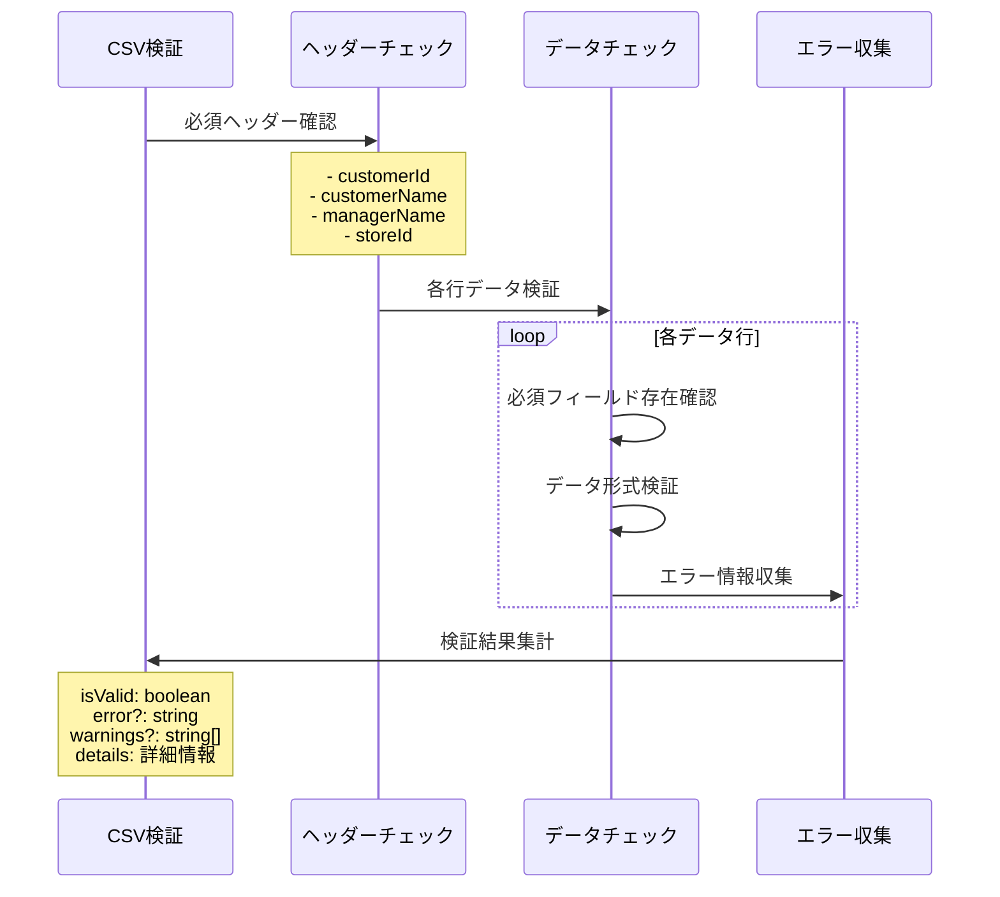

## 4. インポート実行処理

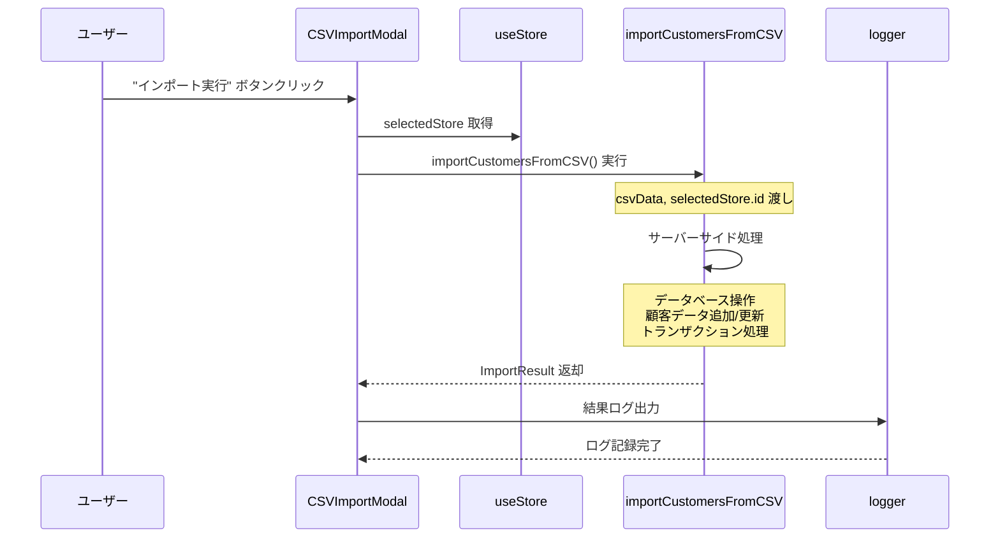

## 5. 結果表示処理

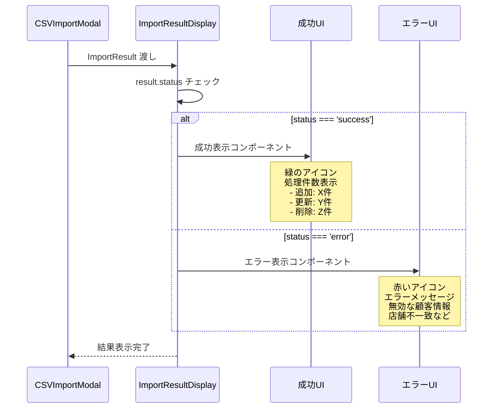

## 6. 成功時のコールバック処理

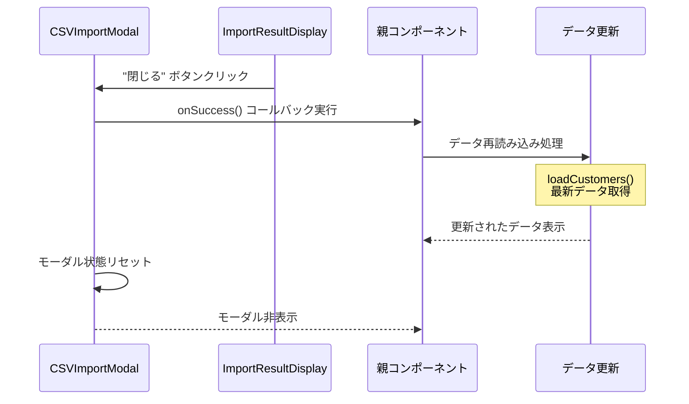

## コンポーネント構造

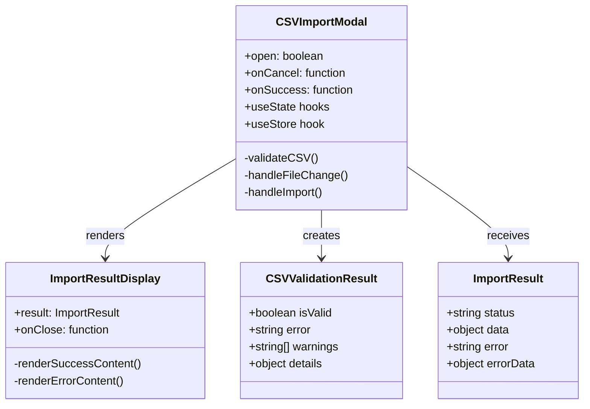

## CSV検証フロー

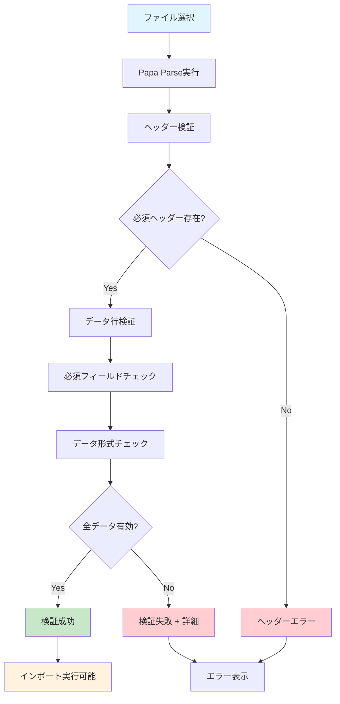

## インポート処理フロー

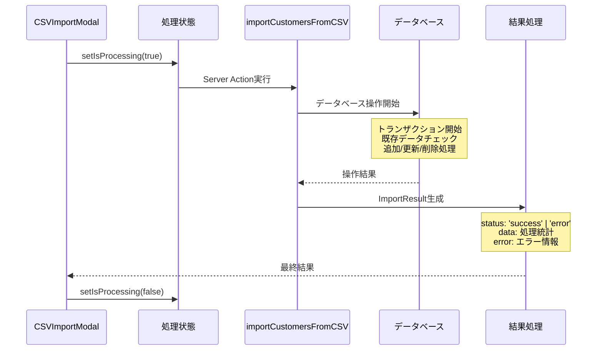

## エラーハンドリング詳細

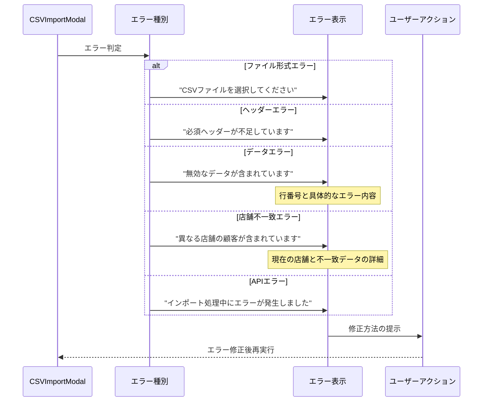

## UI状態遷移

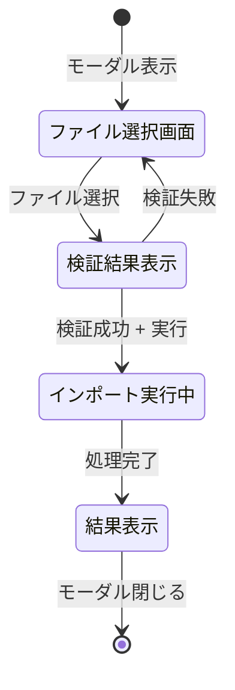

## 特徴

### 1. 段階的処理
- ファイル選択 → 検証 → 実行 → 結果
- 各段階でのエラーハンドリング

### 2. リアルタイム検証
- ファイル選択時の即座検証
- 詳細なエラー情報提供

### 3. 視覚的フィードバック
- グラデーションアイコン
- 色分けによる状態表示

### 4. 包括的エラー処理
- 複数種類のエラー対応
- ユーザーフレンドリーなメッセージ

### 5. データ整合性確保
- 店舗レベルでのデータ分離
- トランザクション処理

## パフォーマンス最適化

### ファイル処理
- ストリーミング可能なCSV処理
- 大容量ファイル対応

### メモリ効率
- 段階的メモリ解放
- 不要データの即座削除

### ユーザー体験
- 非ブロッキング処理
- 進行状況の可視化

## セキュリティ考慮

### データ検証
- 厳密なCSV形式チェック
- 悪意のあるデータの排除

### 店舗分離
- 店舗IDによるアクセス制御
- 他店舗データの混入防止

### エラー情報保護
- 機密情報の非表示
- 適切なログレベル設定

## 拡張可能性

### 対応フォーマット拡張
```typescript
// Excel対応
const handleExcelFile = (file: File) => {
  // Excel処理ロジック
};

// JSON対応
const handleJsonFile = (file: File) => {
  // JSON処理ロジック
};
```

### バッチ処理機能
```typescript
// 複数ファイル同時処理
const handleMultipleFiles = (files: FileList) => {
  // 複数ファイル処理ロジック
};
```

### インポート履歴
```typescript
// インポート履歴管理
const [importHistory, setImportHistory] = useState<ImportRecord[]>([]);
```