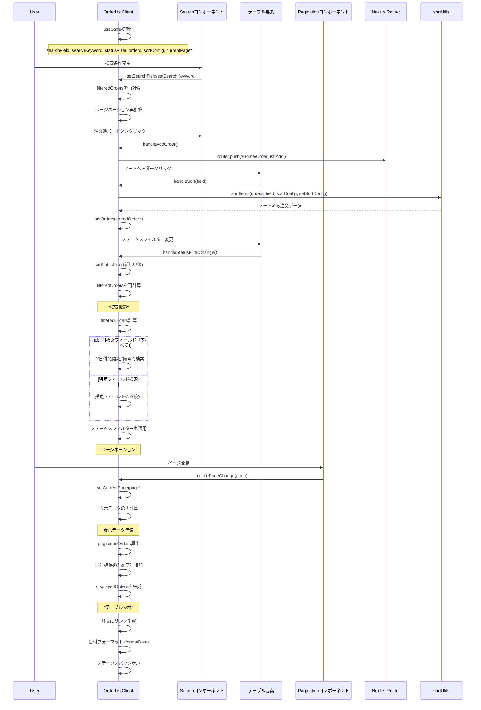

# OrderListClientコンポーネントのシーケンス図



## 概要

OrderListClientコンポーネント (`mbs/app/Home/OrderList/components/OrderListClient.tsx`) は、注文一覧画面のクライアントサイド機能を提供する高機能なデータ表示コンポーネントです。

## 主要機能

### 1. 高度な検索・フィルタリング
- **検索フィールド**: すべて、注文ID、注文日、顧客名、備考、商品名
- **ステータスフィルター**: 完了、未完了での絞り込み
- **複合フィルター**: 検索とステータスの同時適用
- **リアルタイム検索**: 入力即座にフィルタリング実行

### 2. 双方向ソート機能
- **ソート対象**: 注文ID、注文日
- **SortIcon統合**: sortUtilsによる統一されたソートUI
- **永続的ソート**: フィルタリング後もソート状態維持

### 3. Prisma型統合
- **OrderWithCustomer**: Prisma Order型の拡張
- **型安全**: TypeScriptによる厳密な型チェック
- **フラット化**: 顧客情報の効率的なアクセス

### 4. 高度なページネーション
- **固定表示**: 15件/ページ
- **空行補完**: 一貫したテーブル高さの維持
- **情報表示**: 件数・範囲の詳細表示

## 技術的特徴

### 1. 複合状態管理
```typescript
interface OrderWithCustomer extends Order {
  customerName: string;
  customerContactPerson: string;
}

const [searchField, setSearchField] = useState<SearchFieldType>('すべて');
const [statusFilter, setStatusFilter] = useState<StatusFilterType>('');
const [sortConfig, setSortConfig] = useState<SortConfig<OrderWithCustomer> | null>({
  key: 'id',
  direction: 'asc',
});
```

### 2. 高度なフィルタリングロジック
```typescript
const filteredOrders = (orders || []).filter((order) => {
  const matchField = /* 検索フィールドロジック */;
  const matchStatus = statusFilter === '' || order.status === statusFilter;
  return matchField && matchStatus;
});
```

### 3. 日付処理の統一
```typescript
const formatDate = (date: Date | string): string => {
  const dateObj = date instanceof Date ? date : new Date(date);
  return dateObj.toISOString().split('T')[0]; // YYYY-MM-DD形式
};
```

### 4. ユーティリティ統合
- **sortUtils**: SortIcon、sortItems関数の活用
- **Search/Pagination**: 再利用可能コンポーネント

## 検索仕様

### 1. 全検索（すべて）
```typescript
order.id.includes(searchKeyword) ||
orderDateStr.includes(searchKeyword) ||
order.customerName.includes(searchKeyword) ||
(order.note || '').includes(searchKeyword)
```

### 2. フィールド別検索
- **注文ID**: `order.id.includes(searchKeyword)`
- **注文日**: `orderDateStr.includes(searchKeyword)`
- **顧客名**: `order.customerName.includes(searchKeyword)`
- **備考**: `(order.note || '').includes(searchKeyword)`
- **商品名**: 未実装（OrderDetailsとの結合が必要）

### 3. ステータスフィルター
```typescript
const matchStatus = statusFilter === '' || order.status === statusFilter;
```

## UI/UX特徴

### 1. インタラクティブヘッダー
- **ソート可能**: cursor-pointer + hover効果
- **ステータスフィルター**: select要素の直接埋め込み
- **視覚的フィードバック**: SortIconによる状態表示

### 2. ステータスバッジ
```typescript
{order.status === '未完了' ? (
  <span className="rounded-full bg-red-50 px-2 py-1 text-xs font-semibold text-red-600">
    {order.status}
  </span>
) : order.status === '完了' ? (
  <span className="rounded-full bg-green-50 px-2 py-1 text-xs font-semibold text-green-600">
    {order.status}
  </span>
) : ('')}
```

### 3. リンク統合
- **注文詳細**: `/Home/OrderList/${order.id}` への直接遷移
- **注文追加**: `/Home/OrderList/Add` への新規作成

## 空行処理

### 1. 動的空行生成
```typescript
while (displayedOrders.length < itemsPerPage) {
  const emptyOrder: OrderWithCustomer = {
    id: '',
    customerId: '',
    orderDate: new Date(),
    // ... 空の値で初期化
  };
  displayedOrders.push(emptyOrder);
}
```

### 2. 条件付き表示
```typescript
{order.id ? formatDate(order.orderDate) : ''}
{order.id ? (
  <Link href={`/Home/OrderList/${order.id}`}>
    {order.id}
  </Link>
) : ('')}
```

## 使用技術

- **Next.js**: App Router、useRouter、Link
- **React**: useState、関数コンポーネント
- **TypeScript**: Prisma型の拡張、型安全な操作
- **Prisma**: Order型の直接利用
- **カスタムコンポーネント**: Search、Pagination
- **ユーティリティ**: sortUtils（SortConfig、SortIcon、sortItems）

## パフォーマンス考慮

### 1. 効率的フィルタリング
- 検索とステータスフィルターの合成
- 無駄な再計算の回避

### 2. 最小限の再レンダリング
- 適切な状態分離
- 条件付きレンダリングの最適化

## ファイルパス
`mbs/app/Home/OrderList/components/OrderListClient.tsx`