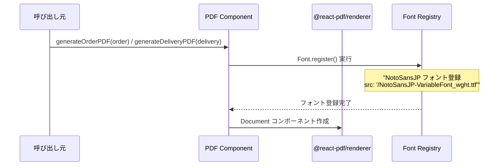
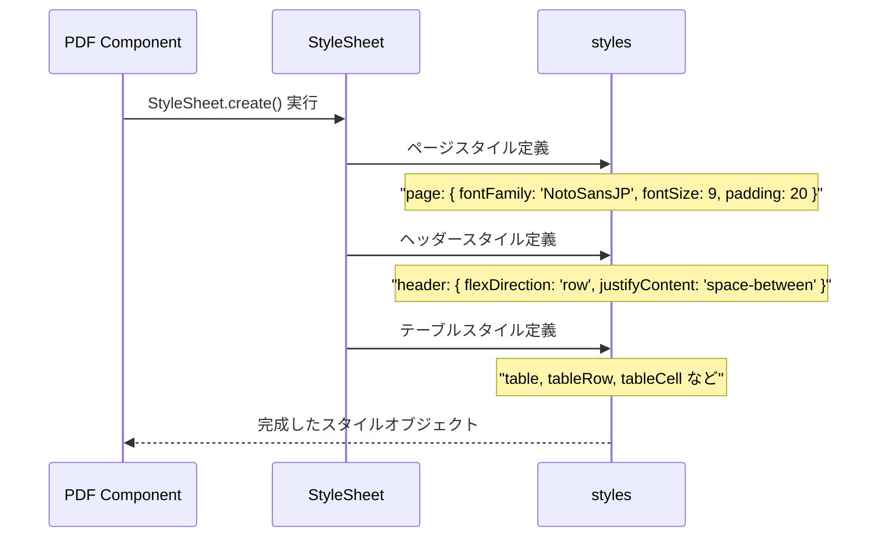
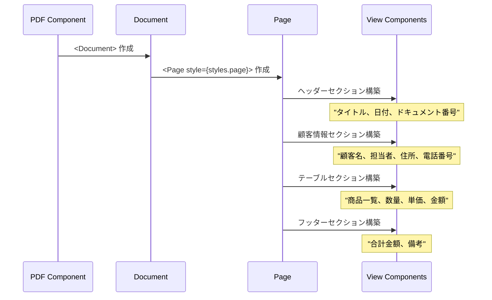
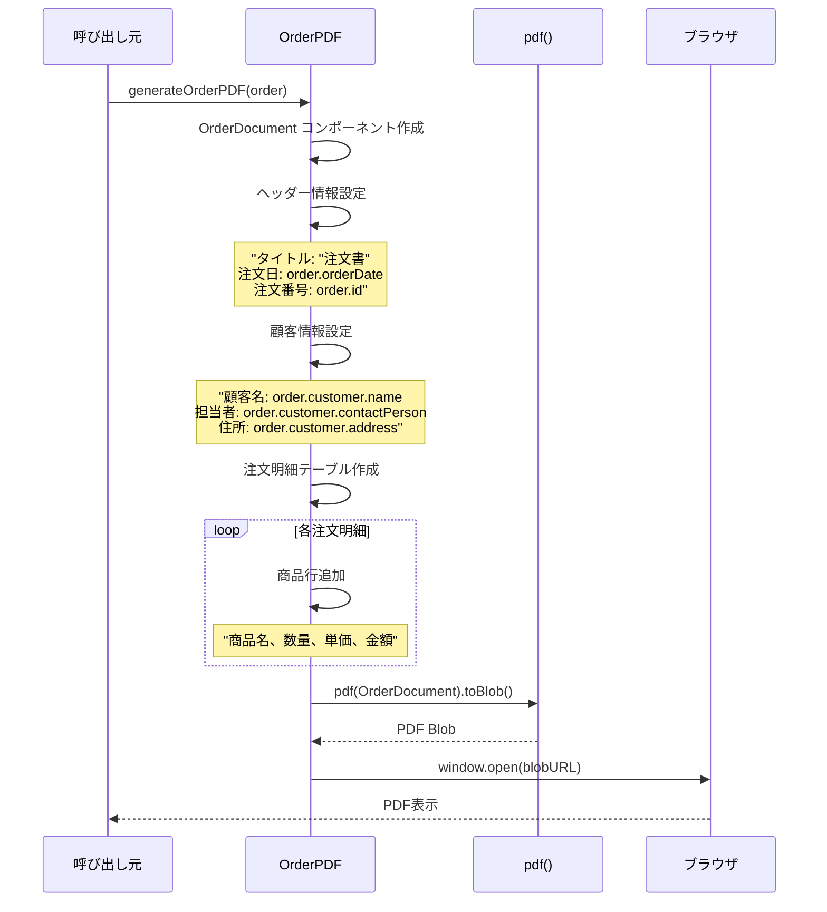
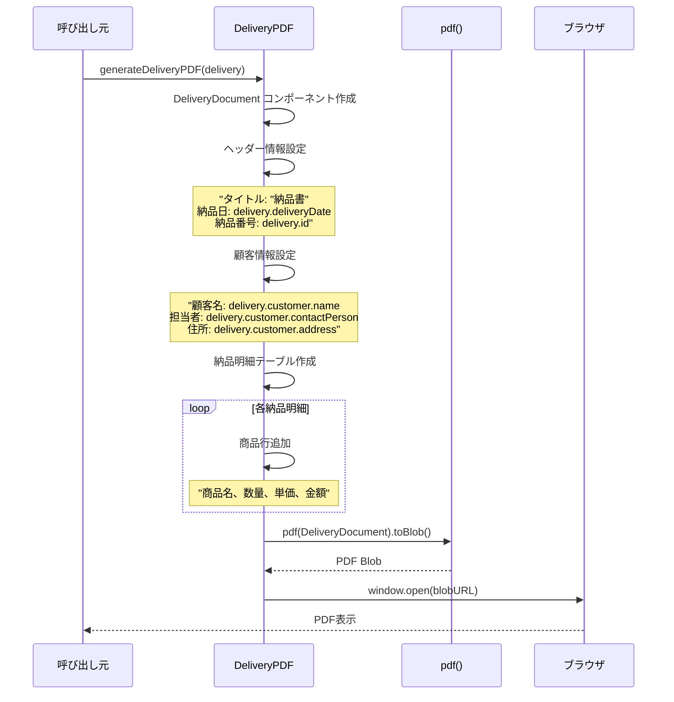
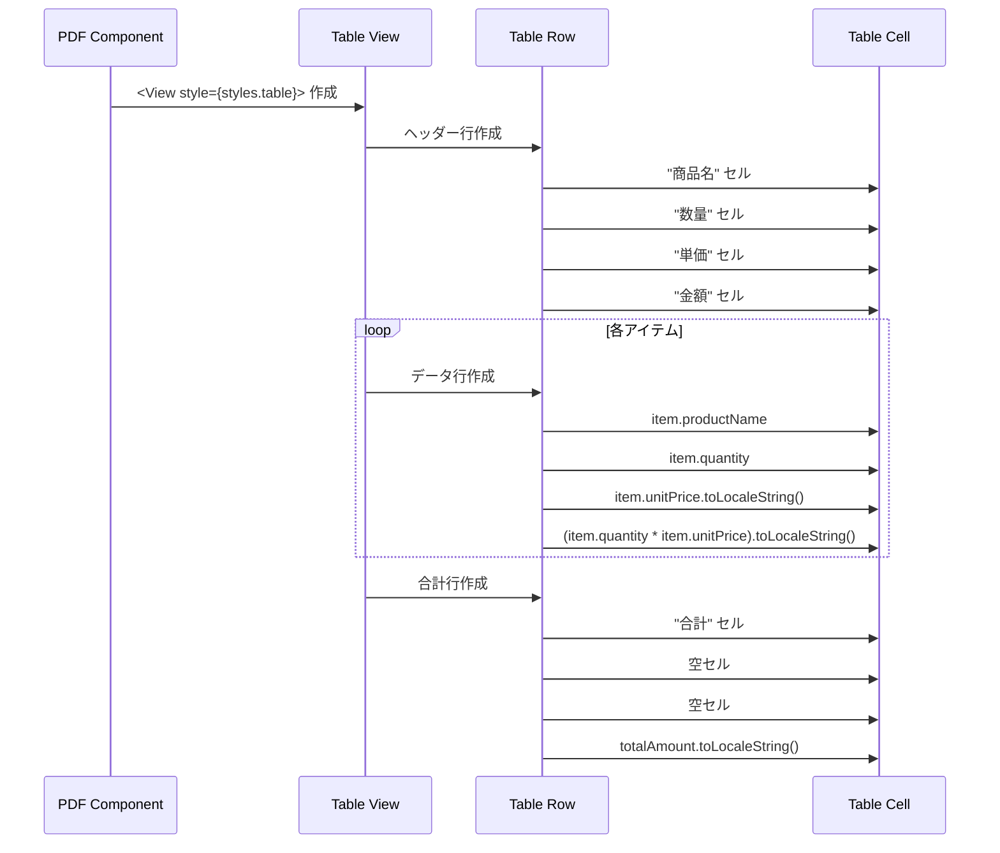
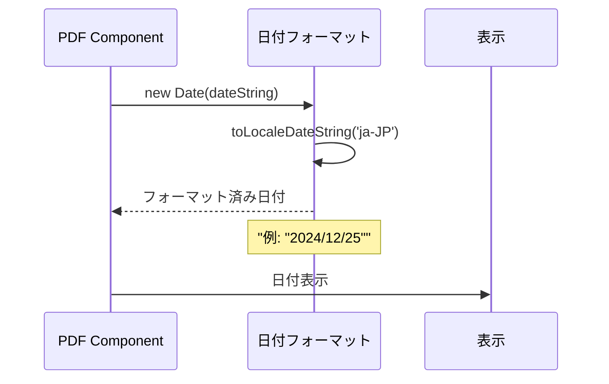
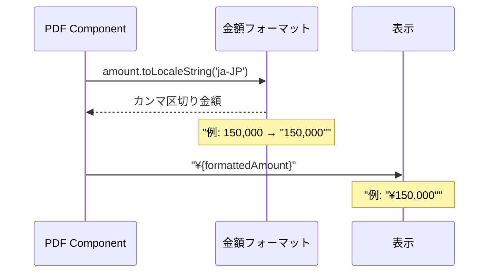
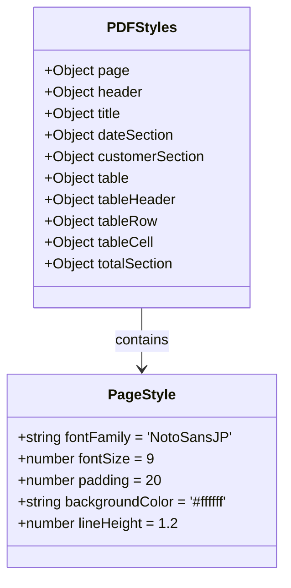
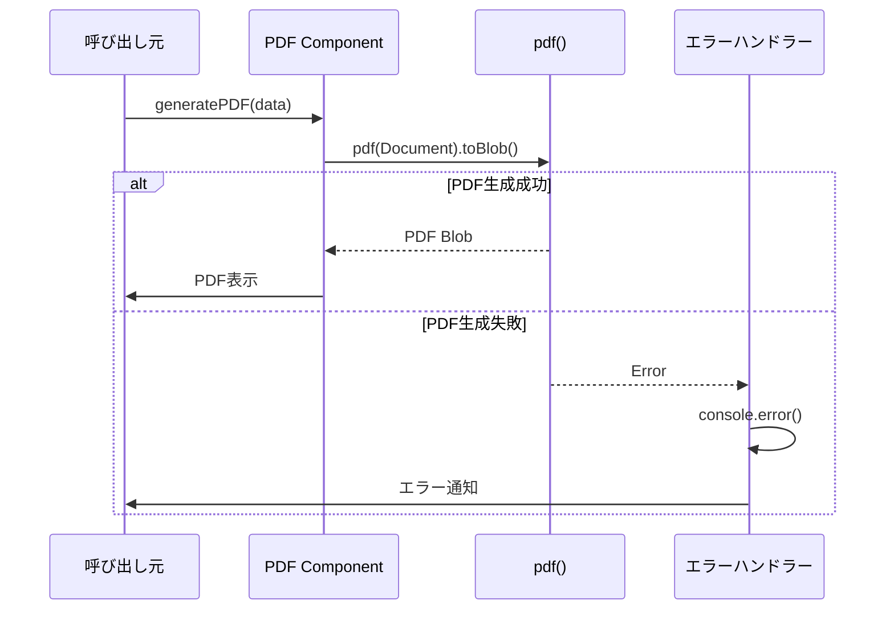

# PDF Components (OrderPDF.tsx & DeliveryPDF.tsx) - シーケンス図

## 概要
注文書・納品書PDF生成コンポーネントの処理フローを示すシーケンス図です。

## 1. PDF生成の初期化



## 2. スタイルシート適用



## 3. PDFドキュメント構築



## 4. 注文書PDF生成 (OrderPDF)



## 5. 納品書PDF生成 (DeliveryPDF)



## 6. テーブル構築処理



## 7. 日付フォーマット処理



## 8. 金額フォーマット処理



## 共通スタイル構造



## エラーハンドリング



## 使用パターン

### 注文書生成
```typescript
import { generateOrderPDF } from '@/components/OrderPDF';

const handlePrintOrder = async () => {
  try {
    await generateOrderPDF(orderData);
  } catch (error) {
    console.error('PDF生成に失敗しました:', error);
  }
};
```

### 納品書生成
```typescript
import { generateDeliveryPDF } from '@/components/DeliveryPDF';

const handlePrintDelivery = async () => {
  try {
    await generateDeliveryPDF(deliveryData);
  } catch (error) {
    console.error('PDF生成に失敗しました:', error);
  }
};
```

## 特徴

### 1. 日本語対応
- NotoSansJPフォント使用
- 適切な文字エンコーディング

### 2. プロフェッショナルなレイアウト
- ビジネス文書に適したデザイン
- 構造化された情報配置

### 3. 動的コンテンツ
- データに基づく動的生成
- 柔軟な明細行数対応

### 4. ブラウザ統合
- 新しいタブでの表示
- 印刷・保存機能

### 5. 再利用性
- 共通スタイルの活用
- モジュラー設計

## パフォーマンス考慮

### フォント最適化
- フォントファイルの事前読み込み
- 適切なファイルサイズ

### PDF生成最適化
- 効率的なコンポーネント構造
- 最小限のメモリ使用量