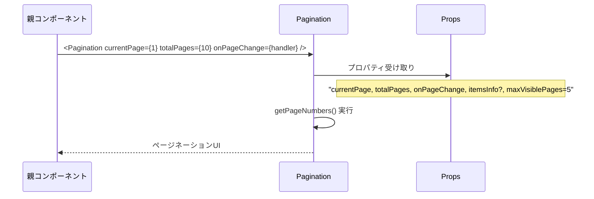
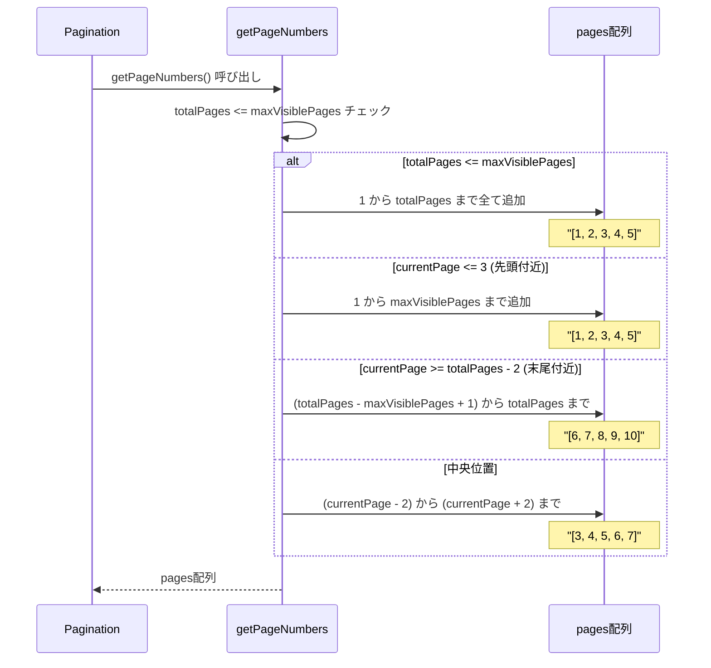
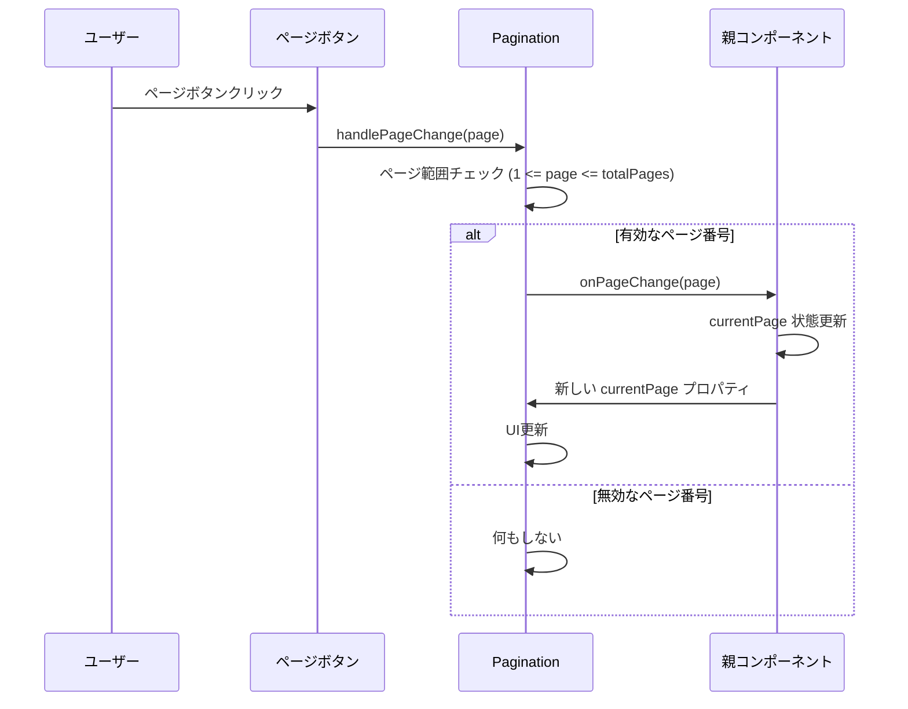
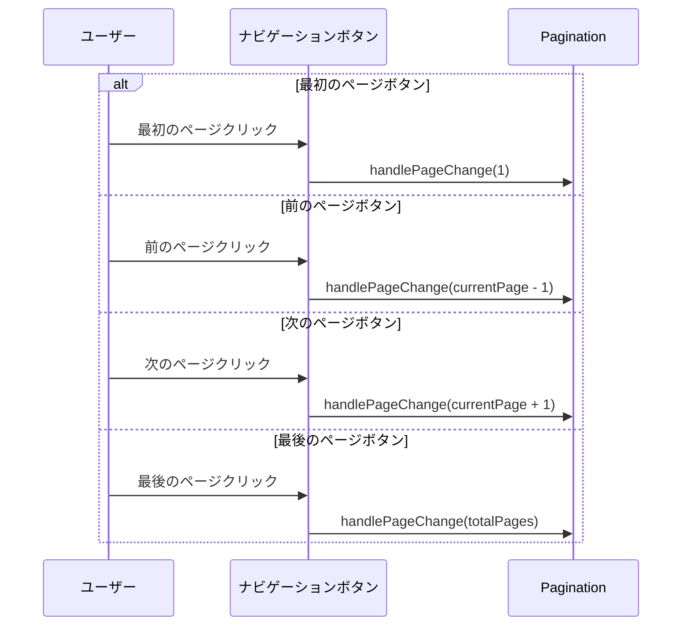
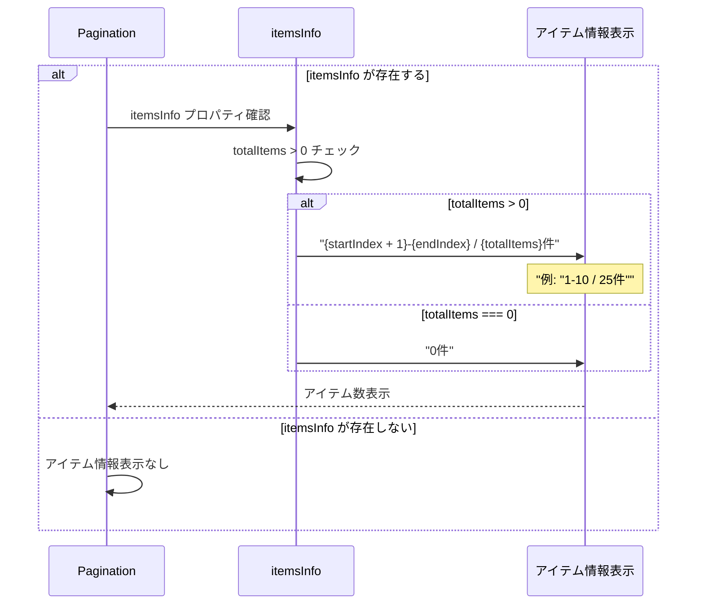
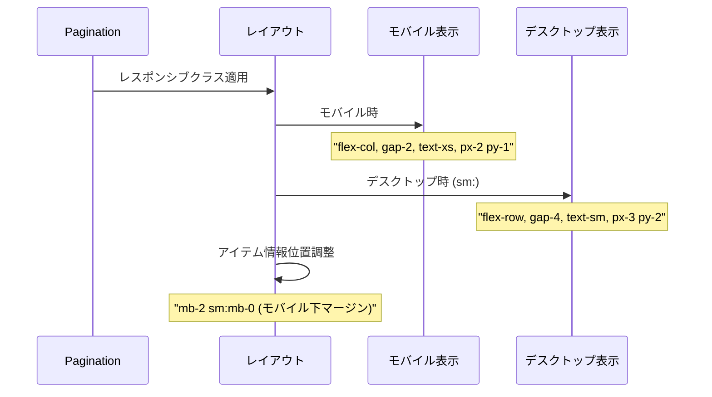
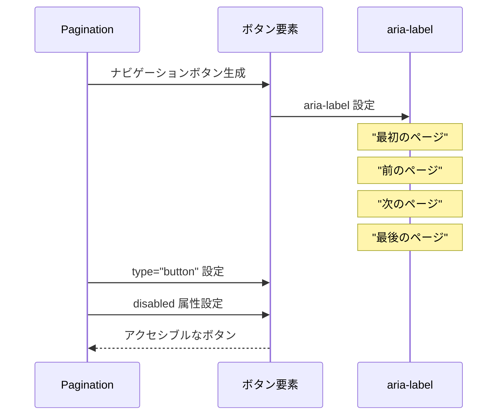

# Pagination.tsx - シーケンス図

## 概要
汎用ページネーションコンポーネントの処理フローを示すシーケンス図です。

## 1. コンポーネント初期化



## 2. ページ番号配列生成 (getPageNumbers)



## 3. ページ変更処理



## 4. ナビゲーションボタン処理



## 5. ボタン無効化制御

**Pagination ボタン無効化制御フロー**
1. ページネーションレンダリング → ボタン無効化判定
2. 現在ページチェック：
   - currentPage === 1: 最初・前ページボタン無効化 → disabled クラス適用
   - その他: 最初・前ページボタン有効 → 有効状態スタイル
3. 最終ページチェック：
   - currentPage === totalPages: 次・最後ページボタン無効化 → disabled クラス適用
   - その他: 次・最後ページボタン有効 → 有効状態スタイル
4. スタイル適用：
   - disabled: cursor-not-allowed, opacity-50
   - 有効: hover:bg-gray-100

この制御により、適切なユーザーインターフェースが提供されます。

## 6. アイテム情報表示



## 7. レスポンシブレイアウト



## データ型とProps

**Pagination コンポーネントデータ構造**
- PaginationProps: currentPage、totalPages、onPageChange の必須プロパティと itemsInfo、maxVisiblePages のオプションプロパティ
- ItemsInfo: startIndex、endIndex、totalItems フィールドでアイテム情報を表現

PaginationProps は ItemsInfo を含み、詳細なページ情報を提供します。

## ページ番号生成ロジックの詳細

**getPageNumbers ロジックフロー**
1. getPageNumbers 開始 → totalPages と maxVisiblePages 比較
2. ページ表示ロジック：
   - totalPages <= maxVisiblePages: 全ページ表示 (1 to totalPages)
   - その他: currentPage 位置で分岐
     - currentPage <= 3: 先頭付近表示 (1 to maxVisiblePages)
     - currentPage >= totalPages - 2: 末尾付近表示 (totalPages-maxVisiblePages+1 to totalPages)
     - その他: 中央付近表示 (currentPage-2 to currentPage+2)
3. pages 配列返却

このロジックにより、常に適切な数のページボタンが表示されます。

## アクセシビリティ対応



## 使用例とパターン

### 基本的なページネーション
```typescript
const [currentPage, setCurrentPage] = useState(1);
const totalPages = Math.ceil(totalItems / itemsPerPage);

<Pagination
  currentPage={currentPage}
  totalPages={totalPages}
  onPageChange={setCurrentPage}
/>
```

### アイテム情報付き
```typescript
const startIndex = (currentPage - 1) * itemsPerPage;
const endIndex = Math.min(startIndex + itemsPerPage, totalItems);

<Pagination
  currentPage={currentPage}
  totalPages={totalPages}
  onPageChange={setCurrentPage}
  itemsInfo={{
    startIndex,
    endIndex,
    totalItems
  }}
/>
```

### カスタム表示ページ数
```typescript
<Pagination
  currentPage={currentPage}
  totalPages={totalPages}
  onPageChange={setCurrentPage}
  maxVisiblePages={7}
/>
```

## 特徴

### 1. 動的ページ表示
- 現在位置に応じたページ番号表示
- 大量ページでもコンパクトな表示

### 2. 完全なナビゲーション
- 最初/最後ページへのジャンプ
- 前/次ページへの移動
- 直接ページ指定

### 3. レスポンシブデザイン
- モバイル/デスクトップ対応
- 適応的なサイズとレイアウト

### 4. UX最適化
- ボタンの適切な無効化
- 現在ページの視覚的強調
- アイテム数情報の表示

### 5. アクセシビリティ
- キーボードナビゲーション対応
- スクリーンリーダー対応
- 適切なボタンラベル