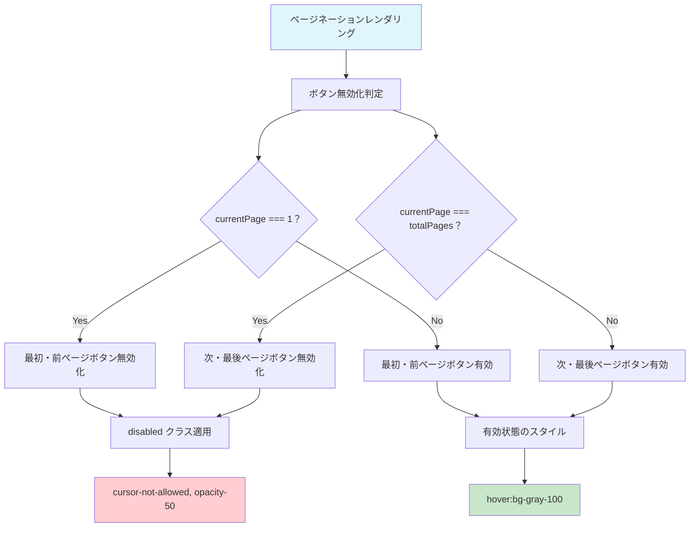
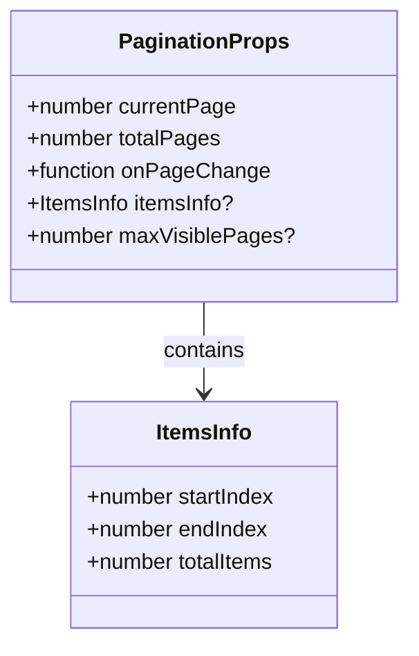
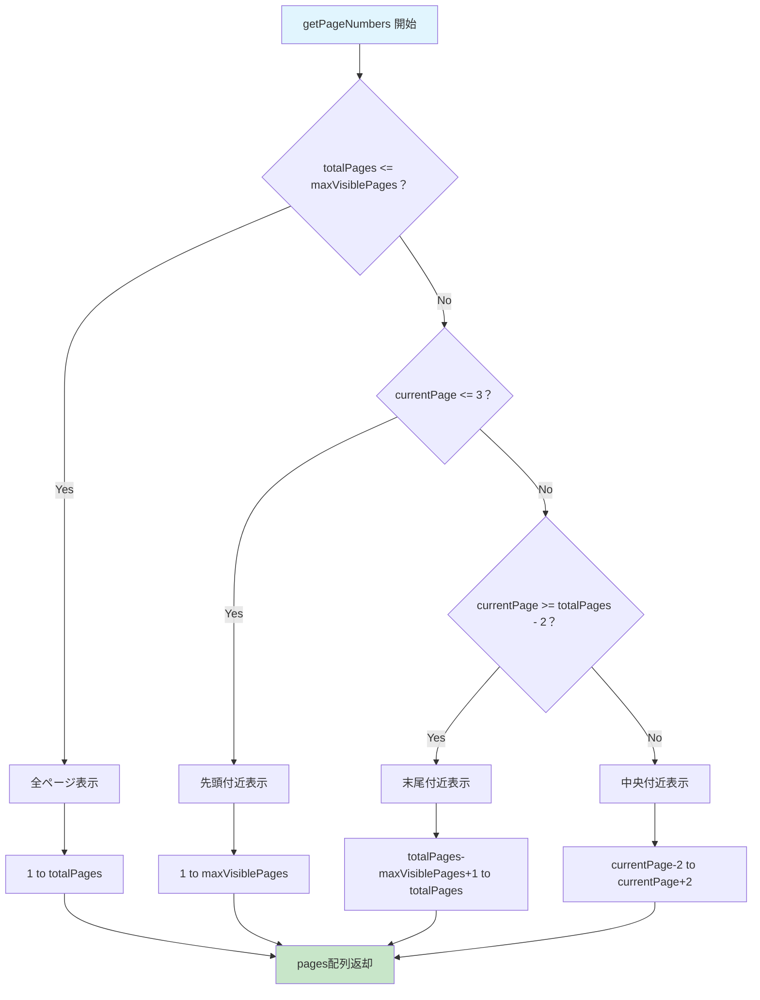

# Pagination.tsx - シーケンス図

## 概要
汎用ページネーションコンポーネントの処理フローを示すシーケンス図です。

## 1. コンポーネント初期化


## 2. ページ番号配列生成 (getPageNumbers)


## 3. ページ変更処理


## 4. ナビゲーションボタン処理


## 5. ボタン無効化制御



## 6. アイテム情報表示


## 7. レスポンシブレイアウト


## データ型とProps



## ページ番号生成ロジックの詳細



## アクセシビリティ対応


## 使用例とパターン

### 基本的なページネーション
```typescript
const [currentPage, setCurrentPage] = useState(1);
const totalPages = Math.ceil(totalItems / itemsPerPage);

<Pagination
  currentPage={currentPage}
  totalPages={totalPages}
  onPageChange={setCurrentPage}
/>
```

### アイテム情報付き
```typescript
const startIndex = (currentPage - 1) * itemsPerPage;
const endIndex = Math.min(startIndex + itemsPerPage, totalItems);

<Pagination
  currentPage={currentPage}
  totalPages={totalPages}
  onPageChange={setCurrentPage}
  itemsInfo={{
    startIndex,
    endIndex,
    totalItems
  }}
/>
```

### カスタム表示ページ数
```typescript
<Pagination
  currentPage={currentPage}
  totalPages={totalPages}
  onPageChange={setCurrentPage}
  maxVisiblePages={7}
/>
```

## 特徴

### 1. 動的ページ表示
- 現在位置に応じたページ番号表示
- 大量ページでもコンパクトな表示

### 2. 完全なナビゲーション
- 最初/最後ページへのジャンプ
- 前/次ページへの移動
- 直接ページ指定

### 3. レスポンシブデザイン
- モバイル/デスクトップ対応
- 適応的なサイズとレイアウト

### 4. UX最適化
- ボタンの適切な無効化
- 現在ページの視覚的強調
- アイテム数情報の表示

### 5. アクセシビリティ
- キーボードナビゲーション対応
- スクリーンリーダー対応
- 適切なボタンラベル