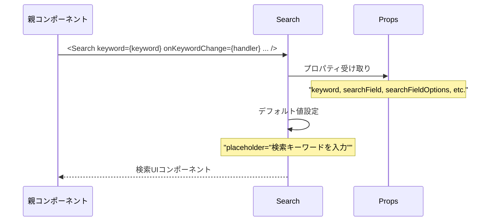
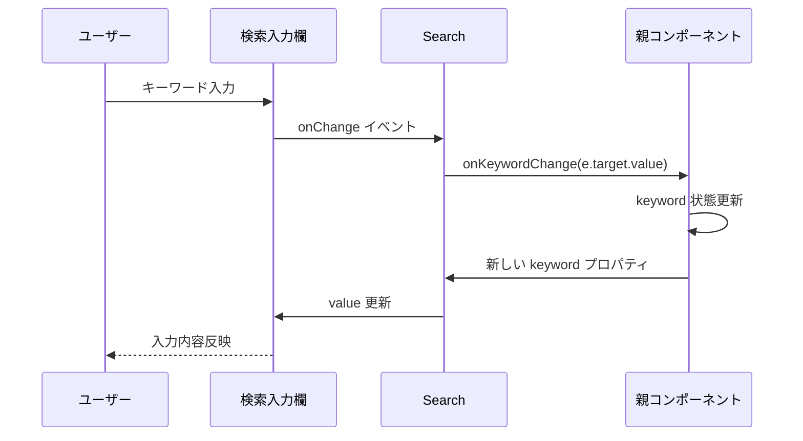
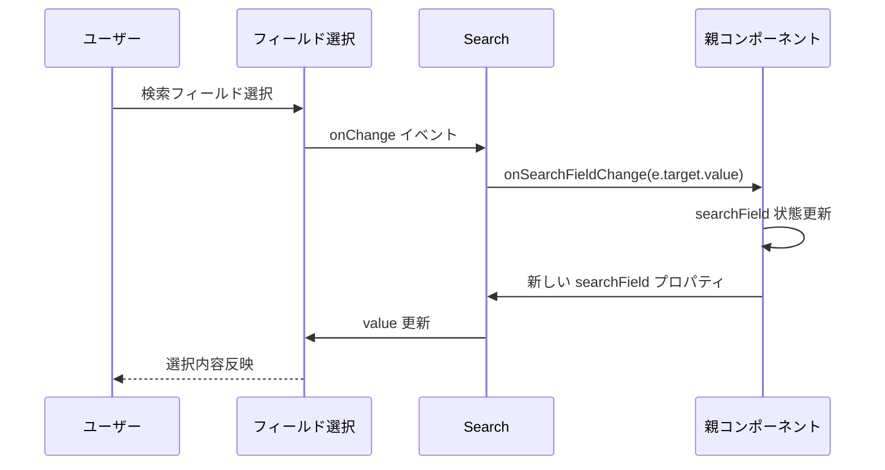
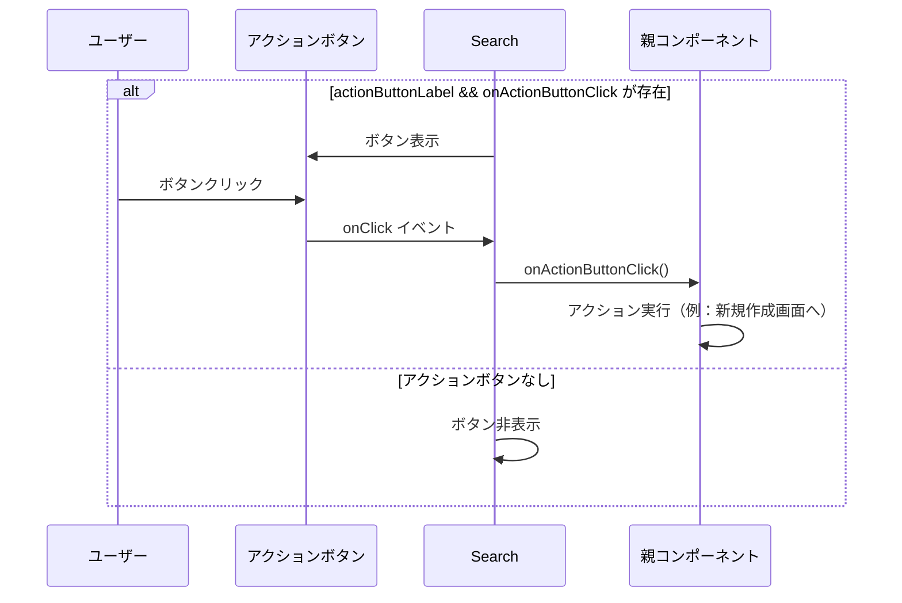
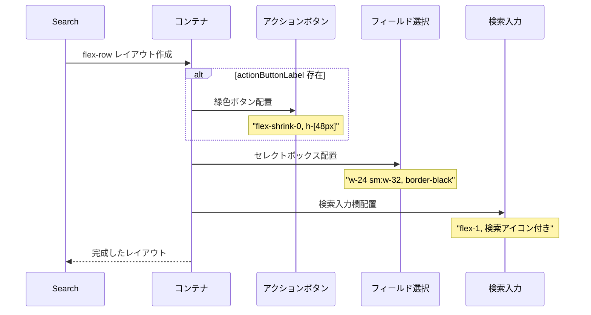
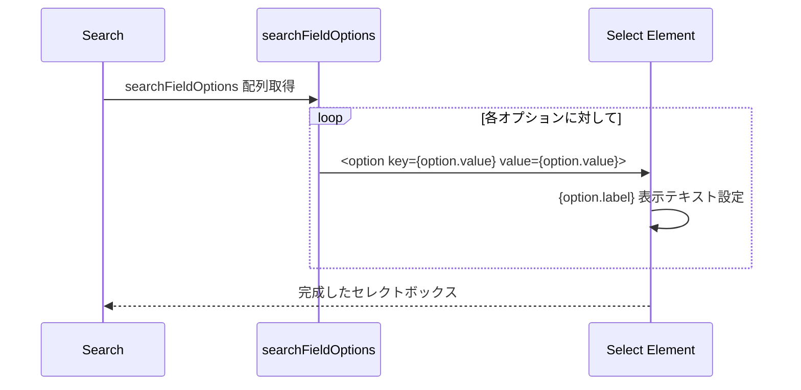
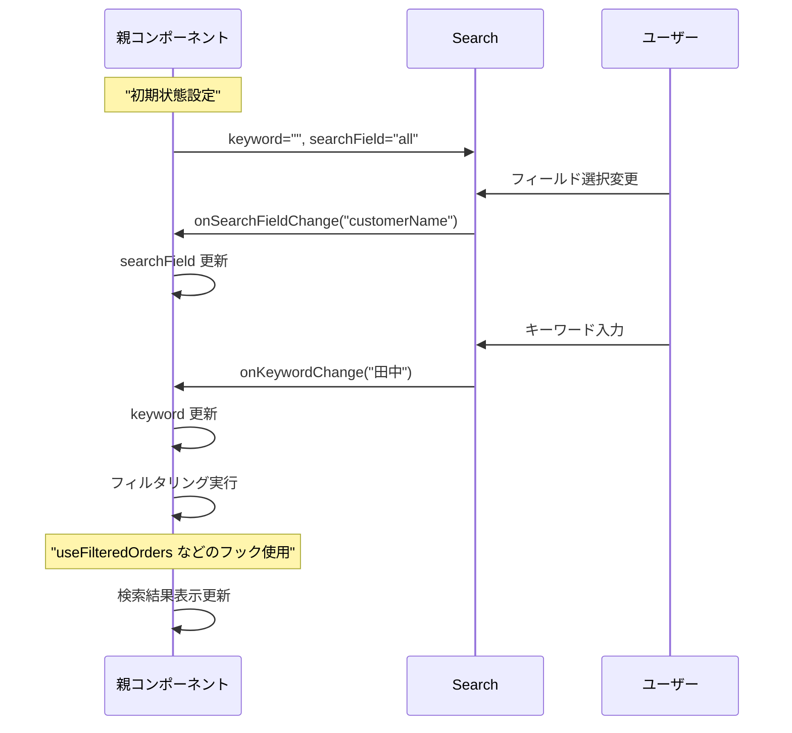
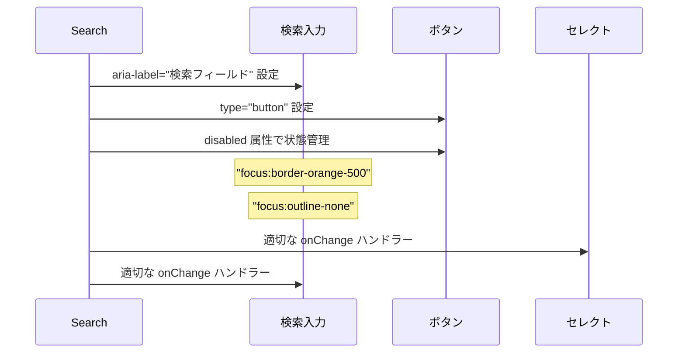

# Search.tsx - シーケンス図

## 概要
汎用検索コンポーネントの処理フローを示すシーケンス図です。

## 1. コンポーネント初期化



## 2. 検索キーワード入力処理



## 3. 検索フィールド選択処理



## 4. アクションボタン処理



## 5. コンポーネントレイアウト構築



## 6. レスポンシブ対応

**Search コンポーネントレスポンシブ設計**
1. Search コンポーネント → レスポンシブクラス適用
2. アクションボタン: px-3 sm:px-4、text-xs sm:text-sm
3. フィールド選択: w-24 sm:w-32、text-xs sm:text-sm
4. 検索入力: text-xs sm:text-sm、アイコン h-4 w-4 sm:h-5 sm:w-5

これらのクラスにより、モバイルからデスクトップまで適切に表示されます。

## データ型とProps

**Search コンポーネントデータ構造**
- SearchProps: keyword、onKeywordChange、searchField、onSearchFieldChange、searchFieldOptions とオプションプロパティ（placeholder、actionButtonLabel、onActionButtonClick、actionButtonDisabled）
- SearchFieldOption: value、label フィールドを持つ検索フィールドオプション

SearchProps は SearchFieldOption の配列を含み、柔軟な検索機能を実現します。

## 検索フィールドオプションの処理



## 状態とイベントフロー



## アクセシビリティ対応



## 使用例とパターン

### 基本的な検索
```typescript
const [keyword, setKeyword] = useState('');
const [field, setField] = useState('all');

const searchFieldOptions = [
  { value: 'all', label: 'すべて' },
  { value: 'customerName', label: '顧客名' },
  { value: 'id', label: 'ID' },
];

<Search
  keyword={keyword}
  onKeywordChange={setKeyword}
  searchField={field}
  onSearchFieldChange={setField}
  searchFieldOptions={searchFieldOptions}
/>
```

### アクションボタン付き
```typescript
<Search
  keyword={keyword}
  onKeywordChange={setKeyword}
  searchField={field}
  onSearchFieldChange={setField}
  searchFieldOptions={options}
  actionButtonLabel="注文追加"
  onActionButtonClick={() => router.push('/orders/add')}
  actionButtonDisabled={loading}
/>
```

## 特徴

### 1. 汎用性
- 任意の検索フィールドに対応
- カスタマイズ可能なオプション

### 2. レスポンシブデザイン
- モバイル/デスクトップ対応
- 適応的なサイズ調整

### 3. UX最適化
- 検索アイコンによる視覚的ガイド
- 直感的なレイアウト

### 4. 統合性
- 他のフィルタリングフックとの連携
- 状態管理の外部化

### 5. アクセシビリティ
- キーボードナビゲーション
- スクリーンリーダー対応
- 適切なフォーカス管理