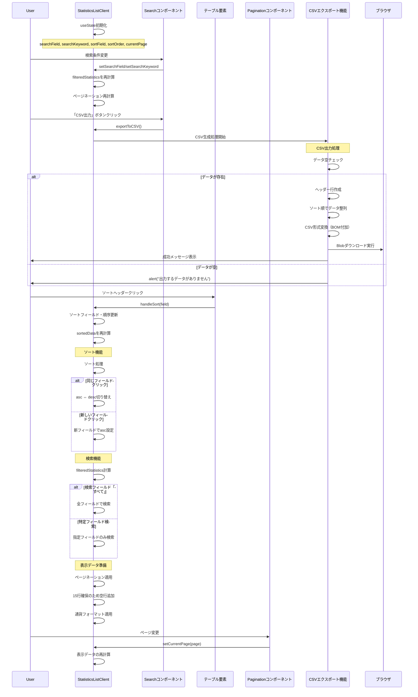

# StatisticsListClientコンポーネントのシーケンス図



## 概要

StatisticsListClientコンポーネント (`mbs/app/Home/Statistics/components/StatisticsListClient.tsx`) は、統計情報の表示とCSVエクスポート機能を提供する高機能なデータ分析コンポーネントです。

## 主要機能

### 1. 統計データ表示
- **顧客ID**: 一意識別子の表示
- **顧客名**: 会社・組織名
- **平均リードタイム**: 小数点1桁での日数表示
- **累計売上額**: 日本円フォーマットでの金額表示

### 2. 高度な検索機能
- **検索フィールド**: すべて、顧客ID、顧客名
- **全検索**: ID、名前、リードタイム、売上すべてで検索
- **リアルタイム検索**: 入力即座にフィルタリング

### 3. 全フィールドソート機能
- **ソート対象**: 顧客ID、顧客名、平均リードタイム、累計売上額
- **双方向ソート**: 昇順・降序の自動切り替え
- **視覚的インジケーター**: ▲▼による方向表示

### 4. 高機能CSVエクスポート
- **BOM付きCSV**: Excel互換の文字エンコーディング
- **タイムスタンプファイル名**: 自動生成された一意ファイル名
- **エラーハンドリング**: 出力失敗時の適切な通知
- **データ整合性**: 表示順序とエクスポート順序の同期

## 技術的特徴

### 1. 統計データ型定義
```typescript
interface StatisticsData {
  customerId: string;
  customerName: string;
  averageLeadTime: number;
  totalSales: number;
  updatedAt: string;
}
```

### 2. 高度なソート実装
```typescript
const sortedData = [...filteredStatistics].sort((a, b) => {
  if (!sortField) return 0;
  const aValue = a[sortField];
  const bValue = b[sortField];
  if (aValue === bValue) return 0;
  const comparison = aValue > bValue ? 1 : -1;
  return sortOrder === 'asc' ? comparison : -comparison;
});
```

### 3. CSVエクスポート機能
```typescript
const exportToCSV = () => {
  // BOM付きCSV生成
  const csvContent = '\uFEFF' + [headers.join(','), ...rows].join('\n');
  const blob = new Blob([csvContent], { type: 'text/csv;charset=utf-8;' });
  
  // タイムスタンプファイル名生成
  const timestamp = now.toISOString().slice(0, 19).replace(/[T:]/g, '_').replace(/-/g, '');
  const filename = `統計情報_${timestamp}.csv`;
};
```

## 検索仕様

### 1. 全検索（すべて）
```typescript
item.customerId.includes(searchKeyword) ||
item.customerName.includes(searchKeyword) ||
item.averageLeadTime.toString().includes(searchKeyword) ||
item.totalSales.toString().includes(searchKeyword)
```

### 2. フィールド別検索
- **顧客ID**: `item.customerId`
- **顧客名**: `item.customerName`

## ソート仕様

### 1. 全フィールド対応
- **文字列**: 顧客ID、顧客名
- **数値**: 平均リードタイム、累計売上額

### 2. ソート状態管理
```typescript
const handleSort = (field: keyof StatisticsData) => {
  let nextOrder: 'asc' | 'desc' = 'asc';
  if (sortField === field) {
    nextOrder = sortOrder === 'asc' ? 'desc' : 'asc';
  }
  setSortField(field);
  setSortOrder(nextOrder);
};
```

## CSVエクスポート仕様

### 1. データ変換
```typescript
const rows = sortedForExport.map((item) => [
  item.customerId,
  item.customerName,
  item.averageLeadTime.toFixed(1),
  item.totalSales, // 数値のまま（Excel認識用）
]);
```

### 2. エスケープ処理
```typescript
if (stringValue.includes(',') || stringValue.includes('\n') || stringValue.includes('"')) {
  return `"${stringValue.replace(/"/g, '""')}"`;
}
```

### 3. ファイル名生成
```typescript
const timestamp = now.toISOString().slice(0, 19).replace(/[T:]/g, '_').replace(/-/g, '');
const filename = `統計情報_${timestamp}.csv`;
```

## UI/UX特徴

### 1. データフォーマット
- **リードタイム**: `item.averageLeadTime.toFixed(1)` （1桁小数）
- **売上額**: `Intl.NumberFormat('ja-JP', { style: 'currency', currency: 'JPY' })`

### 2. 空データ対応
```typescript
{item.customerId === '' ? '' : item.averageLeadTime.toFixed(1)}
{item.customerId === '' ? '' : formatCurrency(item.totalSales)}
```

### 3. レスポンシブ設計
- **最小幅**: min-w-[600px]でテーブル構造維持
- **段階的フォント**: text-[10px] sm:text-xs md:text-sm

## エラーハンドリング

### 1. CSV出力エラー
```typescript
try {
  // CSV生成処理
} catch (error) {
  console.error('CSV出力エラー:', error);
  alert('CSV出力中にエラーが発生しました。もう一度お試しください。');
}
```

### 2. 空データ対応
```typescript
if (filteredStatistics.length === 0) {
  alert('出力するデータがありません。');
  return;
}
```

## 使用技術

- **React**: useState、関数コンポーネント
- **TypeScript**: 型安全なデータ操作
- **Intl API**: 国際化対応の数値フォーマット
- **Blob API**: ファイルダウンロード機能
- **カスタムコンポーネント**: Search、Pagination

## パフォーマンス考慮

### 1. 効率的ソート
- スプレッド演算子による非破壊的ソート
- 条件分岐による最適化

### 2. メモリ管理
- Blob URLの適切なクリーンアップ
- DOM要素の一時追加・削除

## ファイルパス
`mbs/app/Home/Statistics/components/StatisticsListClient.tsx`