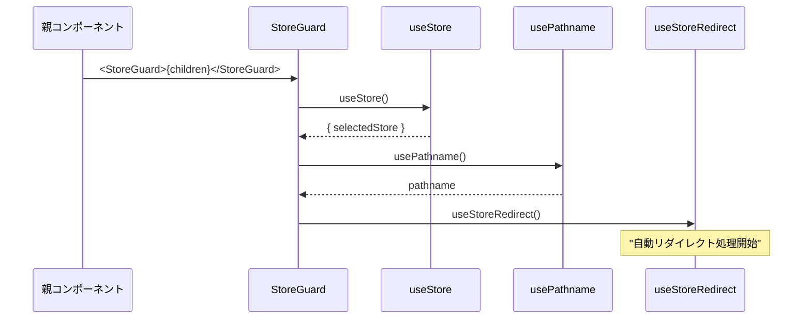
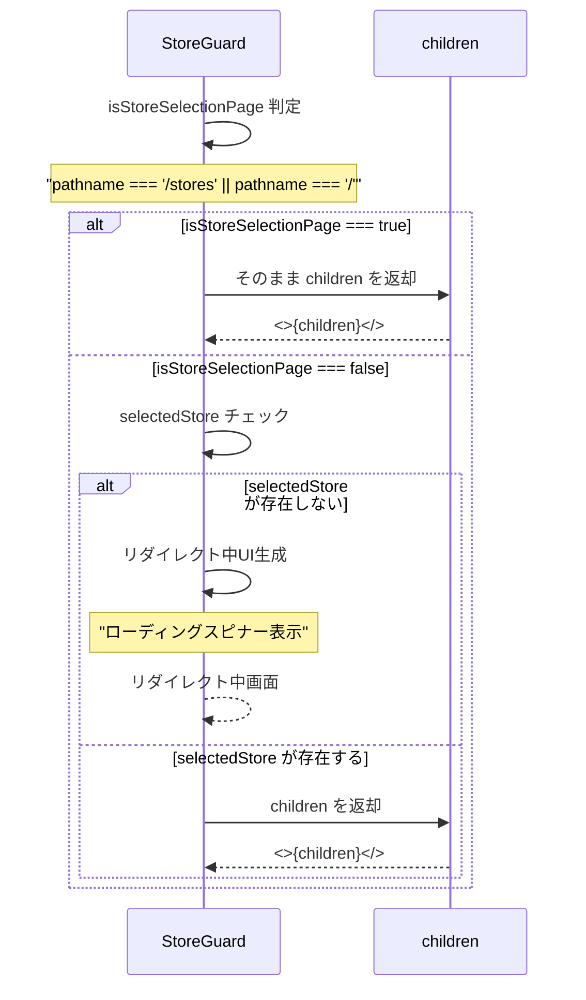
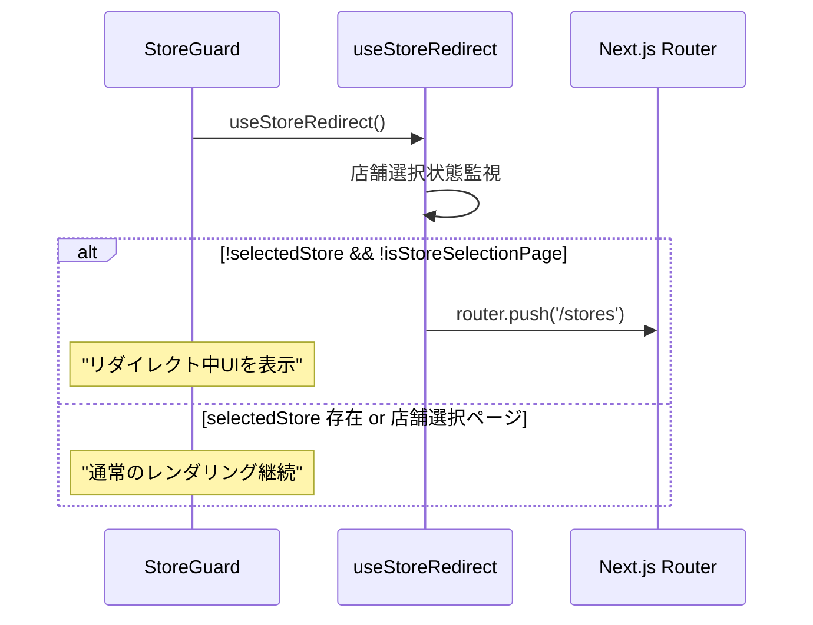
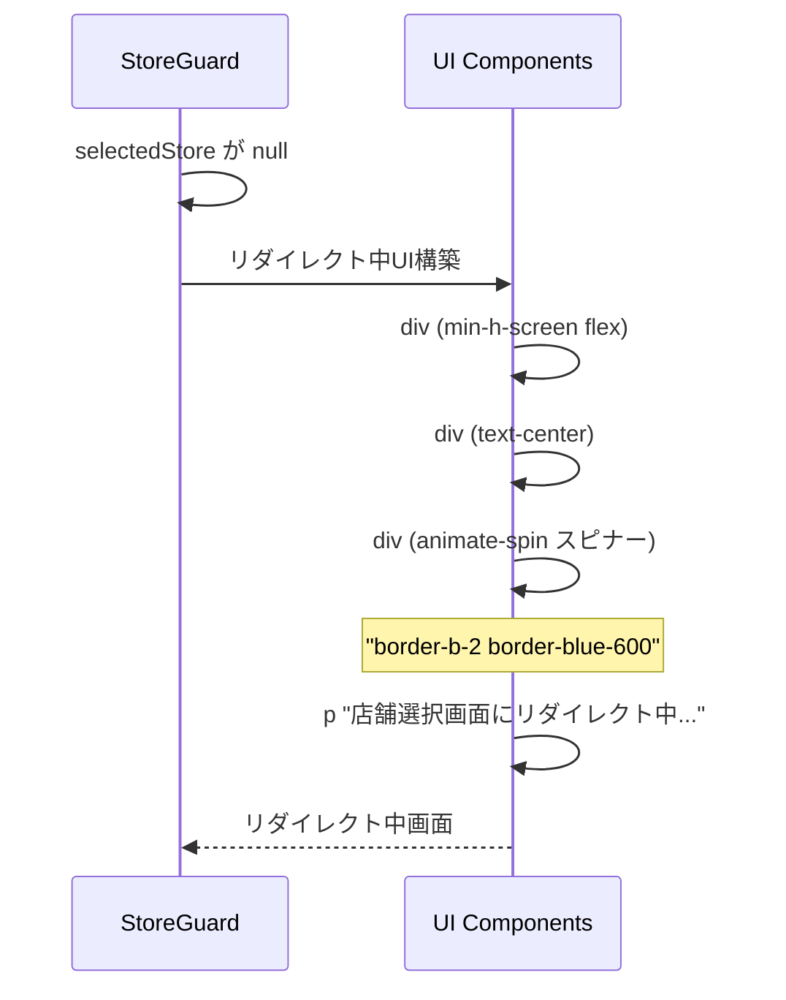
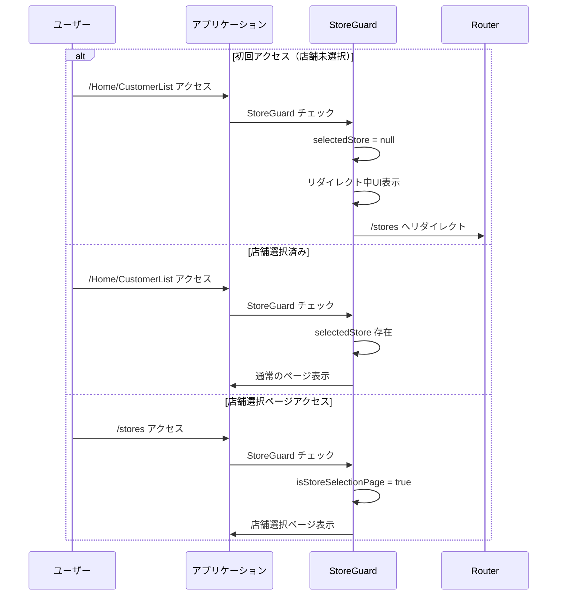
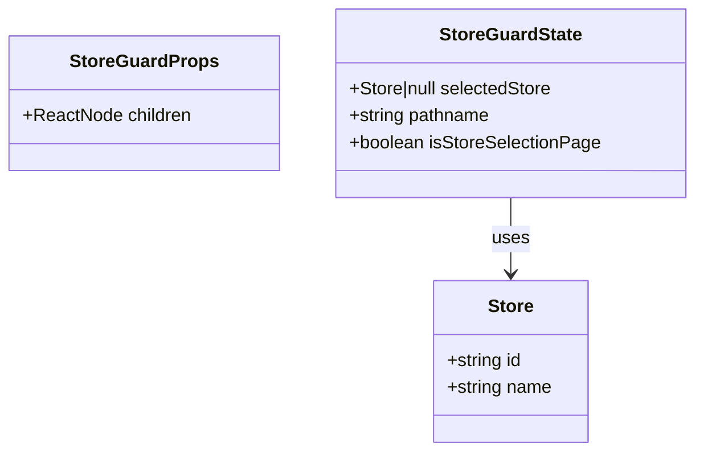

# StoreGuard.tsx - シーケンス図

## 概要
店舗選択状態を監視し、必要に応じてリダイレクトを行うガードコンポーネントの処理フローを示すシーケンス図です。

## 1. コンポーネント初期化と状態取得



## 2. ページ判定とレンダリング制御



## 3. useStoreRedirect フックとの連携



## 4. 条件分岐の詳細フロー

```mermaid
flowchart TD
    A[StoreGuard レンダリング] --> B{pathname チェック}
    B -->|/stores or /| C[isStoreSelectionPage = true]
    B -->|その他| D[isStoreSelectionPage = false]
    
    C --> E[children をそのまま表示]
    
    D --> F{selectedStore 存在？}
    F -->|Yes| G[children を表示]
    F -->|No| H[リダイレクト中UI表示]
    
    H --> I[useStoreRedirect が動作]
    I --> J[/stores へリダイレクト]
    
    style A fill:#e1f5fe
    style E fill:#c8e6c9
    style G fill:#c8e6c9
    style J fill:#ffcdd2
```

## 5. リダイレクト中UI



## 6. 使用場面による動作



## データ型とProps



## 統合パターン

### Layout.tsx での使用
```typescript
export default function RootLayout({ children }) {
  return (
    <StoreProvider>
      <StoreGuard>
        <Header />
        {children}
      </StoreGuard>
    </StoreProvider>
  );
}
```

### 特定ページでの使用
```typescript
export default function ProtectedPage() {
  return (
    <StoreGuard>
      <PageContent />
    </StoreGuard>
  );
}
```

## 特徴

### 1. 自動保護機能
- 店舗未選択時の自動リダイレクト
- アクセス制御の一元化

### 2. UX最適化
- リダイレクト中の視覚的フィードバック
- スムーズな画面遷移

### 3. 柔軟な制御
- 店舗選択ページは除外
- ホームページも除外

### 4. シンプルな実装
- children パターン使用
- 透過的なラッピング

### 5. パフォーマンス
- 不要な再レンダリング防止
- 効率的な状態チェック

## エッジケース対応

### Cookie 削除時
1. selectedStore が null になる
2. StoreGuard がリダイレクトUI表示
3. useStoreRedirect が /stores へリダイレクト

### 直接URL入力
1. 保護されたページへの直接アクセス
2. StoreGuard が即座にチェック
3. 必要に応じてリダイレクト

### ブラウザバック
1. 履歴を戻った時も再チェック
2. 店舗状態に応じた適切な処理