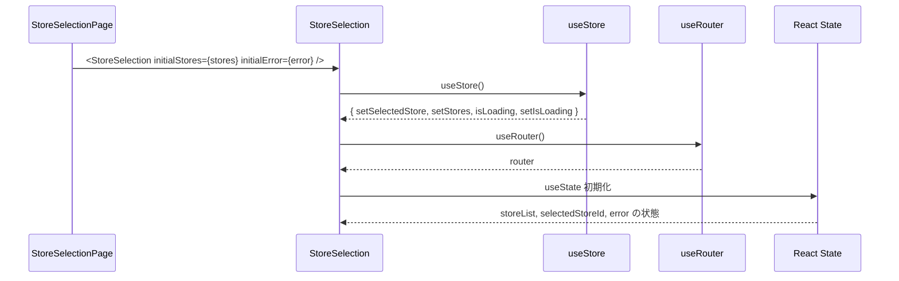
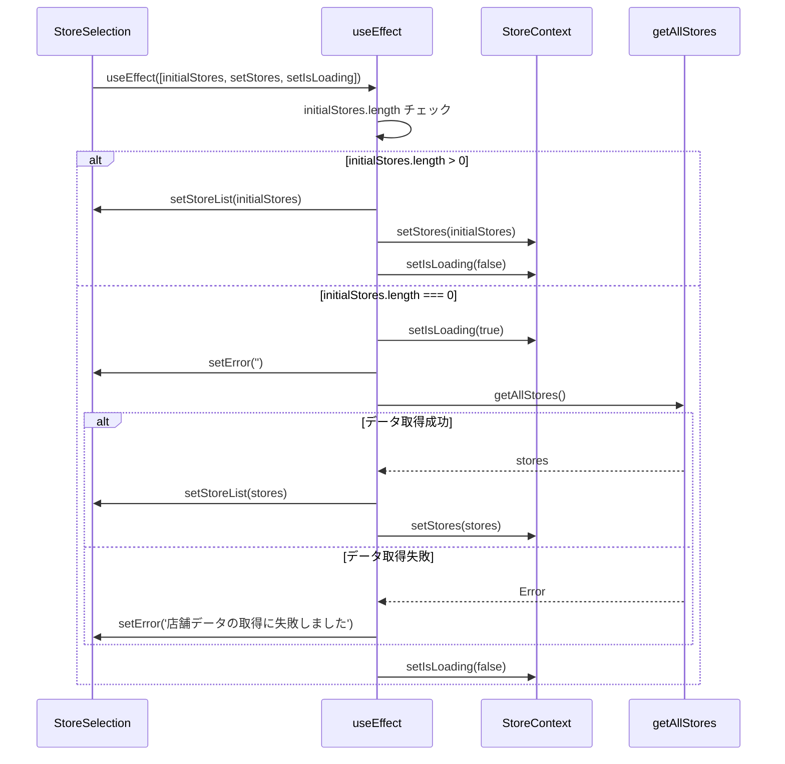
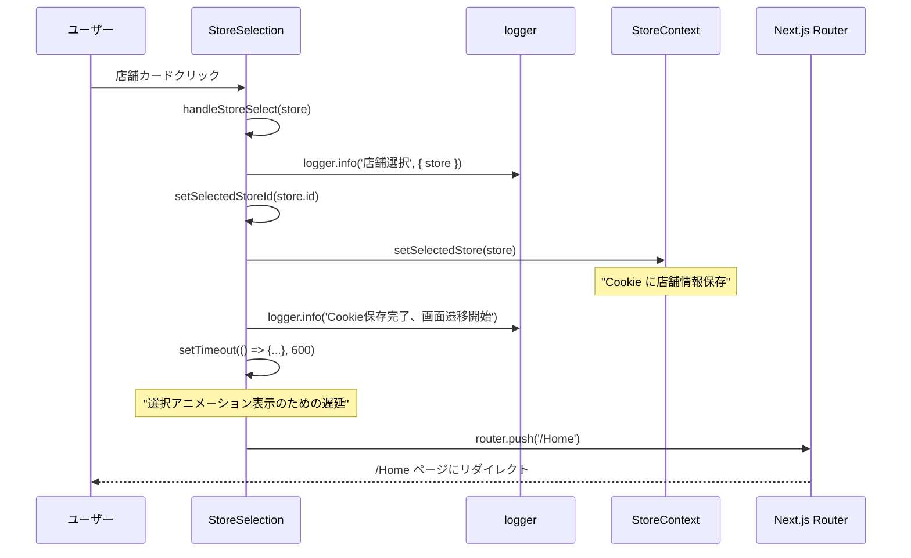
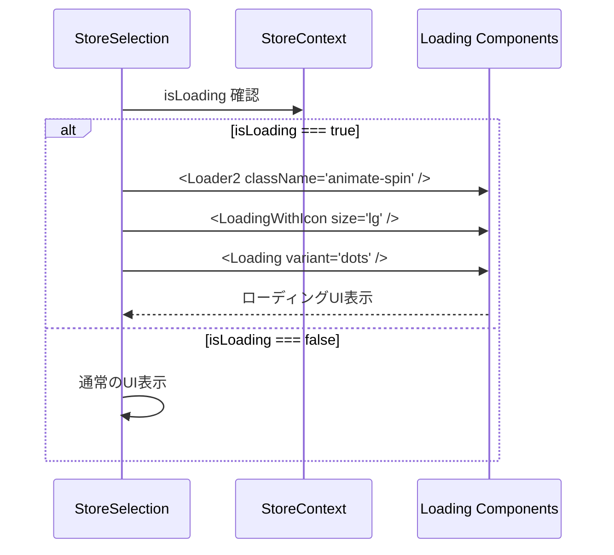
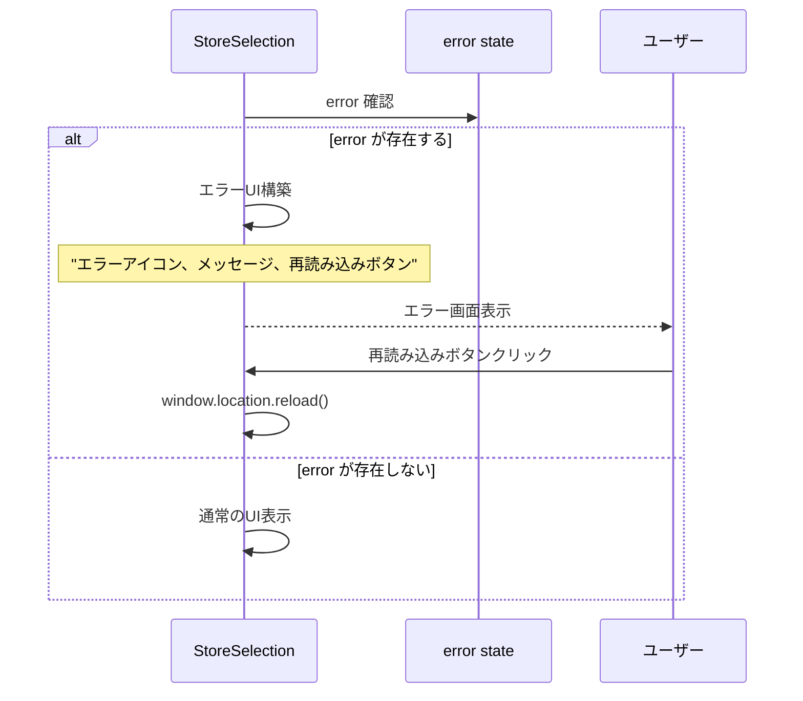
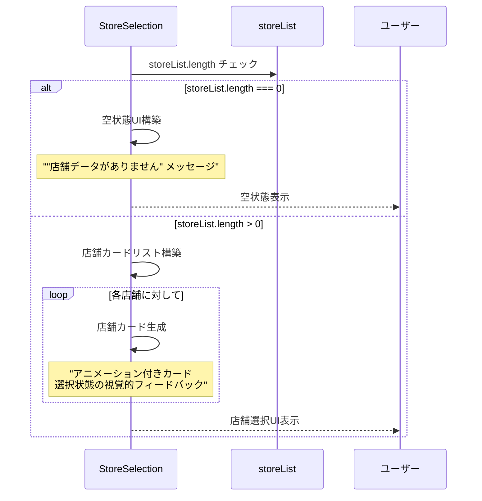

# StoreSelection.tsx - シーケンス図

## 概要
店舗選択コンポーネント (Client Component) の処理フローを示すシーケンス図です。

## 1. コンポーネント初期化



## 2. 初期データ処理 (useEffect)



## 3. 店舗選択処理



## 4. ローディング状態の表示



## 5. エラー状態の表示



## 6. 店舗リスト表示



## 7. アニメーションとUI効果

**店舗選択 UI アニメーションフロー**
1. 店舗カード表示 → fadeInUp アニメーション → インデックス * 100ms 遅延 → カード順次表示
2. ユーザーホバー → transform: translateY(-1px) → shadow-xl 効果
3. 店舗選択 → 選択インジケーター表示
   - チェックアイコン表示
   - ring-2 ring-blue-500 ボーダー効果
4. 選択完了 → 600ms 遅延 → router.push('/Home')

これらのアニメーションにより、ユーザーに心地よい操作体験を提供します。

## Props とデータフロー

**StoreSelection コンポーネントデータ構造**
- StoreSelectionProps: initialStores（Store[]）、initialError（string）のオプションプロパティ
- Store: id、name フィールドを持つ店舗データ
- ComponentState: storeList、selectedStoreId、error のローカル状態
- ContextState: selectedStore、stores、isLoading のグローバル状態

これらのデータ構造により、店舗選択機能が実現されます。
    
    StoreSelectionProps --> Store : contains
    ComponentState --> Store : manages
    ContextState --> Store : stores
```

## 使用パターン

### Server Component からの初期化
```typescript
// stores/page.tsx
const stores = await getAllStores();
return <StoreSelection initialStores={stores} />;
```

### エラー時の初期化
```typescript
// stores/page.tsx (catch block)
return <StoreSelection initialStores={[]} initialError="エラーメッセージ" />;
```

### Context との連携
```typescript
// StoreSelection内
const { setSelectedStore, setStores, isLoading } = useStore();
setSelectedStore(store); // Cookie自動保存
setStores(stores); // グローバル状態更新
```

## 特徴

### 1. ハイブリッドデータ取得
- 初期データ（Server Component）優先
- フォールバック時のClient側取得

### 2. 豊富なUI状態管理
- ローディング状態
- エラー状態
- 空状態
- 選択状態

### 3. アニメーション効果
- 店舗カードの順次表示
- ホバー効果
- 選択フィードバック

### 4. アクセシビリティ
- キーボードナビゲーション対応
- aria-label 設定
- 視覚的フィードバック

### 5. レスポンシブデザイン
- グリッドレイアウト
- モバイル対応
- 柔軟なカードサイズ

## パフォーマンス考慮

### 初期化の最適化
- Server Component からの初期データ活用
- 不要なAPI呼び出しの回避

### アニメーションの最適化
- CSS transform 使用
- GPU加速対応
- 60fps のスムーズな動作