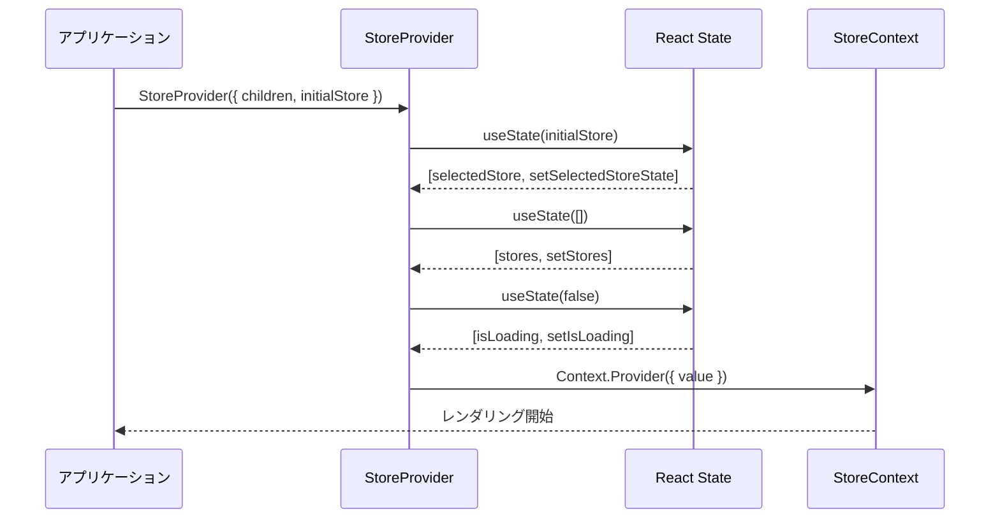
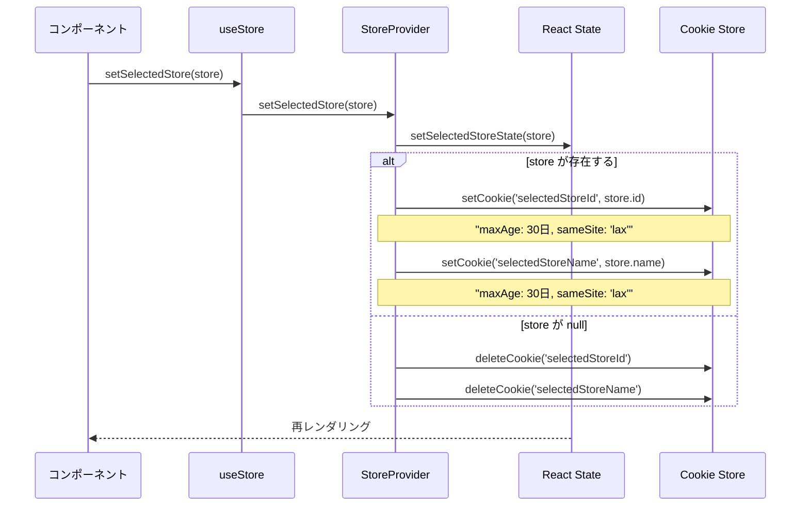
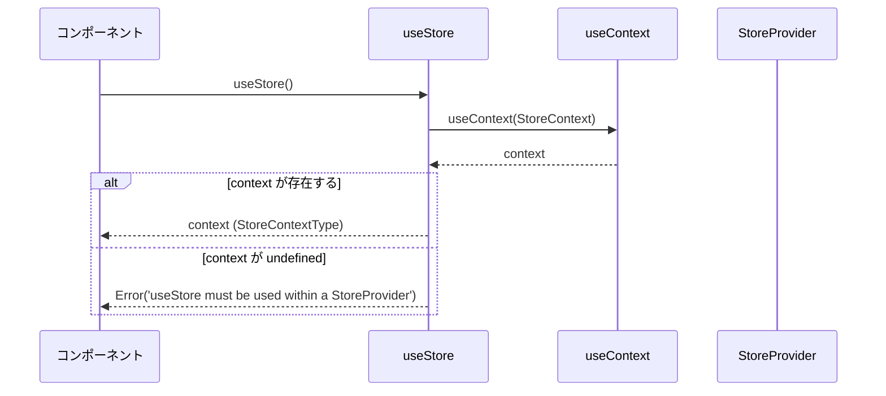
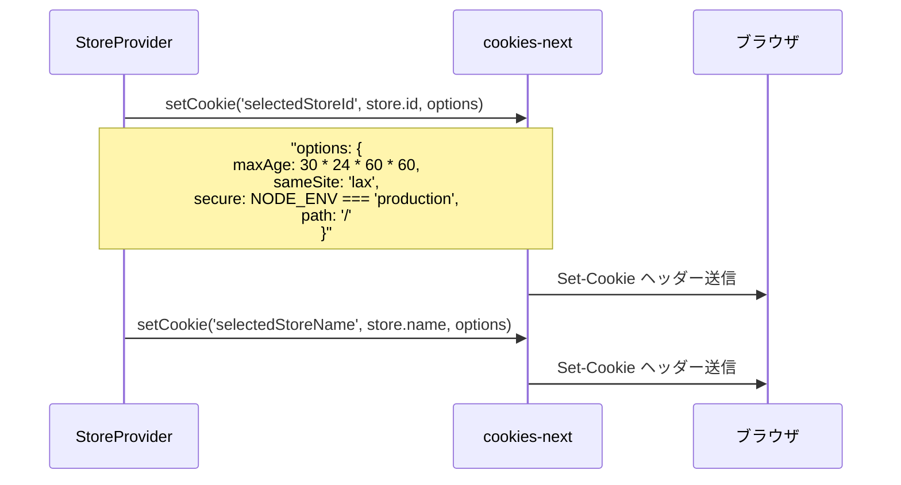
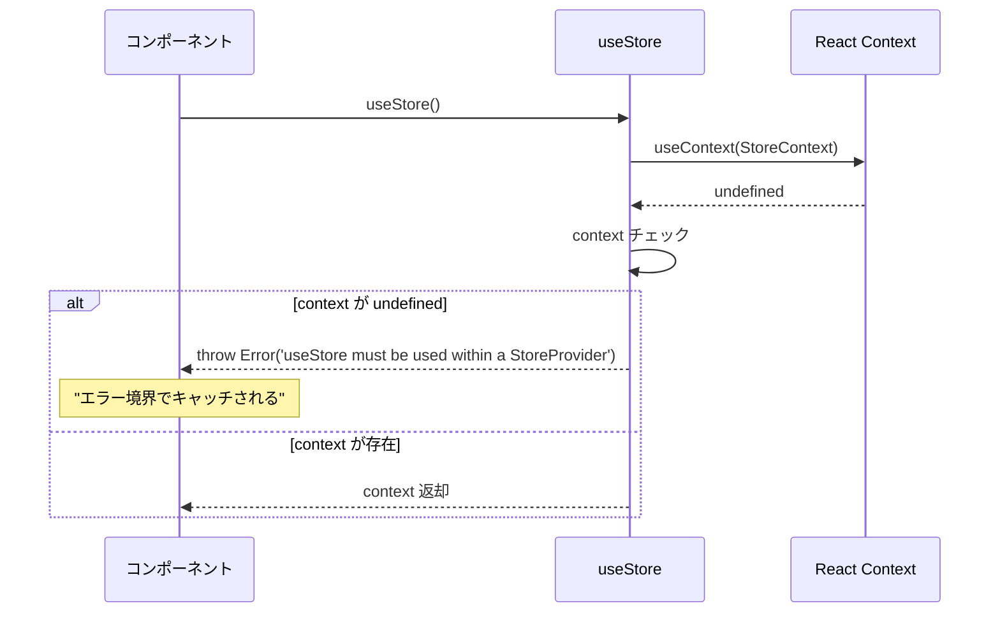

# StoreContext.tsx - シーケンス図

## 概要
店舗選択状態管理に関するReact Contextの処理フローを示すシーケンス図です。

## 1. StoreProvider 初期化



## 2. 店舗選択処理 (setSelectedStore)



## 3. useStore フック使用



## 4. Cookie設定詳細



## 5. Context値の構造

StoreContextで使用されるデータ構造とインターフェース：

### StoreContextTypeインターフェース
Context経由で提供される値と機能：
- **selectedStore: Store|null** - 現在選択されている店舗情報またはnull
- **setSelectedStore: function** - 店舗選択状態を更新する関数
- **stores: Store[]** - 利用可能な店舗の一覧配列
- **setStores: function** - 店舗一覧を更新する関数
- **isLoading: boolean** - ローディング状態を表すフラグ
- **setIsLoading: function** - ローディング状態を制御する関数

### Storeエンティティ
店舗情報を表す基本データ構造：
- **id: string** - 店舗の一意識別子（データベースキー）
- **name: string** - 店舗の表示名（ユーザーインターフェース用）

### StoreProviderPropsインターフェース
StoreProviderコンポーネントが受け取るプロパティ：
- **children: ReactNode** - Provider内でレンダリングされる子コンポーネント
- **initialStore?: Store|null** - オプションの初期店舗設定（サーバーサイドレンダリング用）

### 関係性
- StoreContextTypeはStoreエンティティを含んでおり、selectedStoreとstores配列で店舗情報を管理
- StoreProviderPropsはStoreエンティティを受け入れて初期状態を設定

この構造により、店舗選択状態の型安全性と一貫性が保たれ、アプリケーション全体で信頼性の高い状態管理が実現されています。

## 6. 状態更新フロー

StoreContextの状態更新メカニズムの詳細な流れ：

### 更新トリガー
1. **コンポーネントから店舗選択** - ユーザーが店舗選択インターフェースで操作を実行
2. **setSelectedStore呼び出し** - Contextから提供される状態更新関数を実行

### 店舗選択状態の判定
3. **店舗が選択されたかのチェック** - 渡された店舗オブジェクトがnullではないかを確認

#### 店舗選択時の処理
4. **React State更新** - selectedStore状態を新しい店舗オブジェクトで更新
5. **店舗IDをCookieに保存** - 永続化のためにsetCookie('selectedStoreId', store.id)を実行
6. **店舗名をCookieに保存** - 表示用にsetCookie('selectedStoreName', store.name)を実行

#### 店舗選択解除時の処理
4. **React Stateをnullに** - selectedStore状態をnullにリセット
5. **Cookieを削除** - deleteCookie()で選択状態をクリア
   - selectedStoreId Cookieを削除
   - selectedStoreName Cookieを削除

### 再レンダリング
7. **コンポーネント再レンダリング** - 状態変更によりContextを消費する全コンポーネントが再レンダリング

### 特徴
- **アトミックな操作**: React StateとCookieの更新が同期して実行される
- **一貫性の保証**: 店舗選択と解除どちらの場合も適切な処理が実行される
- **自動永続化**: Cookieへの保存が自動的に行われ、ブラウザー再起動時に状態が復元される

このフローにより、ユーザーの店舗選択状態が確実に管理され、アプリケーション全体で一貫した体験が提供されます。

## 7. エラーハンドリング



## 使用パターン

### 基本的な使用方法
```typescript
// Provider でアプリを包む
<StoreProvider initialStore={serverStore}>
  <App />
</StoreProvider>

// コンポーネント内で使用
const { selectedStore, setSelectedStore, stores, setStores } = useStore();
```

### 店舗選択
```typescript
const handleStoreSelect = (store: Store) => {
  setSelectedStore(store); // 自動的にCookieに保存
};
```

### 店舗解除
```typescript
const handleStoreDeselect = () => {
  setSelectedStore(null); // Cookieも削除される
};
```

## セキュリティ考慮事項

### Cookie設定
- `sameSite: 'lax'` - CSRF攻撃防止
- `secure: production` - HTTPS環境でのみセキュア
- `path: '/'` - アプリ全体でアクセス可能
- `maxAge: 30日` - 適切な有効期限

### データ最小化
- 店舗IDと名前のみ保存
- 機密情報は含まない

## パフォーマンス考慮事項

### 状態の分離
- 選択店舗、店舗一覧、ローディング状態を分離
- 必要な部分のみ更新

### Cookie操作の最適化
- ID と名前を別々に保存
- フォールバック用の名前保存