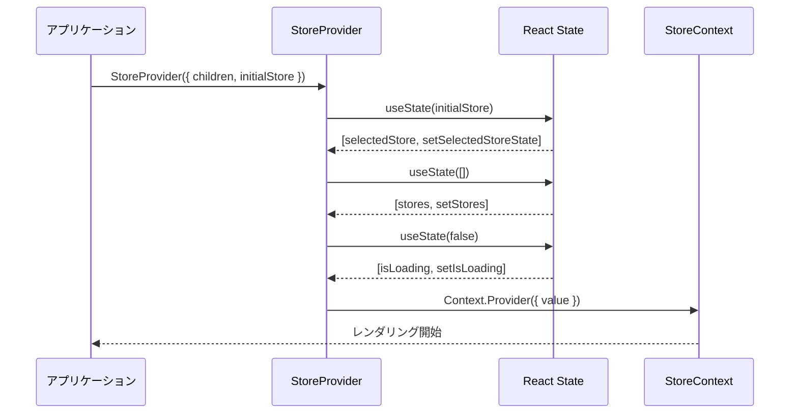
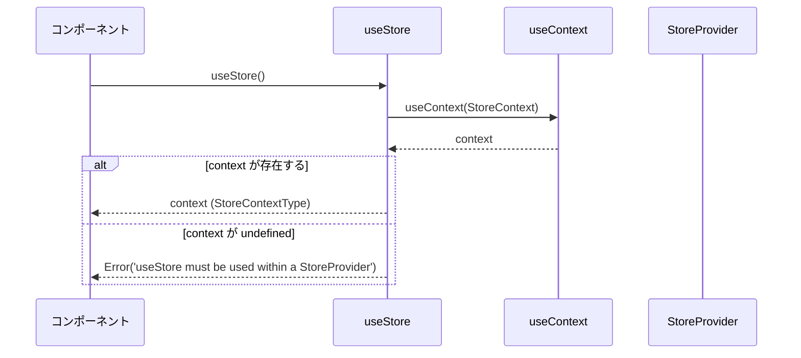
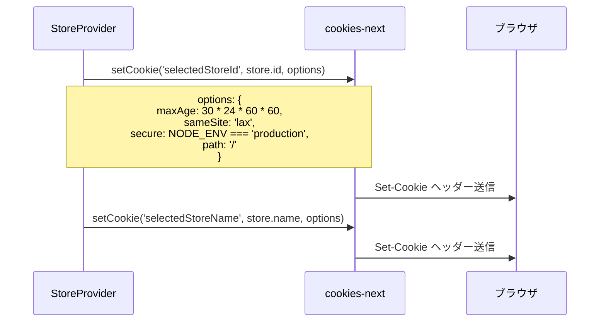
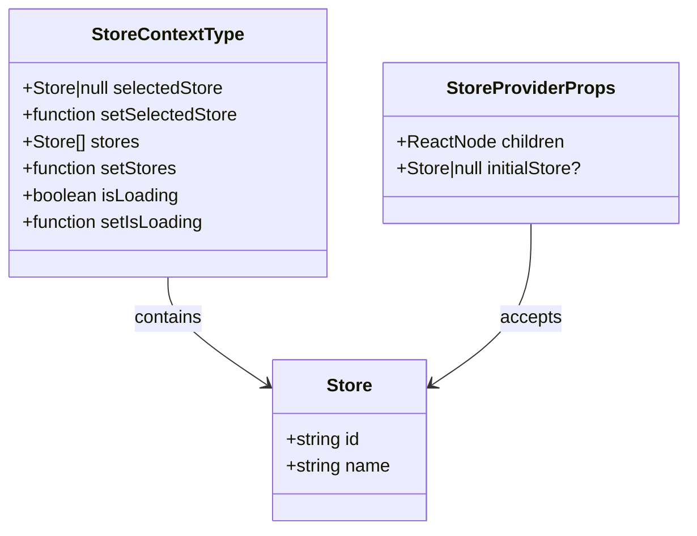
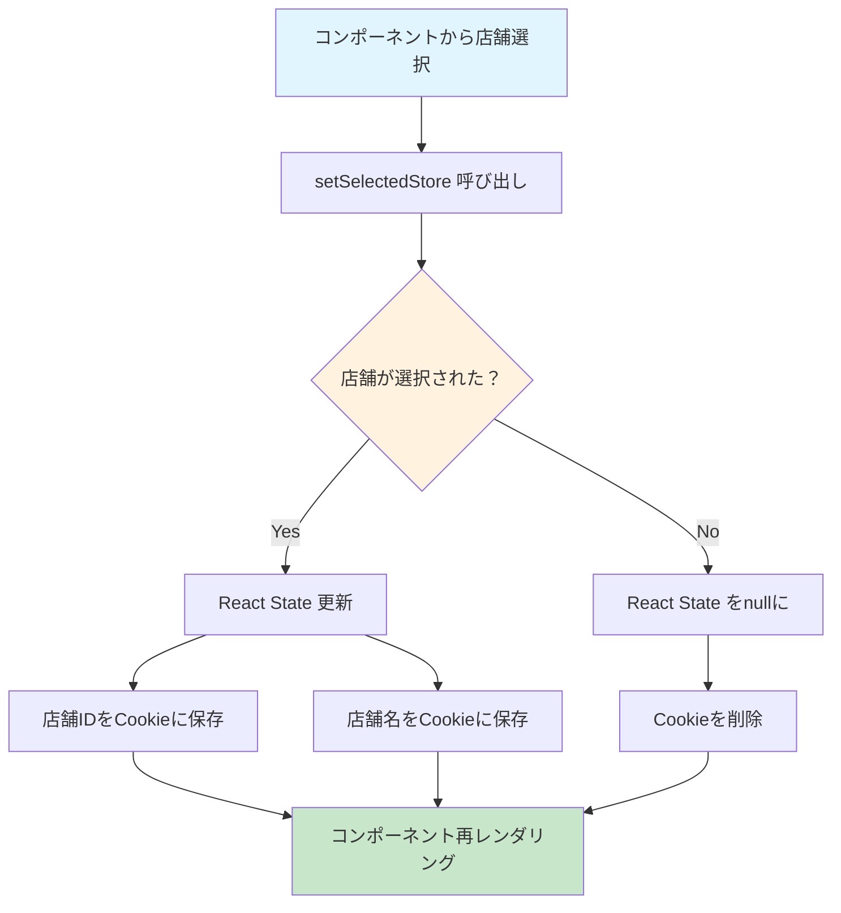
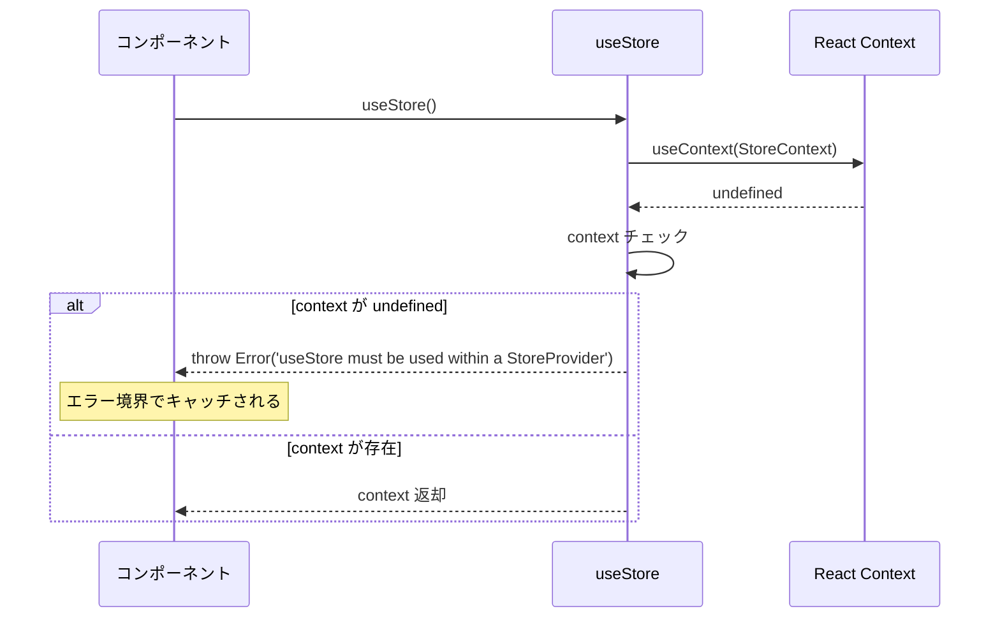

# StoreContext.tsx - シーケンス図

## 概要
店舗選択状態管理に関するReact Contextの処理フローを示すシーケンス図です。

## 1. StoreProvider 初期化



## 2. 店舗選択処理 (setSelectedStore)


## 3. useStore フック使用



## 4. Cookie設定詳細



## 5. Context値の構造



## 6. 状態更新フロー



## 7. エラーハンドリング



## 使用パターン

### 基本的な使用方法
```typescript
// Provider でアプリを包む
<StoreProvider initialStore={serverStore}>
  <App />
</StoreProvider>

// コンポーネント内で使用
const { selectedStore, setSelectedStore, stores, setStores } = useStore();
```

### 店舗選択
```typescript
const handleStoreSelect = (store: Store) => {
  setSelectedStore(store); // 自動的にCookieに保存
};
```

### 店舗解除
```typescript
const handleStoreDeselect = () => {
  setSelectedStore(null); // Cookieも削除される
};
```

## セキュリティ考慮事項

### Cookie設定
- `sameSite: 'lax'` - CSRF攻撃防止
- `secure: production` - HTTPS環境でのみセキュア
- `path: '/'` - アプリ全体でアクセス可能
- `maxAge: 30日` - 適切な有効期限

### データ最小化
- 店舗IDと名前のみ保存
- 機密情報は含まない

## パフォーマンス考慮事項

### 状態の分離
- 選択店舗、店舗一覧、ローディング状態を分離
- 必要な部分のみ更新

### Cookie操作の最適化
- ID と名前を別々に保存
- フォールバック用の名前保存