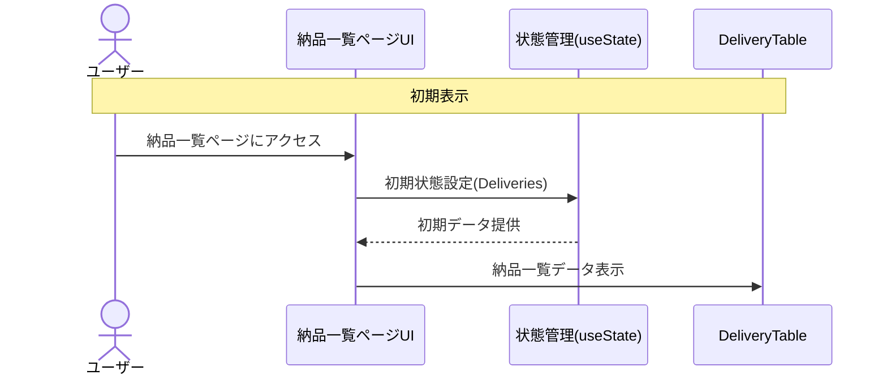

```mermaid
sequenceDiagram
    actor ユーザー
    participant UI as 納品一覧ページUI
    participant State as 状態管理(useState)
    participant Table as DeliveryTable

    Note over ユーザー,Table: 初期表示
    ユーザー->>UI: 納品一覧ページにアクセス
    UI->>State: 初期状態設定(Deliveries)
    State-->>UI: 初期データ提供
    UI->>Table: 納品一覧データ表示
    
```