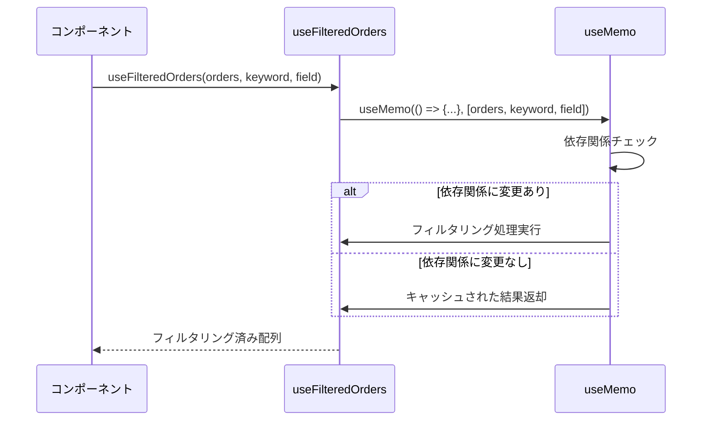
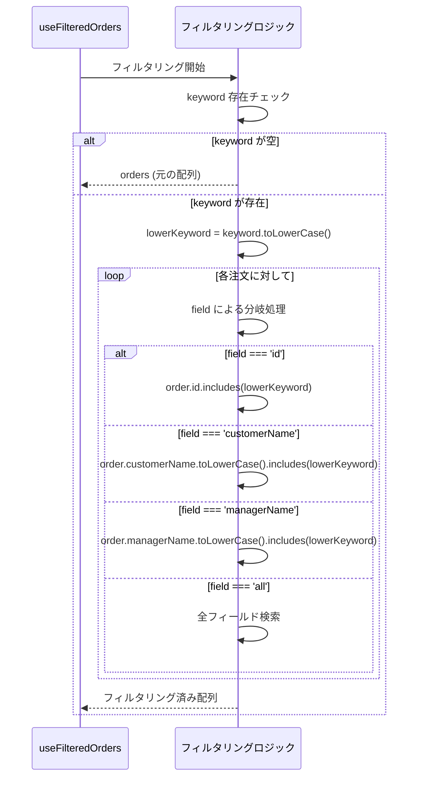
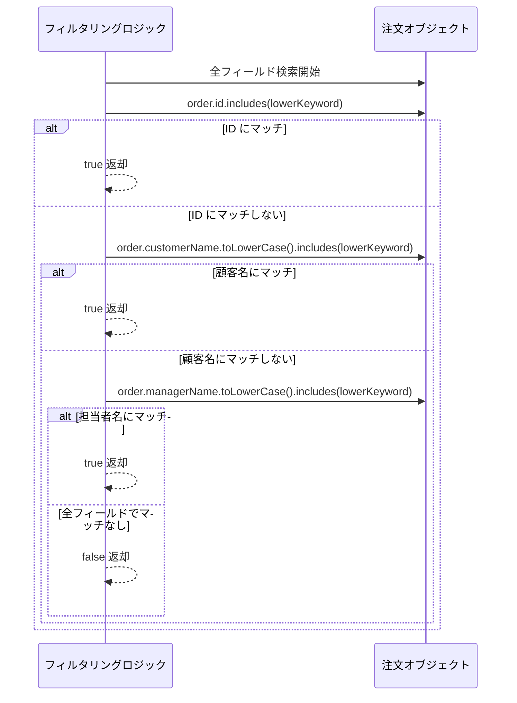
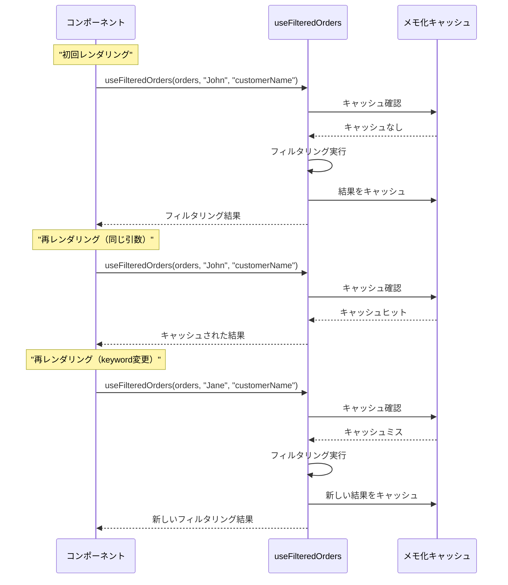

# useFilteredOrders.ts - シーケンス図

## 概要
注文データのフィルタリング機能を提供するカスタムフックの処理フローを示すシーケンス図です。

## 1. フック初期化とメモ化



## 2. フィールド別フィルタリング処理



## 3. 全フィールド検索の詳細



## 4. 依存関係による再計算制御

useMemoを使用した依存関係ベースの再計算制御：

1. **orders変更時**: 再計算実行
2. **keyword変更時**: 再計算実行  
3. **field変更時**: 再計算実行
4. **変更なし**: キャッシュ結果返却

パフォーマンス最適化のため、依存関係が変更された場合のみフィルタリング処理を実行します。

## 5. パフォーマンス最適化



## データ型定義

### Order型
- `id: string` - 注文ID
- `customerName: string` - 顧客名
- `managerName: string` - 担当者名

### FilterParams型
- `orders: Order[]` - フィルタ対象の注文配列
- `keyword: string` - 検索キーワード
- `field: string` - 検索対象フィールド

## 使用例

### 基本的な使用方法
```typescript
function OrderList() {
  const [orders] = useState(initialOrders);
  const [keyword, setKeyword] = useState('');
  const [field, setField] = useState('all');
  
  const filteredOrders = useFilteredOrders(orders, keyword, field);
  
  return (
    <div>
      <SearchInput value={keyword} onChange={setKeyword} />
      <FieldSelector value={field} onChange={setField} />
      <OrderTable orders={filteredOrders} />
    </div>
  );
}
```

### リアルタイム検索
```typescript
function SearchableOrderList() {
  const [orders] = useState(orderData);
  const [searchTerm, setSearchTerm] = useState('');
  
  const filteredOrders = useFilteredOrders(orders, searchTerm, 'all');
  
  return (
    <div>
      <input
        type="text"
        placeholder="注文を検索..."
        value={searchTerm}
        onChange={(e) => setSearchTerm(e.target.value)}
      />
      {filteredOrders.map(order => (
        <OrderCard key={order.id} order={order} />
      ))}
    </div>
  );
}
```

### フィールド指定検索
```typescript
function CustomerNameSearch() {
  const [orders] = useState(orderData);
  const [customerQuery, setCustomerQuery] = useState('');
  
  // 顧客名のみで検索
  const filtered = useFilteredOrders(orders, customerQuery, 'customerName');
  
  return <OrderResults orders={filtered} />;
}
```

## フックの特徴

### 1. パフォーマンス最適化
- `useMemo` による結果のメモ化
- 不要な再計算の防止

### 2. 柔軟な検索
- 特定フィールド検索
- 全フィールド検索

### 3. 大文字小文字を区別しない
- `toLowerCase()` による正規化
- ユーザーフレンドリーな検索

### 4. 部分一致検索
- `includes()` による部分一致
- 直感的な検索体験

### 5. 型安全性
- TypeScript による型定義
- コンパイル時の型チェック

## パフォーマンス考慮事項

### メモ化の効果
- 同じ引数での呼び出し時はO(1)
- データ変更時のみO(n)の計算

### 依存関係の最適化
- 必要最小限の依存関係
- 過度な再計算の防止

### 検索アルゴリズム
- 線形検索 O(n)
- 大量データでは別の最適化が必要