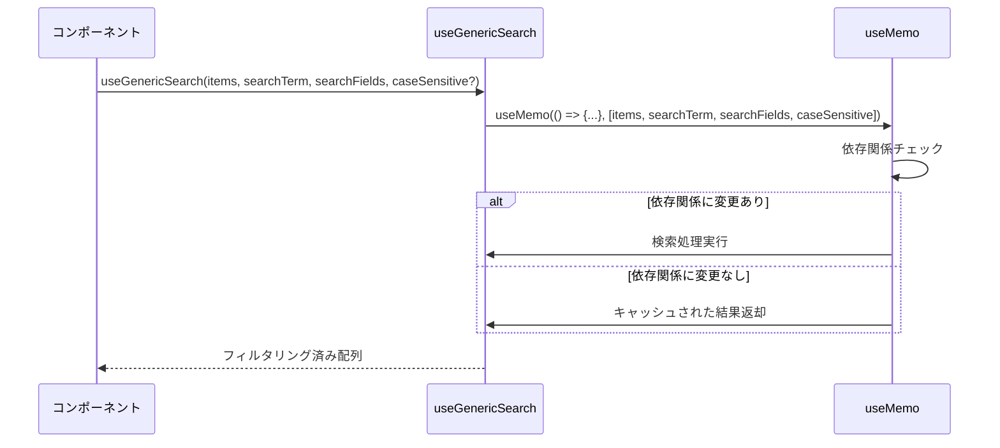
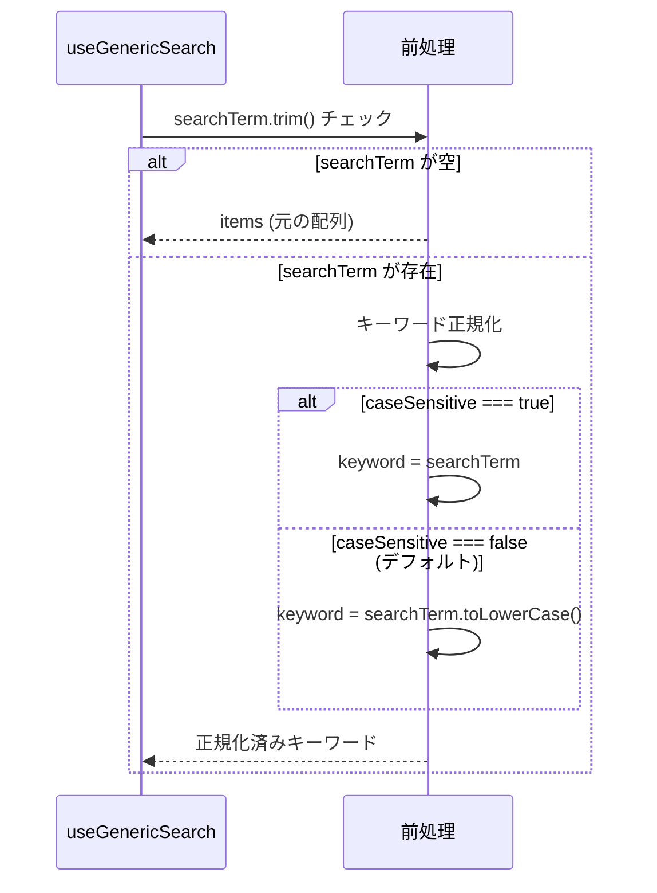
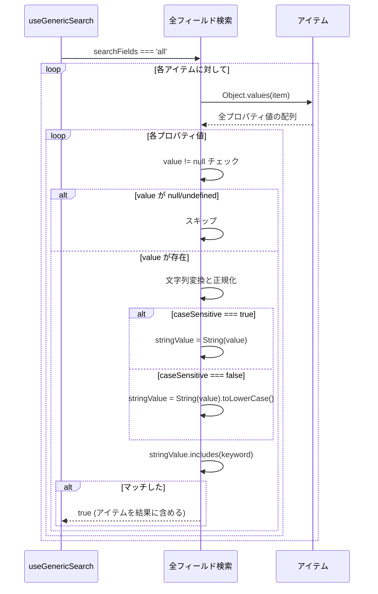
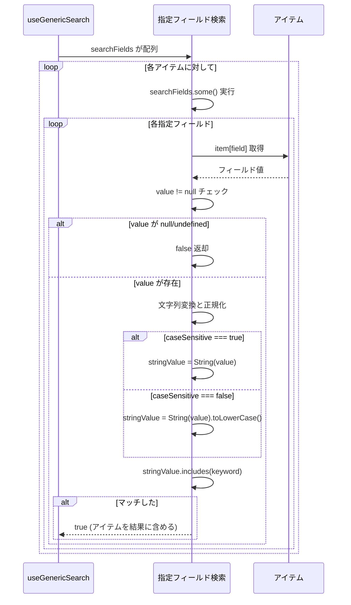
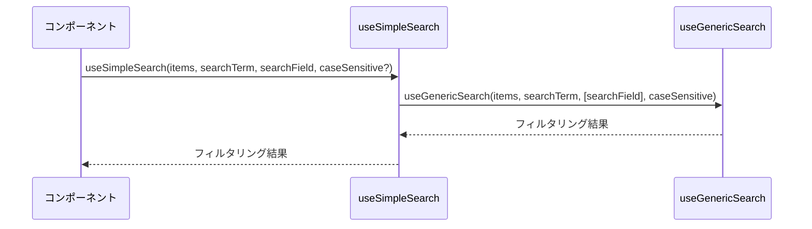
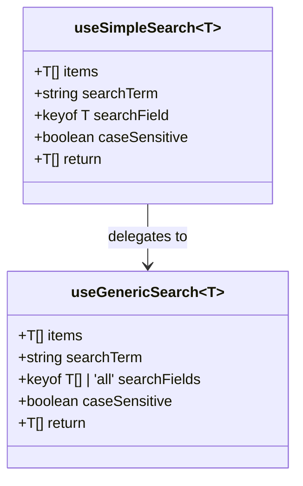

# useGenericSearch.ts - シーケンス図

## 概要
汎用的な検索機能を提供するカスタムフックの処理フローを示すシーケンス図です。

## 1. useGenericSearch フック



## 2. 検索前処理とキーワード正規化



## 3. 全フィールド検索 (searchFields === 'all')



## 4. 指定フィールド検索



## 5. useSimpleSearch フック



## 6. 大文字小文字の処理比較

```mermaid
flowchart TD
    A[検索実行] --> B{caseSensitive?}
    B -->|true| C[元の文字列で比較]
    B -->|false| D[toLowerCase() で正規化]
    
    C --> E[keyword = searchTerm]
    D --> F[keyword = searchTerm.toLowerCase()]
    
    E --> G[String(value).includes(keyword)]
    F --> H[String(value).toLowerCase().includes(keyword)]
    
    G --> I[大文字小文字を区別した検索]
    H --> J[大文字小文字を区別しない検索]
    
    style A fill:#e1f5fe
    style I fill:#c8e6c9
    style J fill:#c8e6c9
```

## データ型とジェネリクス



## 使用例

### 全フィールド検索
```typescript
function ProductSearch() {
  const [products] = useState(productData);
  const [query, setQuery] = useState('');
  
  const searchResults = useGenericSearch(
    products,
    query,
    'all', // 全フィールドを検索
    false  // 大文字小文字を区別しない
  );
  
  return (
    <div>
      <SearchInput value={query} onChange={setQuery} />
      <ProductList products={searchResults} />
    </div>
  );
}
```

### 特定フィールド検索
```typescript
function CustomerSearch() {
  const [customers] = useState(customerData);
  const [searchTerm, setSearchTerm] = useState('');
  
  const filteredCustomers = useGenericSearch(
    customers,
    searchTerm,
    ['name', 'email', 'phone'], // 特定フィールドのみ
    false
  );
  
  return <CustomerTable customers={filteredCustomers} />;
}
```

### 単一フィールド検索（シンプル版）
```typescript
function OrderIdSearch() {
  const [orders] = useState(orderData);
  const [orderId, setOrderId] = useState('');
  
  const matchingOrders = useSimpleSearch(
    orders,
    orderId,
    'id', // IDフィールドのみ
    true  // 大文字小文字を区別
  );
  
  return <OrderResults orders={matchingOrders} />;
}
```

### 大文字小文字を区別する検索
```typescript
function CodeSearch() {
  const [items] = useState(itemData);
  const [code, setCode] = useState('');
  
  const results = useGenericSearch(
    items,
    code,
    ['productCode', 'barcode'],
    true // 大文字小文字を区別する
  );
  
  return <ItemList items={results} />;
}
```

## フックの特徴

### 1. 汎用性
- 任意の型のオブジェクト配列に対応
- 型安全なフィールド指定

### 2. 柔軟な検索対象
- 全フィールド検索
- 特定フィールド群検索
- 単一フィールド検索

### 3. カスタマイズ可能
- 大文字小文字の区別設定
- 検索対象フィールドの動的指定

### 4. パフォーマンス最適化
- `useMemo` による結果キャッシュ
- 不要な再計算の防止

### 5. null安全性
- null/undefined値の適切な処理
- 型安全な値アクセス

## パフォーマンス考慮事項

### メモ化の効果
- 依存関係未変更時はO(1)
- データ変更時のみO(n×m)の計算

### 検索アルゴリズム
- 線形検索による実装
- 大量データでは検索インデックス推奨

### 文字列操作の最適化
- `toLowerCase()` の呼び出し最小化
- 不要な文字列変換の回避