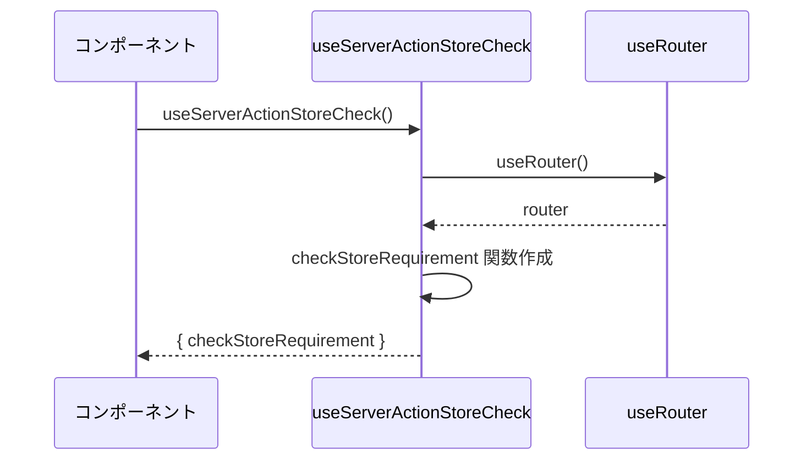
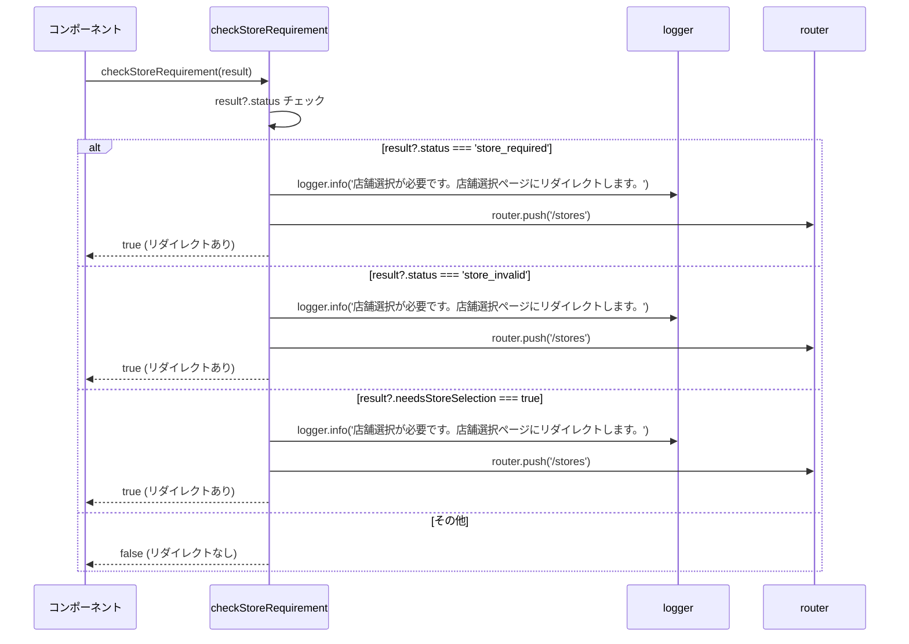
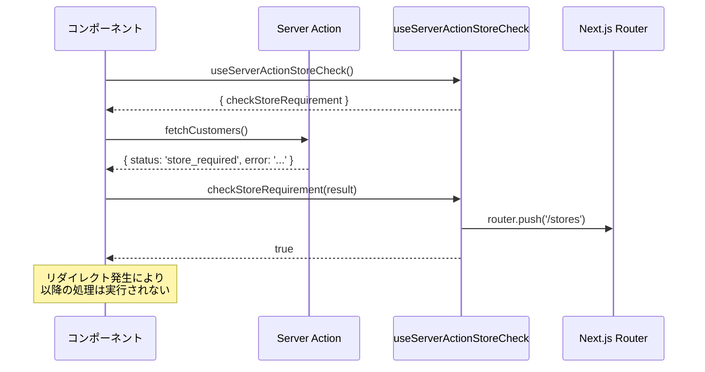
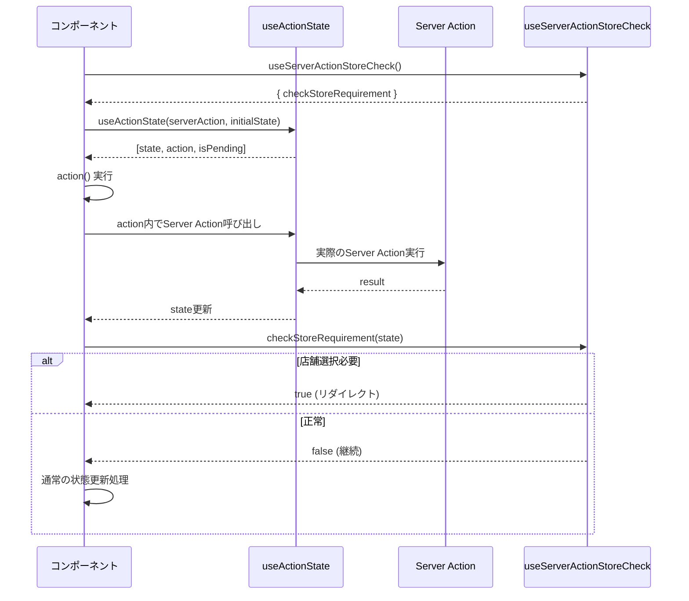
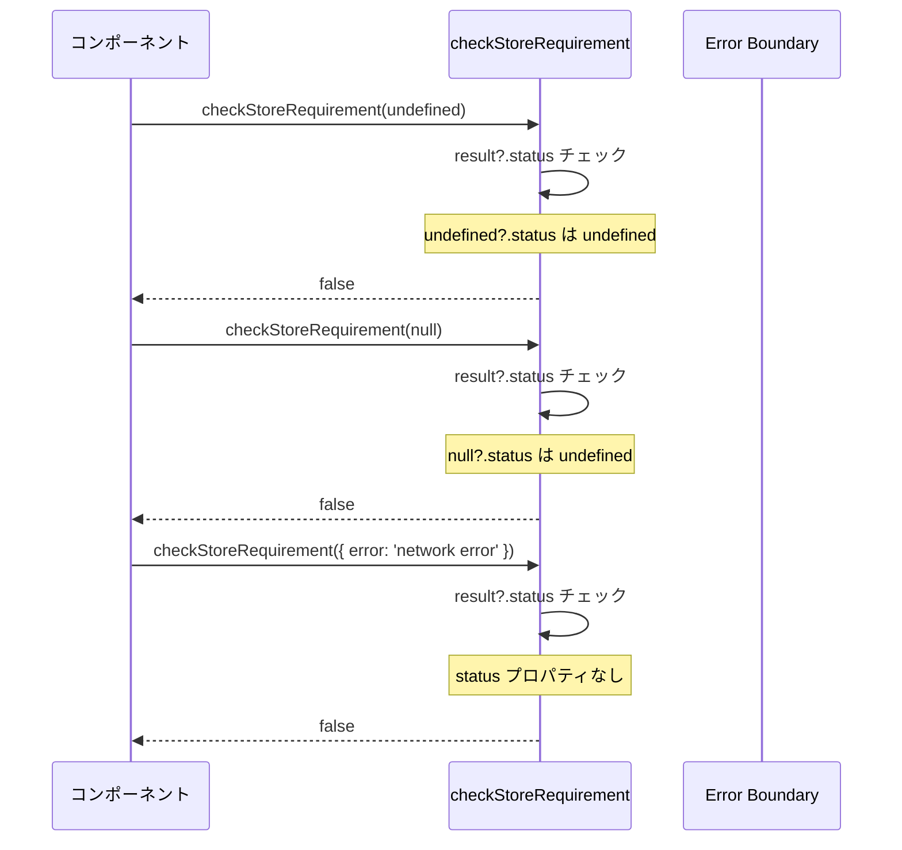
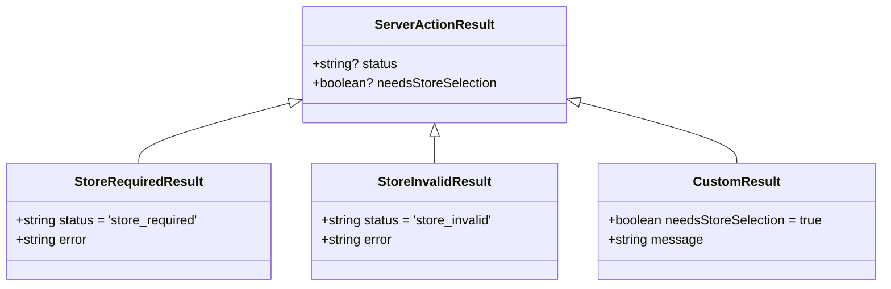

# useServerActionStoreCheck.ts - シーケンス図

## 概要
Server Actionの結果を監視し、店舗選択が必要な場合にリダイレクトするカスタムフックの処理フローを示すシーケンス図です。

## 1. フック初期化



## 2. Server Action結果チェック (checkStoreRequirement)



## 3. 複数条件での判定ロジック

```mermaid
flowchart TD
    A[Server Action結果受信] --> B[checkStoreRequirement 呼び出し]
    B --> C{result?.status === 'store_required'？}
    C -->|Yes| D[ログ出力 & リダイレクト]
    C -->|No| E{result?.status === 'store_invalid'？}
    E -->|Yes| D
    E -->|No| F{result?.needsStoreSelection === true？}
    F -->|Yes| D
    F -->|No| G[何もしない]
    
    D --> H[router.push('/stores')]
    H --> I[true を返却]
    G --> J[false を返却]
    
    style A fill:#e1f5fe
    style D fill:#ffcdd2
    style G fill:#c8e6c9
    style I fill:#ffcdd2
    style J fill:#c8e6c9
```

## 4. 実際の使用パターン



## 5. useActionState との統合



## 6. エラーハンドリングパターン



## データ型定義



## 使用例

### 基本的な使用方法
```typescript
function CustomerList() {
  const { checkStoreRequirement } = useServerActionStoreCheck();
  const [customers, setCustomers] = useState([]);
  
  useEffect(() => {
    const loadCustomers = async () => {
      const result = await fetchCustomers();
      
      // 店舗選択が必要な場合は自動でリダイレクト
      if (checkStoreRequirement(result)) {
        return; // リダイレクト発生、処理中断
      }
      
      setCustomers(result.data);
    };
    
    loadCustomers();
  }, [checkStoreRequirement]);
}
```

### useActionState との組み合わせ
```typescript
function OrderForm() {
  const { checkStoreRequirement } = useServerActionStoreCheck();
  const [state, formAction] = useActionState(createOrder, initialState);
  
  useEffect(() => {
    if (state) {
      checkStoreRequirement(state); // 必要に応じて自動リダイレクト
    }
  }, [state, checkStoreRequirement]);
}
```

### カスタム条件での使用
```typescript
function CustomComponent() {
  const { checkStoreRequirement } = useServerActionStoreCheck();
  
  const handleAction = async () => {
    const result = await customAction();
    
    // カスタムフィールドでの判定
    if (checkStoreRequirement({ needsStoreSelection: result.requiresStore })) {
      return;
    }
    
    // 正常処理継続
    processResult(result);
  };
}
```

## フックの利点

### 1. 統一的な処理
- 全てのServer Actionで同じ判定ロジック
- 一貫したリダイレクト動作

### 2. 簡潔なコード
- if文の繰り返しを削減
- 可読性の向上

### 3. ログ機能
- リダイレクト発生時の追跡可能
- デバッグ支援

### 4. 柔軟性
- 複数の判定条件に対応
- カスタム条件の追加可能

### 5. 型安全性
- TypeScriptでの型チェック
- オプショナルチェーン使用