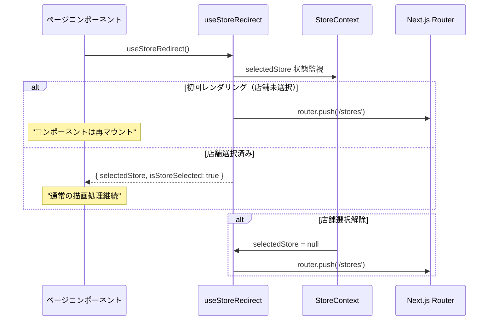

# useStoreRedirect.ts - シーケンス図

## 概要
店舗未選択時のリダイレクト処理を行うカスタムフックの処理フローを示すシーケンス図です。

## 1. フック初期化と監視


## 2. リダイレクト判定とログ出力


## 3. 依存関係の変更監視

useEffectによる依存関係の監視：

1. **selectedStore変更時**: リダイレクト判定実行
2. **isStoreSelectionPage変更時**: リダイレクト判定実行
3. **router変更時**: リダイレクト判定実行
4. **変更なし**: 処理スキップ

条件（!selectedStore && !isStoreSelectionPage）を満たす場合、`/stores`ページにリダイレクトします。

## 4. 戻り値オブジェクトの構築


## 5. ページ判定ロジック

pathnameによるページ判定：

1. **pathname === '/stores'**: isStoreSelectionPage = true（リダイレクト対象外）
2. **pathname === '/'**: isStoreSelectionPage = true（リダイレクト対象外）
3. **その他**: isStoreSelectionPage = false（リダイレクト対象）

店舗選択ページとルートページ以外では、店舗未選択時にリダイレクトを実行します。

## 6. コンポーネント統合例



## 使用例

### 基本的な使用方法
```typescript
function CustomerListPage() {
  const { selectedStore, isStoreSelected } = useStoreRedirect();
  
  if (!isStoreSelected) {
    return <Loading />; // リダイレクト中の表示
  }
  
  return (
    <div>
      <h1>{selectedStore.name} の顧客一覧</h1>
      {/* コンテンツ */}
    </div>
  );
}
```

### 条件付きレンダリング
```typescript
function Dashboard() {
  const { selectedStore, isStoreSelected } = useStoreRedirect();
  
  return (
    <div>
      {isStoreSelected ? (
        <WelcomeMessage store={selectedStore} />
      ) : (
        <RedirectingMessage />
      )}
    </div>
  );
}
```

## フックの特徴

### 1. 自動監視
- 店舗選択状態の変更を自動監視
- ページ変更時の自動判定

### 2. ログ追跡
- リダイレクト発生時のログ出力
- デバッグとトラブルシューティング支援

### 3. 除外ページ対応
- 店舗選択ページでは動作しない
- ホームページでも動作しない

### 4. シンプルなAPI
- 必要な情報のみを戻り値として提供
- 使いやすいインターフェース

## 依存関係

### 内部依存
- `useStore` - 店舗状態管理
- `useRouter` - ページ遷移
- `usePathname` - 現在のパス取得

### 外部依存
- `logger` - ログ出力
- Next.js Navigation hooks

## パフォーマンス考慮

### メモ化
- `isStoreSelectionPage` の計算は毎回実行
- パフォーマンス上問題ないレベル

### 依存配列
- 必要最小限の依存関係のみ指定
- 不要な再実行を防止