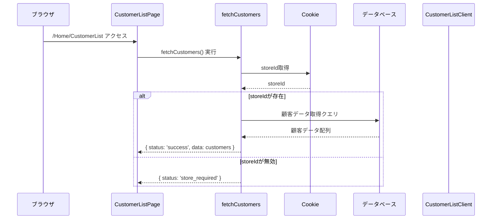
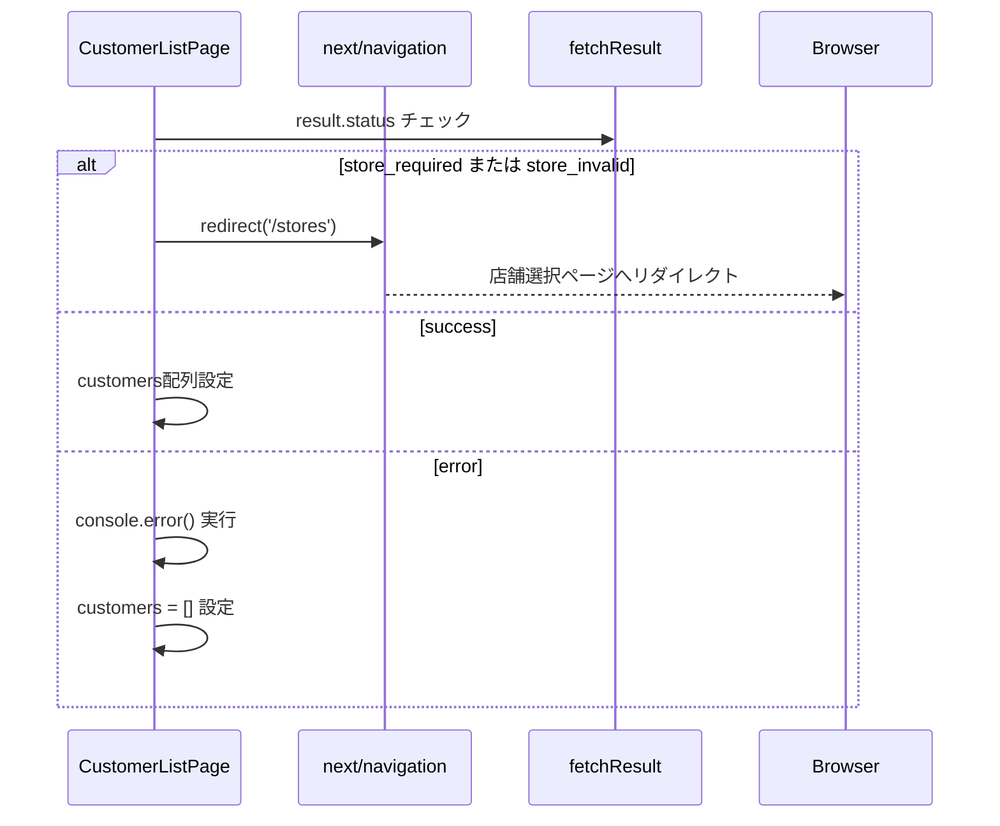
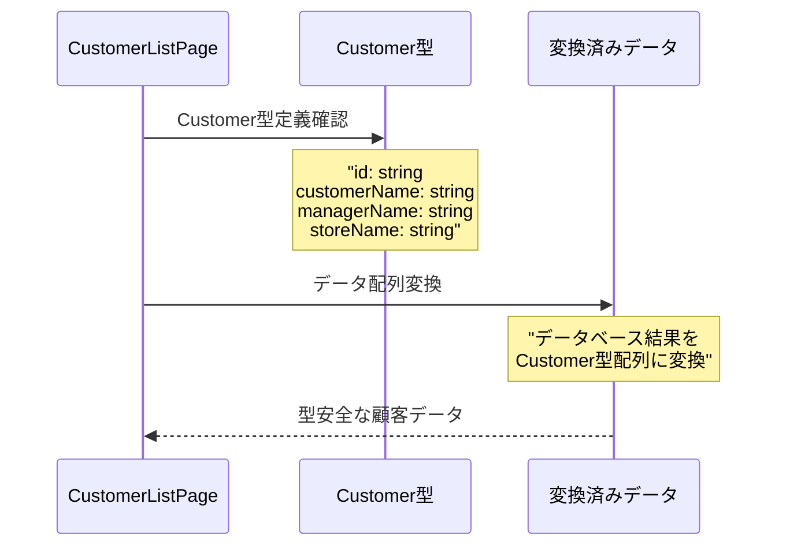
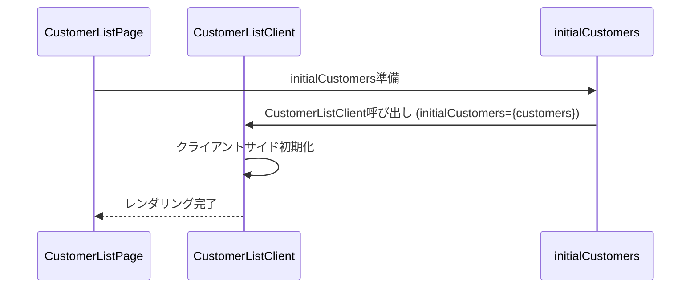
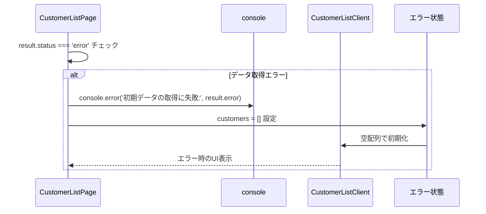
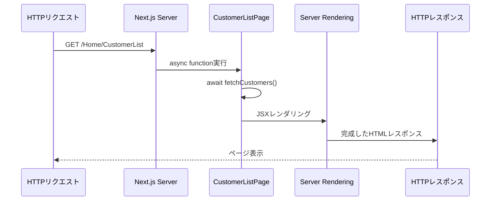

# CustomerList Page - シーケンス図

## 概要
顧客一覧ページの処理フローを示すシーケンス図です。

## 1. ページ初期化とデータ取得

## 2. 店舗選択チェック処理

## 3. データ変換と型定義

## 4. クライアントコンポーネント呼び出し

## 5. エラーハンドリング

## 6. サーバーサイドレンダリングフロー

## データフロー構造

**CustomerList ページコンポーネント構造**
- CustomerListPage: 非同期関数、fetchCustomers()、redirect()、Customer[] customers を持つ
- Customer: id、customerName、managerName、storeName フィールドを持つ
- FetchResult: status、data、error フィールドで API レスポンスを表現

CustomerListPage は Customer を使用し、FetchResult を受け取ります。

## ページ遷移パターン

**顧客一覧ページアクセスフロー**
1. "/Home/CustomerList" アクセス → Cookie 確認
2. storeId 存在チェック：
   - 存在する: 顧客データ取得へ進む
   - 存在しない: "/stores" へリダイレクト
3. データ取得結果による分岐：
   - 成功: CustomerListClient 表示
   - 失敗: エラーログ出力 → 空のリスト表示

このフローにより、適切なアクセス制御とエラーハンドリングが実現されます。

## 特徴

### 1. サーバーサイドレンダリング
- ページロード時にサーバーでデータ取得
- 初期表示の高速化

### 2. 店舗ベースアクセス制御
- Cookie経由でstoreId確認
- 未選択時は自動リダイレクト

### 3. 型安全性
- TypeScript型定義の活用
- コンパイル時エラー検出

### 4. エラーハンドリング
- 複数レベルでのエラー対応
- ユーザーフレンドリーな表示

### 5. パフォーマンス最適化
- サーバーサイドでの事前データ取得
- クライアントの初期化時間短縮

## 依存関係

### 外部依存
- `next/navigation` - リダイレクト機能
- `@/app/actions/customerActions` - データ取得
- `./components/CustomerListClient` - UI表示

### 内部依存
- Cookie経由の店舗情報
- データベース接続
- 型定義システム