# DeliveryAdd Page - シーケンス図

## 概要
納品追加ページの処理フローを示すシーケンス図です。

## 1. ページ初期化とデータ取得

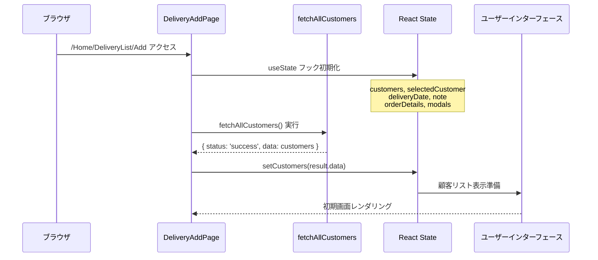

## 2. 顧客検索と選択処理

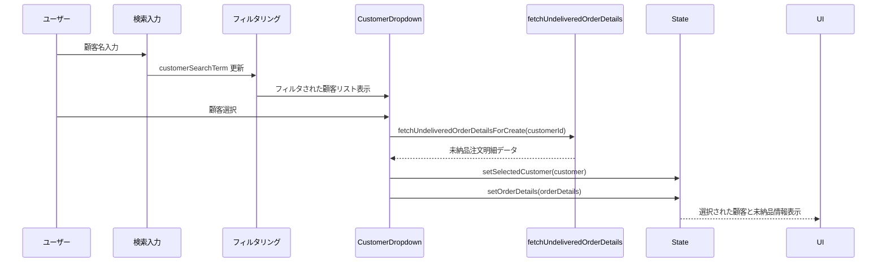

## 3. 未納品商品モーダル表示

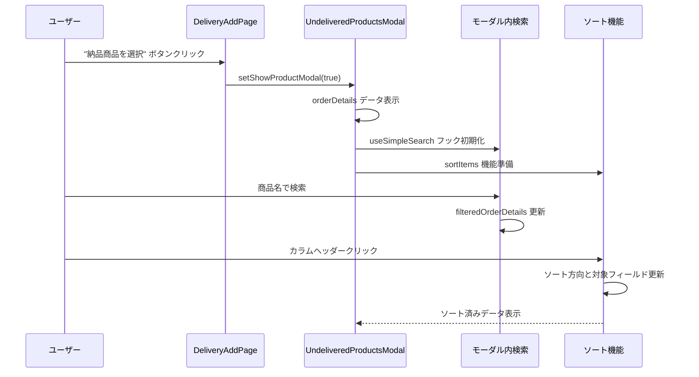

## 4. 数量割り当て処理

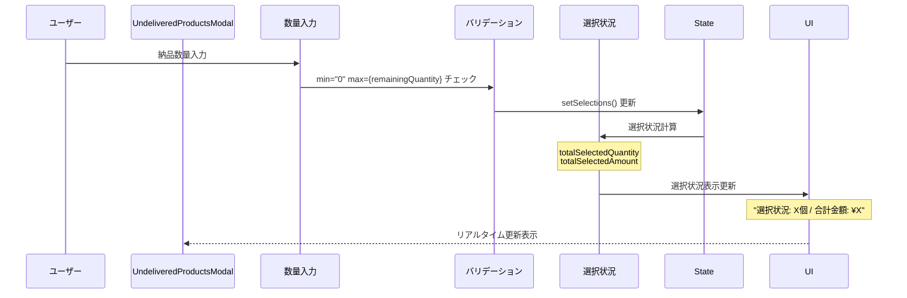

## 5. 納品作成処理

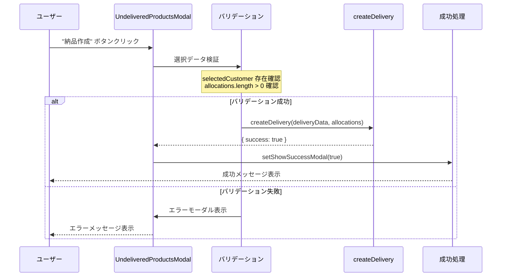

## 6. エラーハンドリング

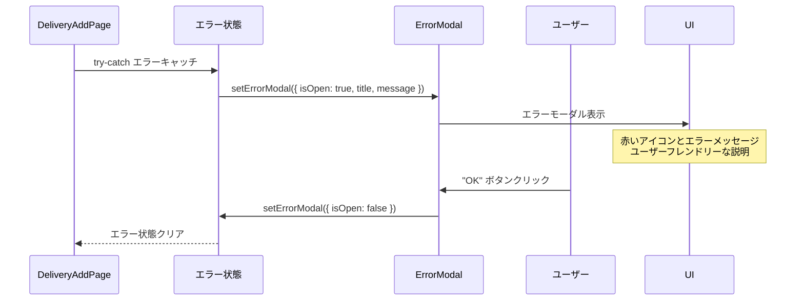

## コンポーネント階層構造

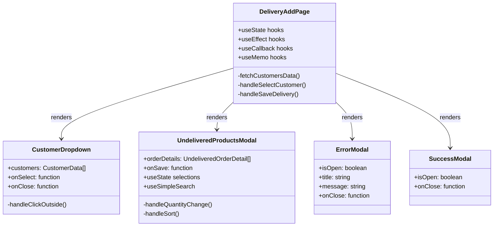

## 状態管理フロー

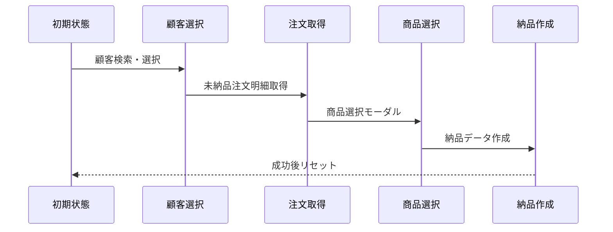

## データフロー詳細

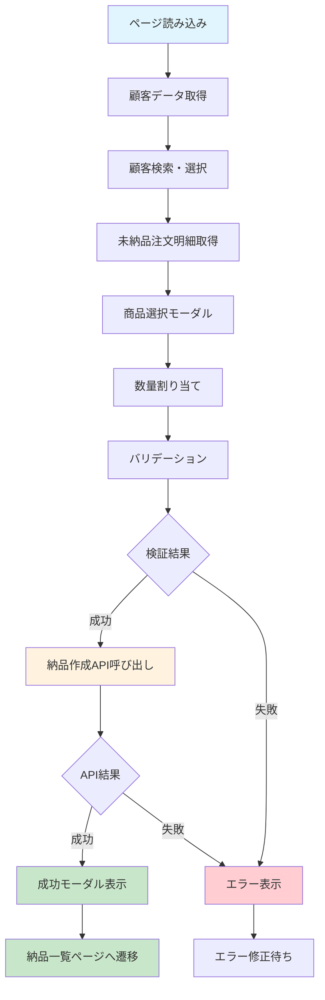

## 検索・フィルタリング機能

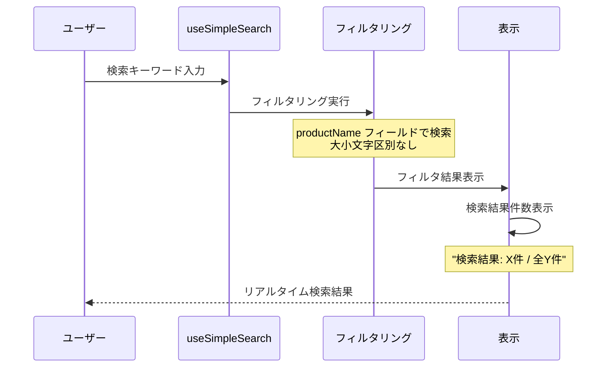

## ソート機能実装

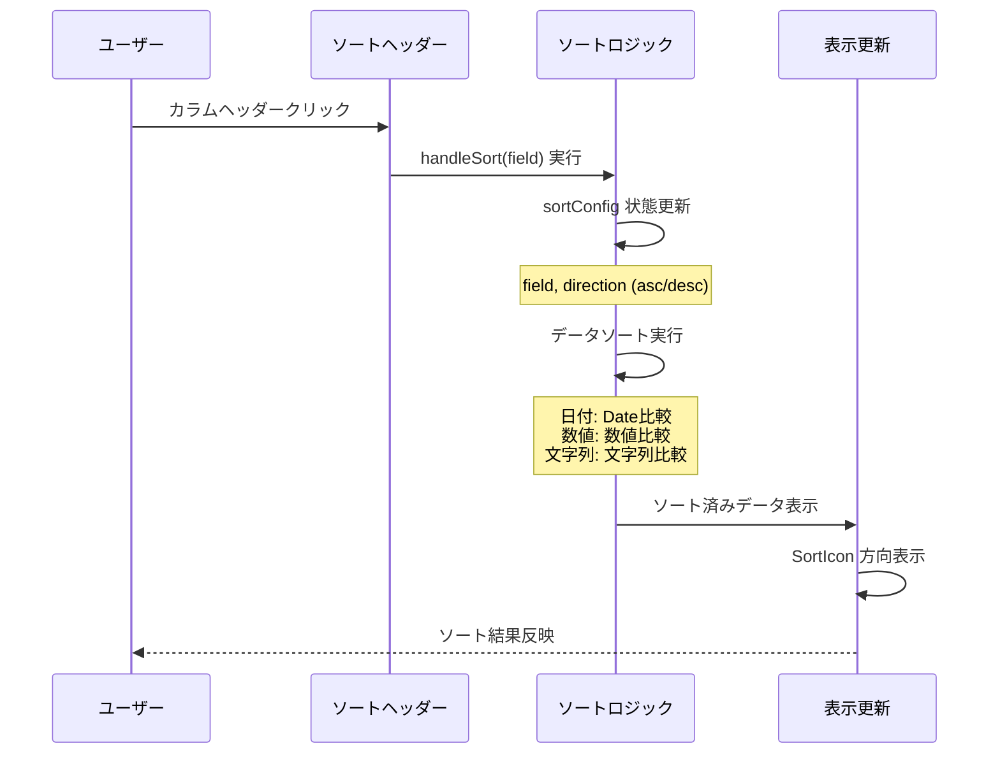

## モーダル管理

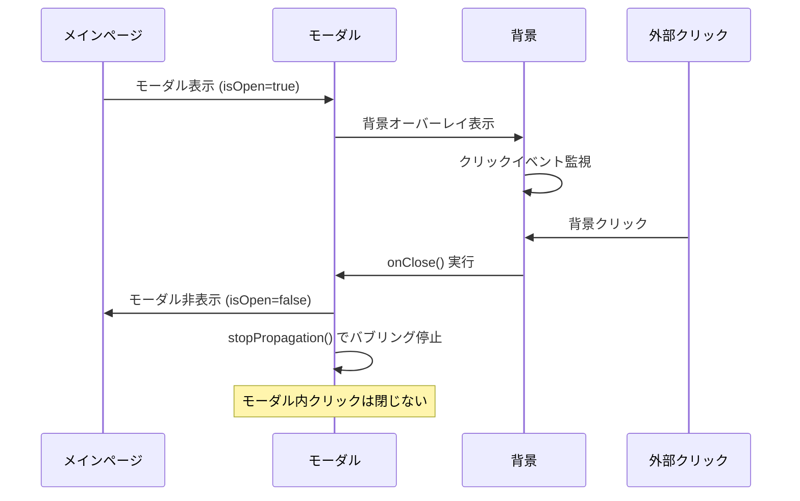

## 特徴

### 1. 複雑な状態管理
- 複数の useState フック
- useCallback によるパフォーマンス最適化
- useMemo による計算最適化

### 2. リアルタイム検索・フィルタリング
- 顧客検索の即座反映
- 商品検索の動的フィルタリング

### 3. 高度なソート機能
- 複数フィールド対応
- データ型別ソートロジック

### 4. 包括的エラーハンドリング
- 段階的エラー処理
- ユーザーフレンドリーなエラーメッセージ

### 5. レスポンシブデザイン
- モバイル対応のモーダル
- 適応的なレイアウト

## パフォーマンス最適化

### React Hook最適化
```typescript
// useCallback によるメモ化
const handleSelectCustomer = useCallback(async (customer) => {
  // 処理ロジック
}, []);

// useMemo による計算最適化
const filteredCustomers = useMemo(() => {
  return customers.filter(/* 条件 */);
}, [customers, customerSearchTerm]);
```

### レンダリング最適化
- 条件分岐による不要なレンダリング回避
- 大きなリストの効率的な表示

### API呼び出し最適化
- 適切なローディング状態管理
- エラー時の適切なフォールバック

## セキュリティ考慮

### データバリデーション
- クライアントサイドバリデーション
- 数量制限の適切な実装

### エラー情報保護
- 技術的詳細の非表示
- ユーザーフレンドリーなメッセージ

## アクセシビリティ

### キーボードナビゲーション
- Tab順序の適切な設定
- Enter/Escapeキー対応

### スクリーンリーダー対応
- 適切なラベル設定
- aria属性の活用

### 視覚的フィードバック
- ローディング状態の明確な表示
- 成功/エラー状態の色分け