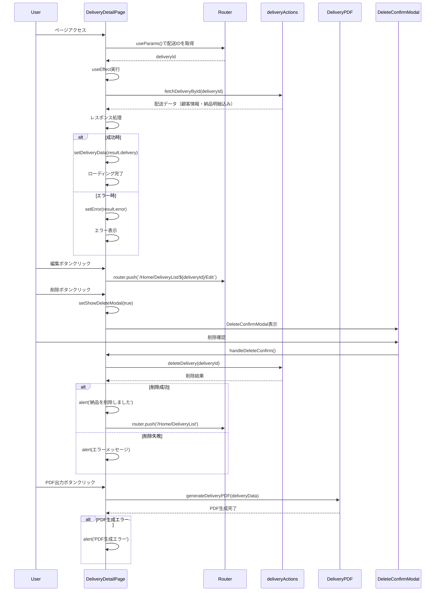

# 配送詳細ページのシーケンス図

## 概要

配送詳細ページ (`mbs/app/Home/DeliveryList/[id]/page.tsx`) は、特定の配送の詳細情報を表示するクライアントコンポーネントです。

## 主要機能

### 1. 配送データ取得
- URLパラメータから配送IDを取得
- `fetchDeliveryById` Server Actionで配送データを取得
- 顧客情報と納品明細を含む完全なデータを表示

### 2. データ表示
- **納品明細テーブル**: 最大10行（空行含む）で明細を表示
- **配送情報**: 配送ID、日付、合計金額、備考
- **顧客情報**: 顧客ID、名義、担当者、連絡先、配達条件など

### 3. アクション機能
- **編集**: 配送編集ページへ遷移
- **削除**: 削除確認モーダル表示後、配送を削除
- **PDF出力**: 配送データをPDF形式で出力

### 4. レスポンシブ対応
- モバイル・タブレット・デスクトップに対応
- XLサイズでは左右2カラムレイアウト

### 5. エラーハンドリング
- データ取得エラー
- 削除処理エラー
- PDF生成エラー

## 使用技術

- **Next.js**: App Router、Client Component
- **React Hooks**: useState、useEffect、useCallback、useMemo
- **Server Actions**: fetchDeliveryById、deleteDelivery
- **PDF生成**: generateDeliveryPDF
- **UI**: TailwindCSS、レスポンシブデザイン

## ファイルパス
`mbs/app/Home/DeliveryList/[id]/page.tsx`