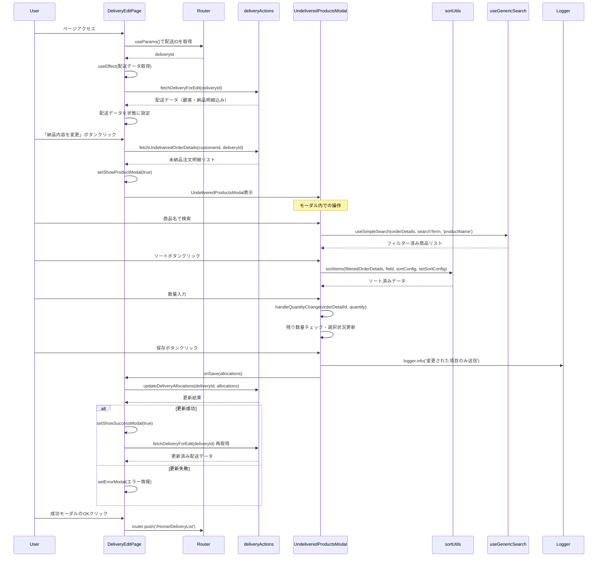

# 配送編集ページのシーケンス図



## 概要

配送編集ページ (`mbs/app/Home/DeliveryList/[id]/Edit/page.tsx`) は、既存の配送の納品内容を編集するためのクライアントコンポーネントです。

## 主要機能

### 1. 配送データ取得・表示
- 既存の配送データを取得して表示（読み取り専用）
- 顧客情報、納品日、現在の納品内容を表示

### 2. 未納品商品選択モーダル
- **商品検索**: useGenericSearchによる商品名フィルタリング
- **ソート機能**: 注文ID、注文日、単価、数量、残り数量でソート
- **数量調整**: 各注文明細の納品数量を個別に設定
- **レスポンシブUI**: モバイル・デスクトップ対応

### 3. 高度な配送管理
- **割り当て制御**: 残り数量 + 現在の割り当て分が上限
- **リアルタイム計算**: 選択状況・合計金額の動的更新
- **変更検知**: 実際に変更された項目のみAPI送信

### 4. データ最適化
- **差分更新**: 変更のない項目はAPI送信をスキップ
- **ログ出力**: 送信データの詳細をログで記録
- **トランザクション安全**: 更新後の再取得でデータ整合性確保

### 5. エラーハンドリング
- データ取得エラー
- 更新処理エラー
- バリデーションエラー

## 使用技術

- **Next.js**: App Router、Client Component
- **React Hooks**: useState、useEffect、useCallback、useMemo
- **カスタムフック**: useSimpleSearch（商品検索）
- **ユーティリティ**: sortUtils（ソート機能）
- **Server Actions**: fetchDeliveryForEdit、fetchUndeliveredOrderDetails、updateDeliveryAllocations
- **ライブラリ**: react-tooltip、@/lib/logger
- **UI**: TailwindCSS、レスポンシブモーダル

## 特殊機能

### 1. 動的数量制御
```typescript
const maxSelectable = detail.remainingQuantity + detail.currentAllocation;
```

### 2. 変更検知システム
```typescript
const hasChanges = Object.entries(selections).some(([orderDetailId, quantity]) => {
  const detail = orderDetails.find((d) => d.orderDetailId === orderDetailId);
  return detail && detail.currentAllocation !== quantity;
});
```

### 3. 最適化されたAPI送信
- 変更のない項目は送信対象外
- ログによる送信データ追跡

## ファイルパス
`mbs/app/Home/DeliveryList/[id]/Edit/page.tsx`