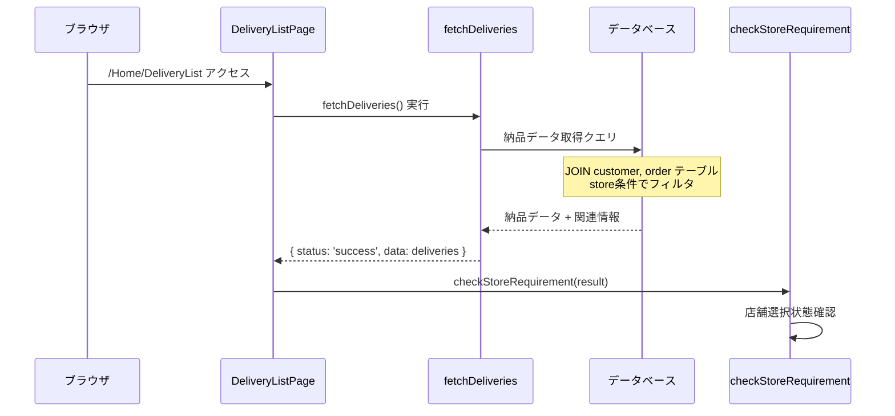
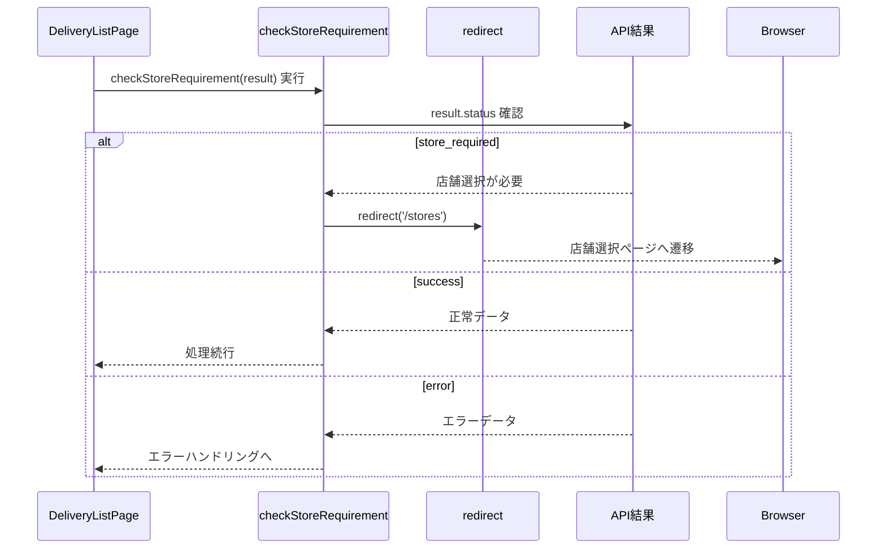
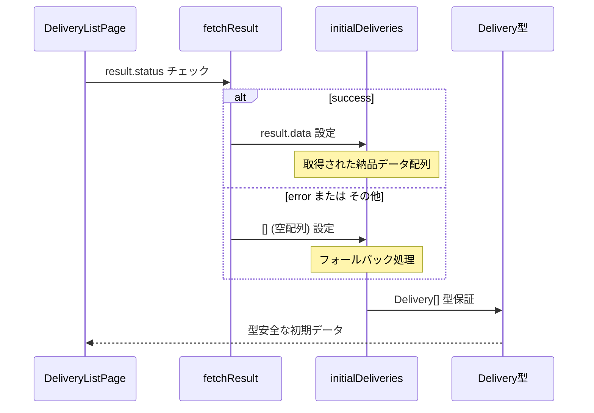
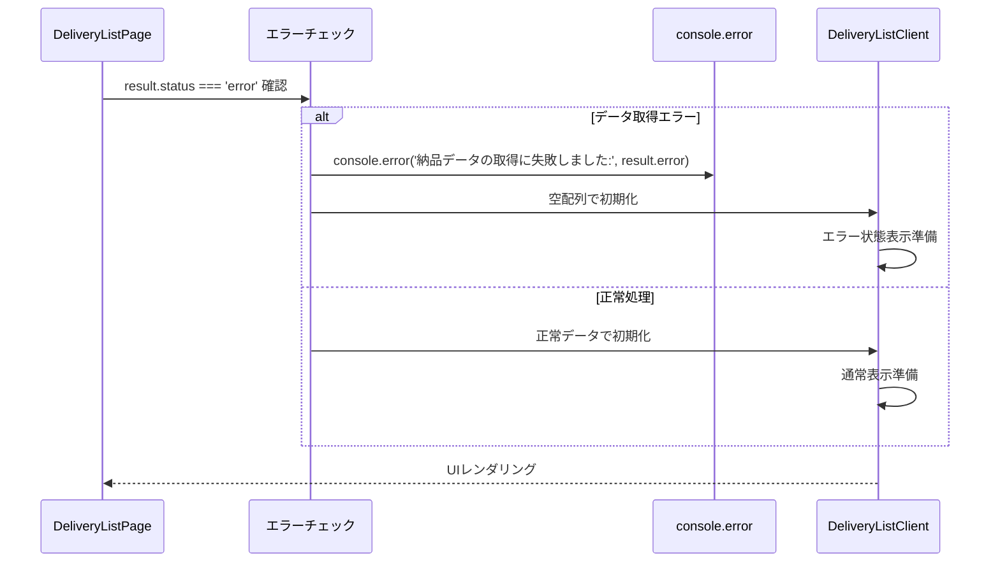
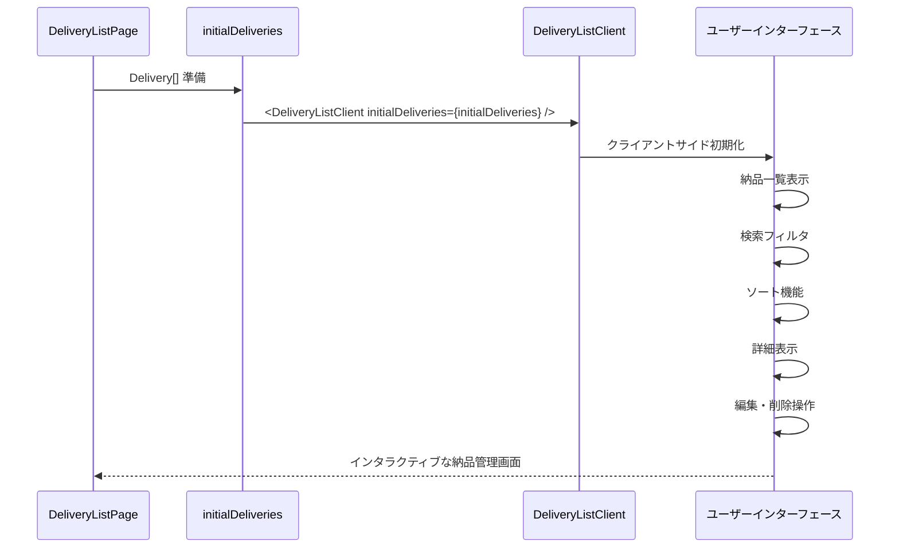
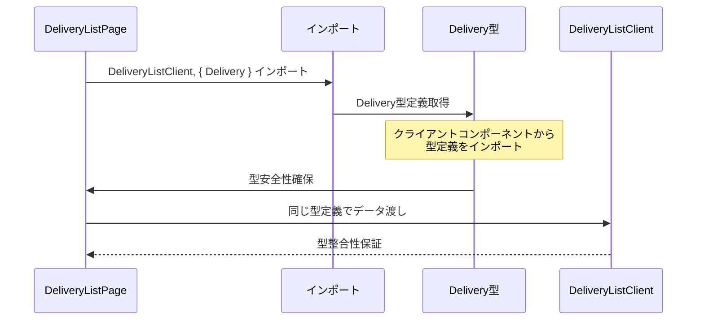
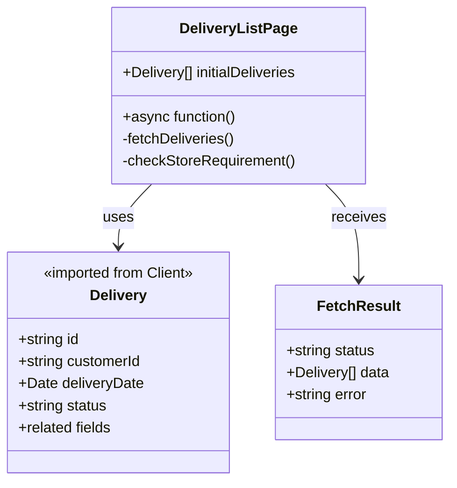
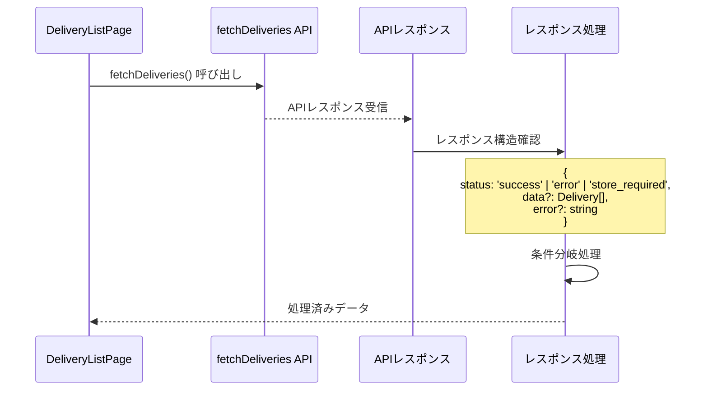
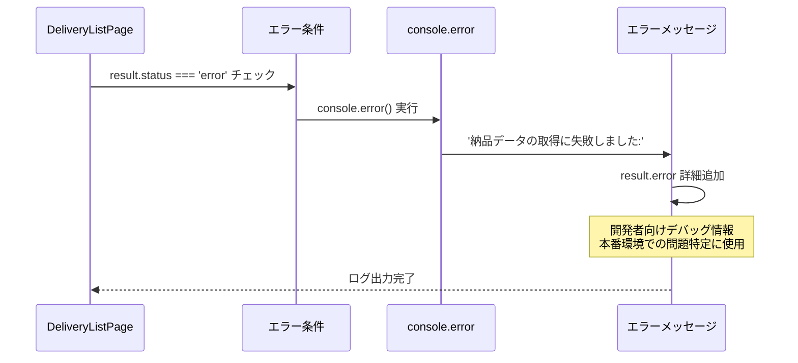
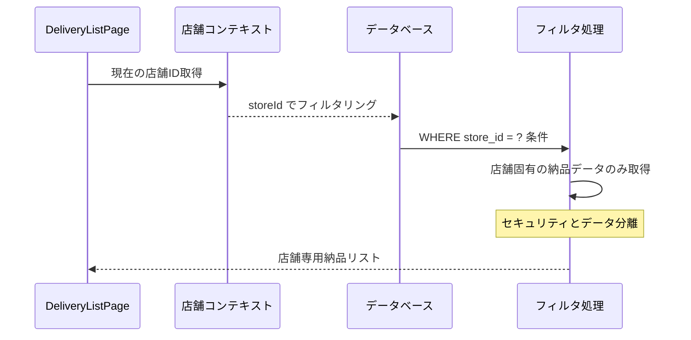

# DeliveryList Page - シーケンス図

## 概要
納品一覧ページの処理フローを示すシーケンス図です。

## 1. ページ初期化とデータ取得



## 2. 店舗要件チェック処理



## 3. 初期データ設定



## 4. エラーハンドリング



## 5. クライアントコンポーネント連携



## 6. 型定義統合



## データフロー構造



## API レスポンス処理



## サーバーサイドレンダリング

```mermaid
flowchart TD
    A[HTTP Request] --> B[DeliveryListPage実行]
    B --> C[fetchDeliveries()]
    C --> D[データベースクエリ]
    D --> E{データ取得成功?}
    
    E -->|成功| F[initialDeliveries設定]
    E -->|失敗| G[エラーログ + 空配列]
    
    F --> H[checkStoreRequirement()]
    G --> H
    
    H --> I{店舗チェック}
    I -->|OK| J[DeliveryListClient作成]
    I -->|NG| K[リダイレクト実行]
    
    J --> L[SSRで完成HTML]
    L --> M[ブラウザに送信]
    
    style A fill:#e1f5fe
    style F fill:#c8e6c9
    style G fill:#ffcdd2
    style J fill:#c8e6c9
    style K fill:#ffecb3
```

## エラーログ出力パターン



## 店舗ベースデータフィルタリング



## 特徴

### 1. シンプルな構造
- 最小限のロジック
- 明確な責任分離

### 2. 型安全性
- クライアントコンポーネントからの型インポート
- 一貫した型定義の使用

### 3. エラー耐性
- 段階的なエラーハンドリング
- フォールバック処理の充実

### 4. パフォーマンス最適化
- サーバーサイドでの初期データ取得
- 効率的なデータベースクエリ

### 5. 店舗ベースアクセス制御
- セキュアなデータアクセス
- 適切なリダイレクト処理

## パフォーマンス考慮

### データベース最適化
- 効率的な JOIN クエリ
- インデックスの活用

### メモリ効率
- 最小限のサーバーサイド処理
- ストリーミング可能な設計

### レンダリング最適化
- 軽量なサーバーコンポーネント
- クライアントでの詳細処理

## 依存関係

### 外部依存
- `@/app/actions/deliveryActions` - データ取得
- `@/app/utils/storeRedirect` - リダイレクト処理

### 内部依存
- `./components/DeliveryListClient` - UI コンポーネント
- 店舗状態管理
- データベース接続

## 拡張可能性

### フィルタリング機能
```typescript
interface DeliveryFilter {
  status?: string;
  dateRange?: { start: Date; end: Date };
  customerId?: string;
}
```

### ソート機能
```typescript
interface DeliverySort {
  field: keyof Delivery;
  direction: 'asc' | 'desc';
}
```

### バッチ操作
```typescript
interface BatchOperation {
  action: 'delete' | 'updateStatus';
  deliveryIds: string[];
  newStatus?: string;
}
```

## セキュリティ考慮

### データアクセス制御
- 店舗レベルでのデータ分離
- 権限ベースのフィルタリング

### エラー情報保護
- ユーザーに機密情報を露出しない
- 開発者向けログの適切な管理

## 監視とログ

### エラー監視
- データ取得失敗の追跡
- パフォーマンス問題の検出

### 利用統計
- ページアクセス頻度
- データ量の監視