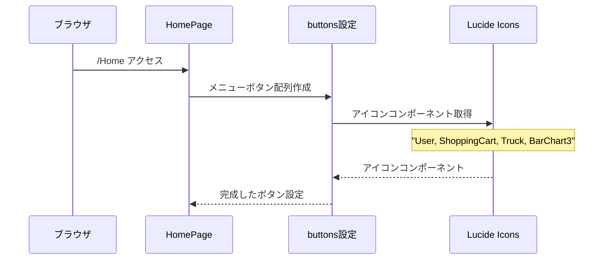
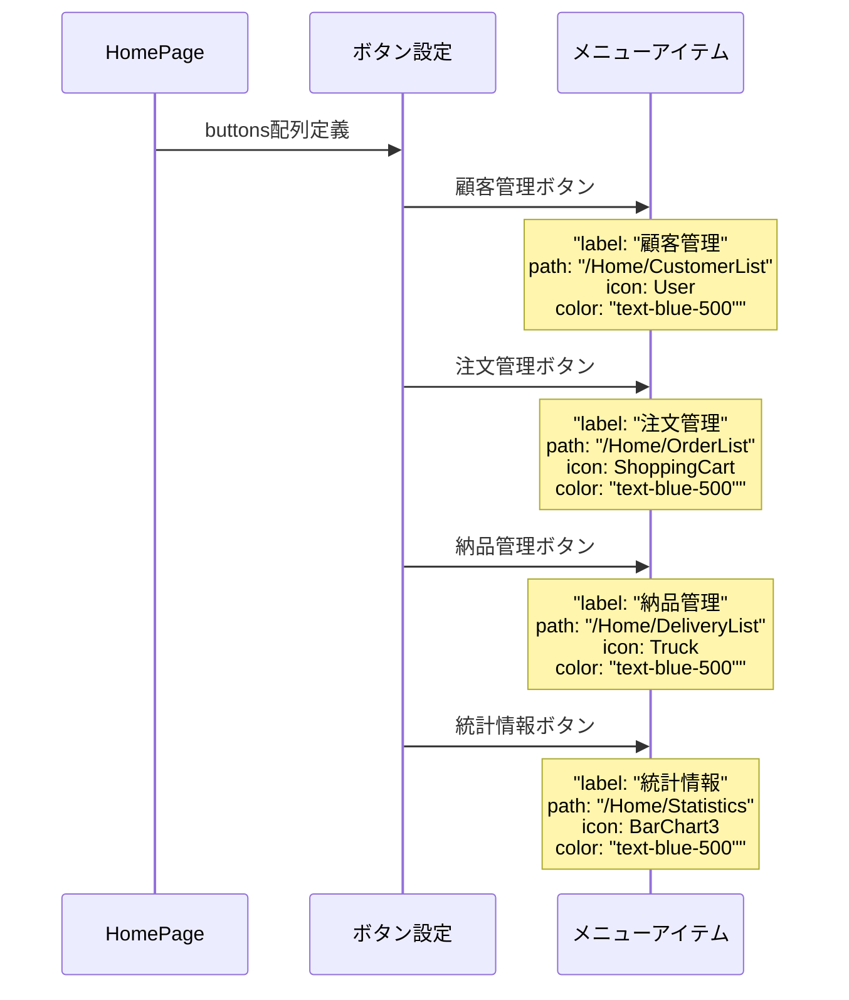
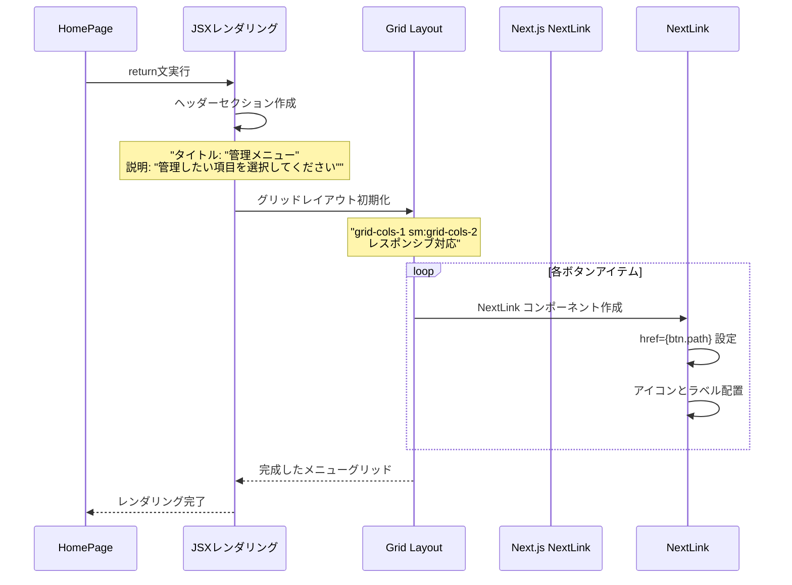
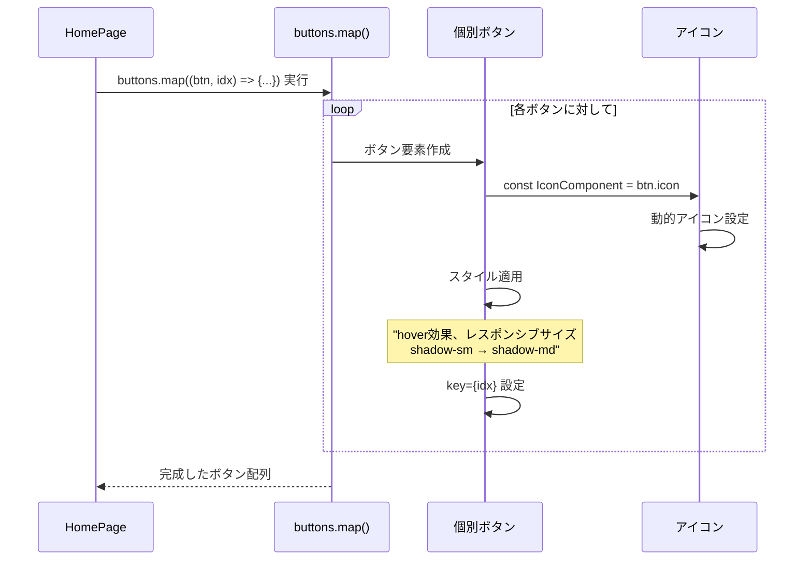
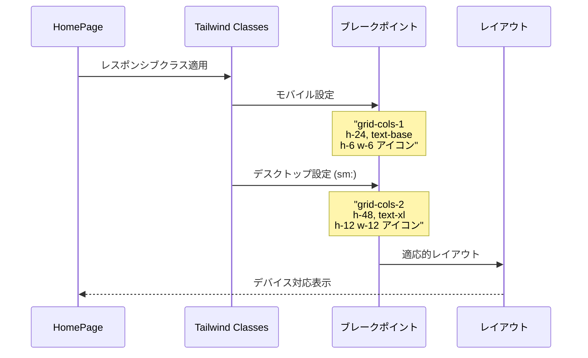
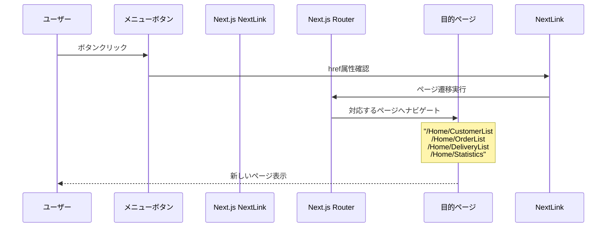
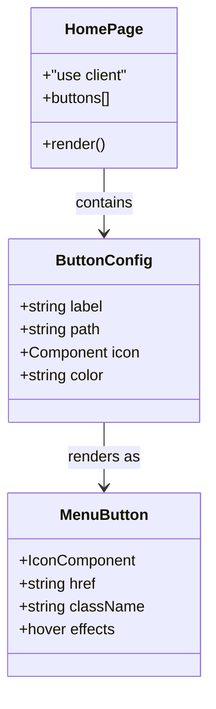
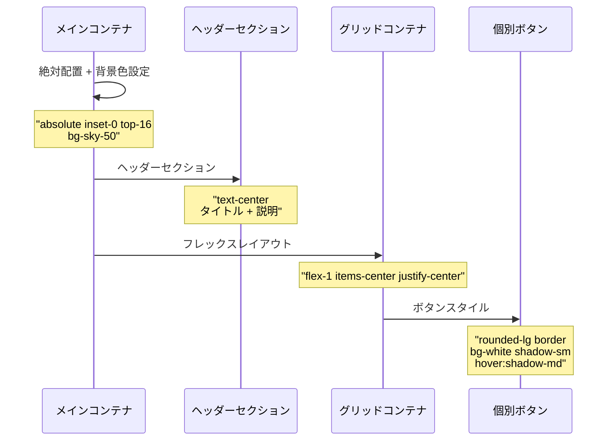

# Home Page - シーケンス図

## 概要
ホームページ（メニュー画面）の処理フローを示すシーケンス図です。

## 1. ページ初期化とメニュー設定



## 2. メニューボタン構成



## 3. レンダリング処理



## 4. ボタンマッピング処理



## 5. レスポンシブデザイン処理



## 6. ナビゲーション処理



## データ構造



## メニュー構造マップ

```mermaid
flowchart TD
    A[ホームページ /Home] --> B[顧客管理]
    A --> C[注文管理]
    A --> D[納品管理]
    A --> E[統計情報]
    
    B --> B1[/Home/CustomerList]
    C --> C1[/Home/OrderList]
    D --> D1[/Home/DeliveryList]
    E --> E1[/Home/Statistics]
    
    style A fill:#e1f5fe
    style B fill:#fff3e0
    style C fill:#fff3e0
    style D fill:#fff3e0
    style E fill:#fff3e0
```

## スタイリング階層



## 特徴

### 1. クライアントサイドコンポーネント
- "use client" ディレクティブ
- ブラウザでのインタラクティブ機能

### 2. レスポンシブデザイン
- モバイルファースト設計
- スマートフォン〜デスクトップ対応

### 3. アイコン統合
- Lucide React アイコンライブラリ
- 意味的で直感的なアイコン選択

### 4. ナビゲーション最適化
- Next.js NextLink コンポーネント
- 高速なクライアントサイド遷移

### 5. 一貫したデザインシステム
- 統一されたカラーパレット
- 再利用可能なスタイリングパターン

## 使用パターン

### メニューボタン追加
```typescript
const newButton = {
  label: "新機能",
  path: "/Home/NewFeature",
  icon: NewIcon,
  color: "text-blue-500",
};
```

### レスポンシブ調整
```css
/* モバイル */
h-24 text-base h-6 w-6

/* デスクトップ */
sm:h-48 sm:text-xl sm:h-12 sm:w-12
```