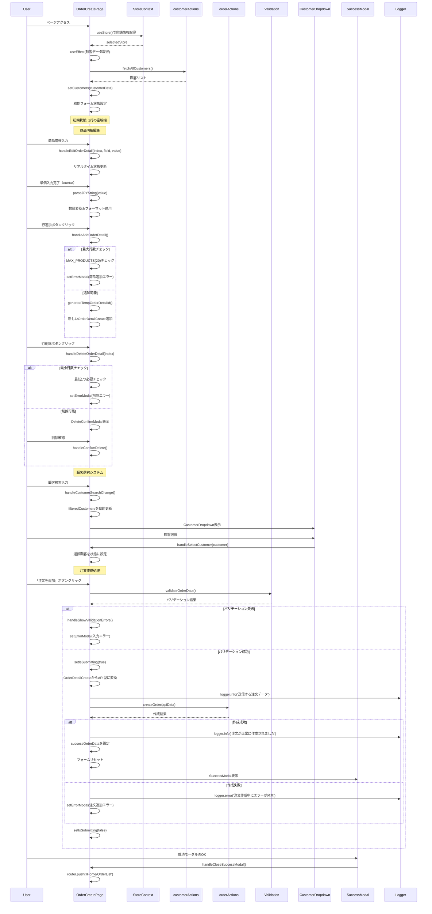

# 注文追加ページのシーケンス図



## 概要

注文追加ページ (`mbs/app/Home/OrderList/Add/page.tsx`) は、新しい注文を作成するための包括的なフォームコンポーネントです。店舗コンテキストと連携し、直感的な注文作成体験を提供します。

## 主要機能

### 1. 店舗連携システム
- **StoreContext統合**: 現在選択中の店舗情報を表示
- **店舗フィルタリング**: 選択店舗の顧客のみ表示
- **視覚的フィードバック**: 店舗情報バナーで現在状態を明示

### 2. 動的商品明細管理
- **動的行操作**: 1〜20行まで自由に追加・削除
- **テンポラリID**: TEMP-XX形式での一時的ID管理
- **リアルタイム計算**: 合計金額の自動更新

### 3. 高度な顧客選択システム
- **リアルタイム検索**: 顧客名・担当者名での瞬時フィルタリング
- **useMemo最適化**: 検索パフォーマンスの向上
- **ドロップダウンUI**: クリック外し検知による直感的操作

### 4. インテリジェントな入力制御
- **通貨入力**: 入力中は自由文字列、確定時に数値変換
- **バリデーション**: リアルタイム検証とエラー表示
- **必須項目制御**: 商品名または摘要いずれか必須

### 5. 成功体験の向上
- **成功モーダル**: 作成された注文の詳細表示
- **フォームリセット**: 成功後の自動クリア
- **シームレス遷移**: 注文一覧への自動遷移

## 技術的特徴

### 1. パフォーマンス最適化
```typescript
const filteredCustomers = useMemo(() => {
  return customers.filter(c => 
    c.name.toLowerCase().includes(customerSearchTerm.toLowerCase()) ||
    (c.contactPerson || '').toLowerCase().includes(customerSearchTerm.toLowerCase())
  );
}, [customerSearchTerm, customers]);
```

### 2. リアルタイムバリデーション
```typescript
const validationResult = useMemo(() => {
  return validateOrderData(orderData);
}, [orderDetails, orderDate, selectedCustomer, note]);
```

### 3. 型安全なデータ変換
```typescript
interface OrderDetailCreate {
  id: string; // TEMP-XX形式
  productName: string;
  unitPrice: number | string; // 入力中は文字列
  quantity: number | '';
  description: string;
}
```

### 4. API統合の最適化
- **実際のServer Action**: createOrderとの統合
- **エラー処理**: 詳細なエラーログとユーザーフィードバック
- **データ変換**: フォーム状態からAPI形式への変換

## 使用技術

- **Next.js**: App Router、Client Component
- **React Hooks**: useState、useEffect、useCallback、useMemo
- **Context API**: StoreContextとの連携
- **Server Actions**: fetchAllCustomers、createOrder
- **ログ**: @/lib/loggerによる詳細ログ
- **UI**: TailwindCSS、レスポンシブデザイン

## バリデーション規則

1. **商品明細**: 最低1つ、最大20個
2. **必須項目**: 商品名または摘要（いずれか必須）
3. **顧客選択**: 必須
4. **注文日**: 必須

## エラーハンドリング

1. **入力エラー**: リアルタイムバリデーションと詳細メッセージ
2. **API エラー**: 作成失敗時の適切なフィードバック
3. **ネットワークエラー**: 予期しないエラーへの対応

## ユーティリティ関数

- **formatJPY**: 金額フォーマット
- **parseJPYString**: 文字列から数値変換
- **generateTempOrderDetailId**: 一時ID生成
- **validateOrderData**: 包括的バリデーション

## ファイルパス
`mbs/app/Home/OrderList/Add/page.tsx`