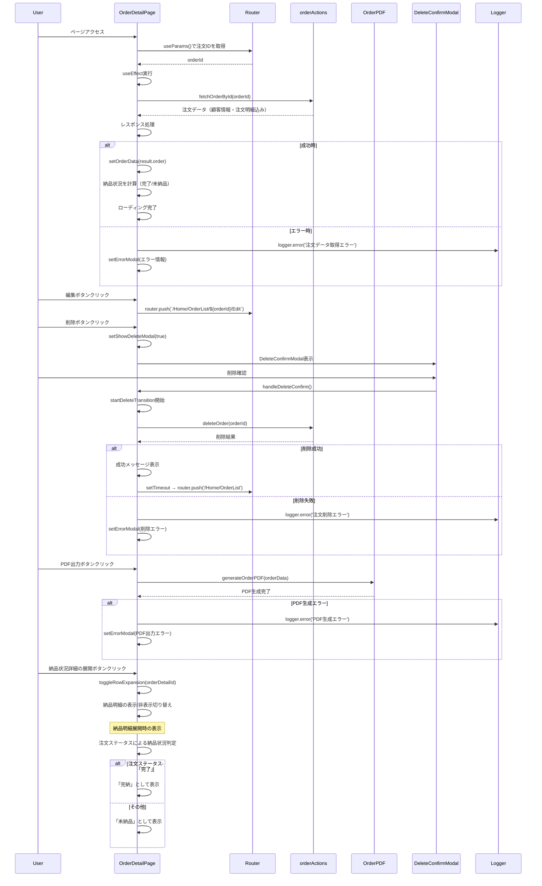

# 注文詳細ページのシーケンス図



## 概要

注文詳細ページ (`mbs/app/Home/OrderList/[id]/page.tsx`) は、特定の注文の詳細情報を表示し、編集・削除・PDF出力機能を提供するクライアントコンポーネントです。

## 主要機能

### 1. 注文データ取得・表示
- URLパラメータから注文IDを取得
- `fetchOrderById` Server Actionで注文データを取得
- 顧客情報と注文明細を含む完全なデータを表示

### 2. 注文明細の納品状況管理
- **ステータス判定**: 注文ステータスに基づく納品状況の表示
- **展開可能な詳細**: 各明細の納品詳細を展開表示
- **視覚的ステータス**: 完了（緑）、一部納品（黄）、未納品（赤）

### 3. アクション機能
- **編集**: 注文編集ページへ遷移
- **削除**: 削除確認モーダル → useTransitionによる削除処理
- **PDF出力**: 注文データをPDF形式で出力

### 4. エラーハンドリング
- **ログ出力**: @/lib/loggerによる詳細ログ記録
- **エラーモーダル**: 統一されたエラー表示UI
- **フォールバック**: データ未取得時の適切な表示

### 5. レスポンシブ対応
- モバイル・タブレット・デスクトップに対応
- XLサイズでは左右2カラムレイアウト
- 注文明細テーブルの横スクロール対応

## 技術的特徴

### 1. パフォーマンス最適化
- **useTransition**: 削除処理の非同期状態管理
- **useMemo**: 合計金額計算の最適化
- **useCallback**: イベントハンドラーの最適化

### 2. 型安全性
- **Prisma型**: OrderWithRelationsによる型安全なデータ操作
- **TypeScript**: 厳密な型チェック

### 3. 納品状況の動的計算
```typescript
const displayOrderDetails: OrderDetailWithDelivery[] = orderData?.orderDetails.map(detail => {
  const totalDelivered = orderData.status === '完了' ? detail.quantity : 0;
  const deliveryStatus = orderData.status === '完了' ? '完了' : '未納品';
  return { ...detail, totalDelivered, deliveryStatus };
})
```

## 使用技術

- **Next.js**: App Router、Client Component
- **React Hooks**: useState、useEffect、useTransition、useMemo、useCallback
- **Server Actions**: fetchOrderById、deleteOrder
- **PDF生成**: generateOrderPDF
- **ログ**: @/lib/logger
- **UI**: TailwindCSS、レスポンシブデザイン

## エラーハンドリング

1. **データ取得エラー**: 適切なエラーメッセージとログ出力
2. **削除エラー**: 削除失敗時のフィードバック
3. **PDF生成エラー**: PDF出力失敗時の通知

## ファイルパス
`mbs/app/Home/OrderList/[id]/page.tsx`