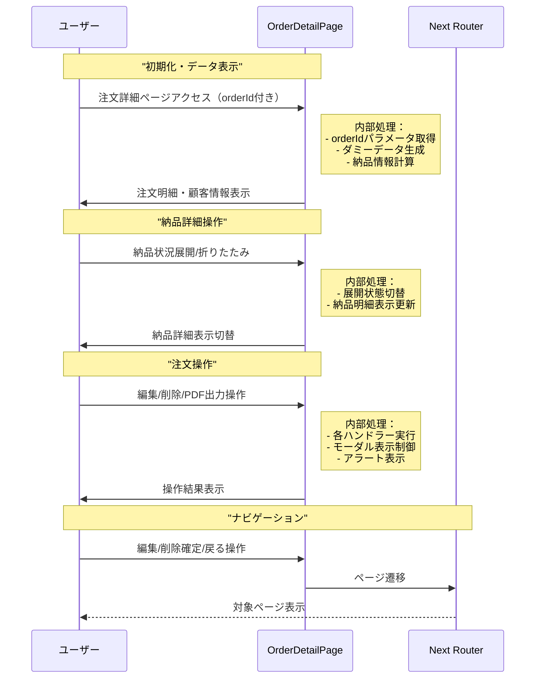

# 注文詳細ページ - シーケンス図

## 概要
注文詳細ページの処理フローを示すシーケンス図です。

## 1. ページ初期化とデータ表示

## 特徴

### 1. 動的データ表示
- 注文IDに基づく詳細情報表示
- 納品状況の計算・表示

### 2. インタラクティブな操作
- 展開可能な納品詳細
- 編集・削除・PDF出力機能

### 3. ナビゲーション
- 適切なページ遷移
- ユーザビリティの向上

## 使用技術

- **Next.js**: App Router
- **React**: クライアントコンポーネント
- **TypeScript**: 型安全性
- **TailwindCSS**: スタイリング

## ファイルパス
`mbs/app/Home/OrderList/[id]/page.tsx`